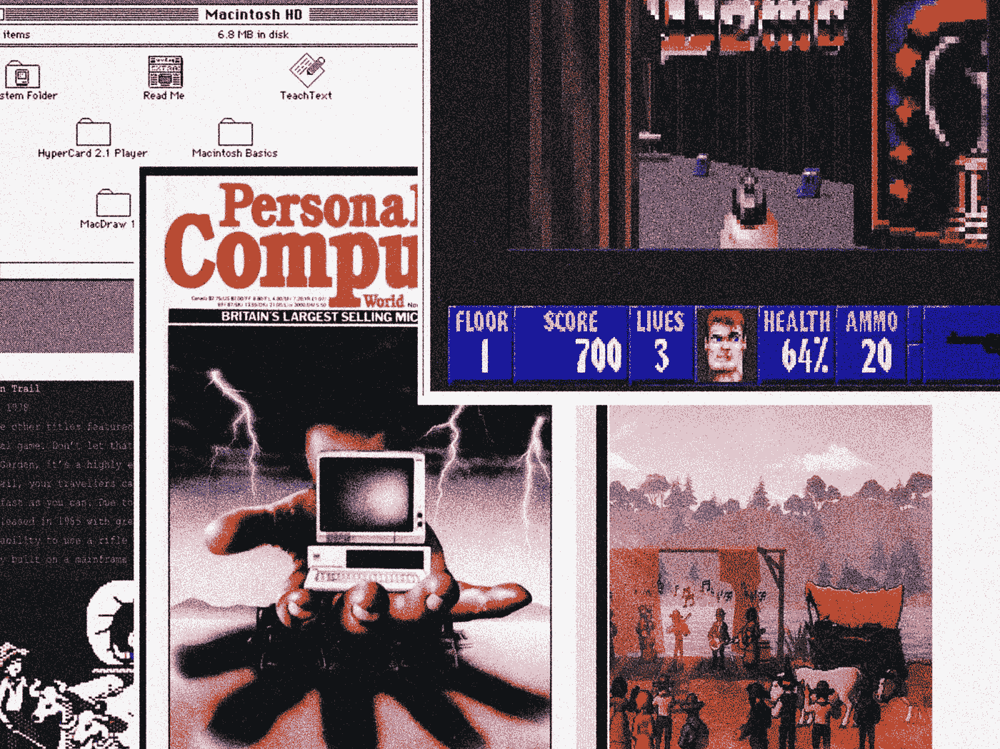

# 经典电脑的终极指南，让你的电脑更棒

> 原文：<https://medium.com/codex/the-ultimate-guide-to-classic-computers-that-made-your-computer-awesome-e2a31e0efc73?source=collection_archive---------11----------------------->

## 苹果、准将、奥斯本和 IBM 创造了你的电脑世界。探索人们是如何工作、娱乐和冲浪的，也可以试一试。

作者的照片和图像

对我们来说，70 年代和 80 年代的电脑就像是石器时代的遗物，但对用户来说，它们是令人兴奋的创新。我选了…