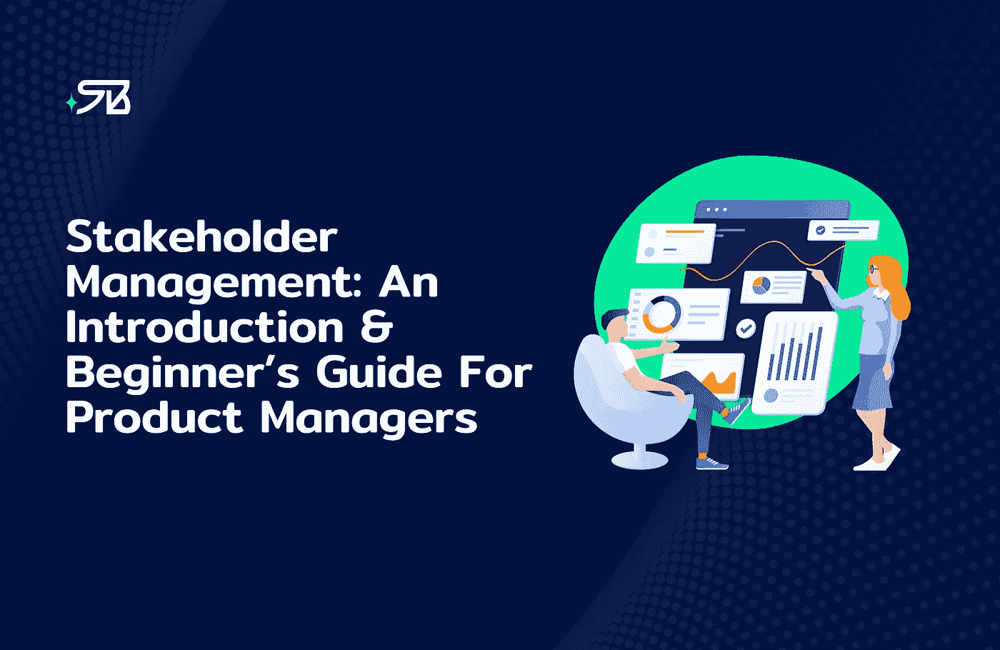
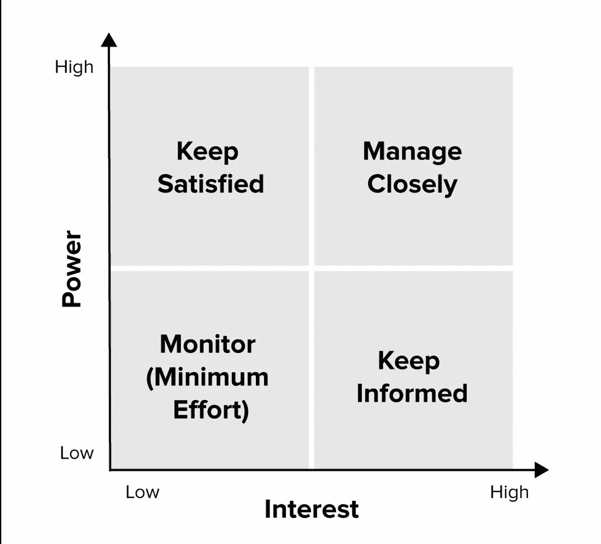

# 利益相关者管理:产品经理入门和初学者指南

> 原文：<https://medium.com/codex/the-ultimate-guide-to-dealing-with-stakeholders-for-product-managers-35732ad2a83?source=collection_archive---------1----------------------->

一个产品经理需要在任何一天与多个利益相关者交谈，因此产品经理能够向不同类型的利益相关者表达想法是至关重要的。

每个利益相关者的思维方式都不同。设计师对产品的思考方式与工程师截然不同。与运营主管相比，副总裁会以不同的方式考虑这个问题。对于产品经理来说，掌握利益相关者管理并以每个利益相关者都能理解的方式表达想法是至关重要的。让我们来看看什么是利益相关者，利益相关者的不同种类，以及你如何成功地管理利益相关者并为他们提供价值。

# **“利益相关者”这个词是什么意思？**

为了理解利益相关者管理，我们首先需要理解什么是利益相关者，以及如何定义谁是利益相关者。一般来说，利益相关者的工作直接或间接地受到你作为产品经理所从事的产品的影响。利益相关者也可以是能够影响产品决策或者对产品的成功感兴趣的人。基本上，利益相关者与产品之间必须有某种直接或间接的关系。

# **谁是不同的利益相关者？**

考虑到上面的定义，一个产品经理每天都要和多个利益相关者打交道。这是不同利益相关者的名单-

*   客户——由于显而易见的原因，他们可能是最大的利益相关者。产品经理所做的一切工作就是解决客户的问题，让他/她的生活变得轻松。此外，这些人付费使用你的产品。这就是为什么他们是利益相关者名单上的第一和最重要的人。
*   **高管** —包括公司的高层管理人员，如首席执行官、高级副总裁等。、投资者和董事会成员。
*   **工程、设计和 QA —** 这些人完全参与到产品开发过程中，并形成利益相关者的核心小组。
*   **市场营销、销售、客户支持和运营—** 在某些情况下，这些也是产品的客户(例如:内部产品)。而在其他情况下，他们的工作会受到产品的间接影响。

# 为什么利益相关者管理很重要？

你会说:“因为他们持有股份，你这个笨蛋！”嗯，那倒是真的。但是请允许我用两件事来扩展一下。

首先，让我提醒我们产品经理工作的一个重要部分:

> 产品经理并不总是做决策。项目经理确保做出最佳决策。

最佳决策是如何做出的？不是因为首相是最聪明、最伟大、直觉最强的。这是通过收集和综合那些知道对产品/业务有价值的东西(但不是全部)的人的意见。你猜怎么着，你的利益相关者集体知道很多有价值的东西来帮助你为你的产品做出最好的决定。

第二，因为你的利益相关者直接受到你的产品结果的影响，如果你的产品失败了，他们也会失败。同样，当他们失败时，你也失败了。猜猜是谁的错？(提示:不是涉众)。

# 与不同的利益相关者打交道

不同的利益相关者需要产品经理提供不同的专业知识来应对他们。这与其说是一门科学，不如说是一门艺术。这是因为人们有不同的观点、期望、议程和沟通方式，管理这些差异需要一个熟练的产品领导者。管理参与项目的人员(客户、开发人员、外部承包商等)的能力。)以及他们之间的关系，对保证一个杀手级产品的顺利及时交付大有帮助。

让我们看看如何在这一部分与不同的利益相关者打交道。

## **客户**

*   永远保持简单。客户只对你的产品如何解决他们的问题感兴趣。这是唯一需要关注的一点。
*   考虑他们的反馈，但也要理解有时甚至顾客也不知道他们想要什么。所以要根据数据、理解和自然本能来做决定。
*   保持沟通的简短和精确，因为客户没有时间吸收大量的信息。

## **高管**

*   由于高管没有足够的时间深入了解产品的细节，所以始终保持高水平，只有在被问到时才深入了解细节。
*   关注公司将如何从产品中获益。
*   为你的产品做一个善于讲故事的人，并且总是让他们知道你的产品。

## **工程、设计和质量保证**

*   向他们解释“是什么”和“为什么”,把“如何”留下，因为“如何”是他们的专长。
*   帮助他们了解产品的影响以及它如何让客户受益。
*   给他们足够的信息开始他们的工作。但是不要参与日常的微观管理。

## **市场营销、销售、客户支持和运营**

*   在产品开发生命周期的早期阶段与他们合作。
*   解释产品能让最终客户的生活变得更轻松的原因和方式。
*   考虑他们的反馈，并在路线图中相应地对其进行优先排序。
*   展示有证据支持数据的计划。

## **如何对利益相关者进行优先排序？**

考虑到一个产品经理要和多个利益相关者打交道，如果 PM 对所有利益相关者一视同仁，那就乱套了。这就是为什么对利益相关者进行优先排序是极其重要的。但问题是，怎么做？

这个问题没有唯一的答案，因为每个组织都是不同的，每个项目经理都有不同的优先顺序。但是这里有一个简单的方法来区分利益相关者的优先级——电力/利益网格。

利益相关者矩阵

以下是对每个存储桶的解释:

*   ***高权力、高兴趣的人(密切管理):*** 你必须充分调动这些人，尽最大努力让他们满意。
*   ***权力大、兴趣少的人(保持满足):*** 对这些人投入足够的工作，让他们保持满足，但不要多到让他们对你的信息感到厌烦。
*   ***权力小、兴趣高的人(保持知情):*** 充分告知这些人，并与他们交谈，以确保不会出现重大问题。这一类的人通常对你的项目细节很有帮助。
*   ***权力低，兴趣少的人(监控):*** 再次，监控这些人，但不要用过度的交流让他们厌烦。

有了这个网格，您就可以更容易地对利益相关者进行优先级排序。例如，公司的副总裁会有很高的兴趣和权力，所以你必须密切管理他/她。而运营团队领导的兴趣较高，权力较低，因此您可以让他/她随时了解情况。

## **知道何时说“不”和“现在不行”**

考虑到一个产品经理要处理的利益相关者的数量，在维护与这些利益相关者的关系方面就有点力不从心了。每个利益相关者都有不同的需求，事实上，很多时候他们都有一个很长的想要实现的愿望清单。这就是一个强大的产品经理需要知道什么时候说“不”，什么时候说“现在不行”的地方。

产品经理的主要职责是尽可能高效、快速地制造产品。如果他/她开始从不同的利益相关者那里获取每一个功能需求，这将会影响整个产品开发过程。但是我们都知道现在说“不”或“不”会影响我们与利益相关者的关系。

这里有一些你可以用来说“不”的技巧，这些技巧将帮助产品经理在收到“不”的情况下保持与利益相关者的健康关系:

*   花时间理解他们的要求，并真诚地想知道他们的问题是什么。
*   有效地扮演产品大使的角色。对你自己的产品有深入的了解，这样你就能为利益相关者的任何问题提供逻辑推理。用数据和用户洞察来支持你的理由。
*   如果你对一个特定的请求说“不”，解释“不”后面的“为什么”。这一点非常重要，因为你不想无缘无故地突然离开你的利益相关者。
*   最后但同样重要的是，要开放和友好。最后，我们都是来打造有影响力的产品的，而这只有在从事产品工作的每个人之间建立了牢固的关系时才能实现。

# 总而言之:利益相关者管理是你和你的产品成功之间的超级力量。

考虑到利益相关者管理的复杂程度和移动部分的数量，真的没有放之四海而皆准的方法可以遵循。

利益相关者管理可能会变得很累或者很令人兴奋，这取决于你作为产品经理如何看待它。一个强有力的产品经理总是会培养与他/她的利益相关者的关系。

为环境的改变做好准备，用同理心来更好地理解和联系你的利益相关者——这样，当进展变得艰难时，你也知道如何让项目继续下去。

在利益相关者管理方面，你作为产品经理遇到过哪些问题？你有什么让你的生活变得更轻松的窍门吗？请在下面评论，我很想知道。