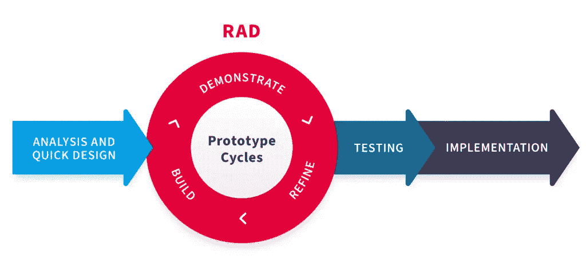
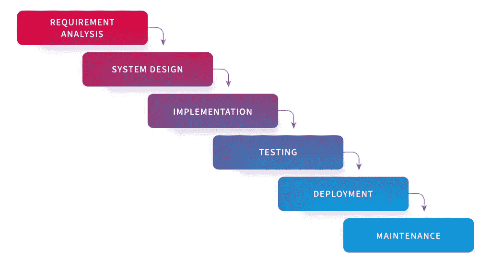
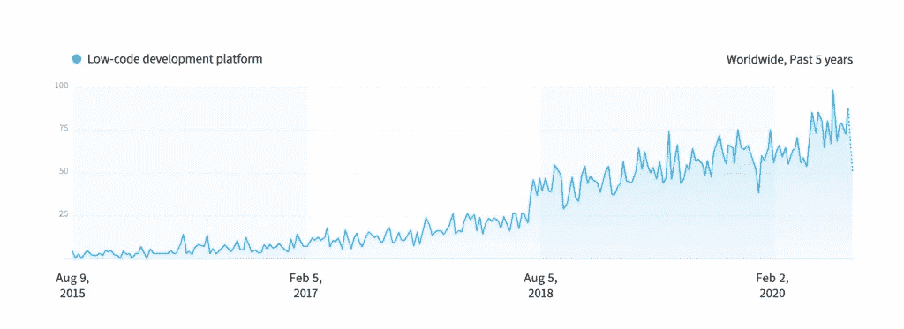
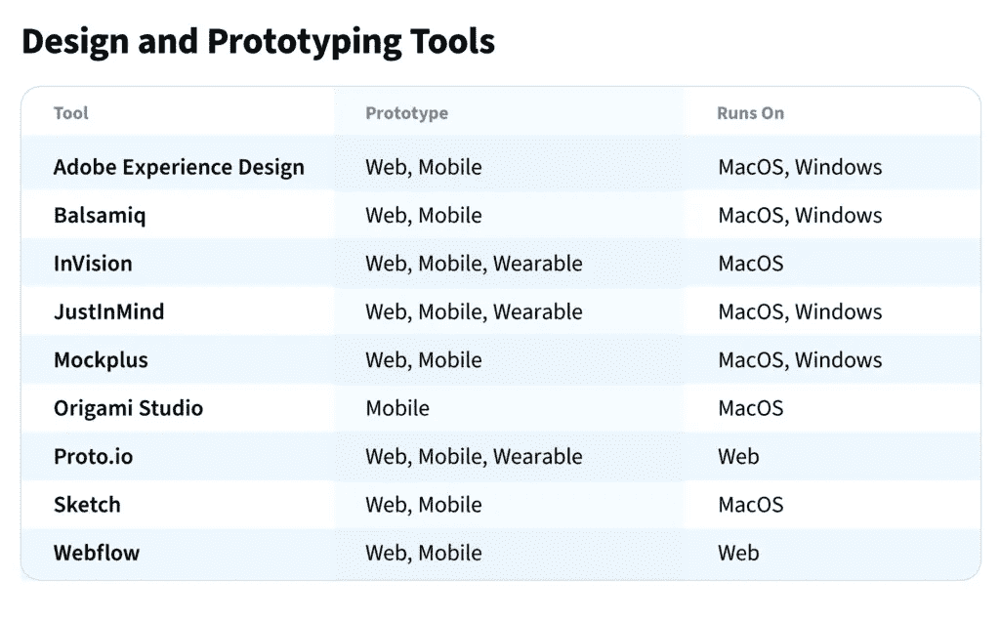
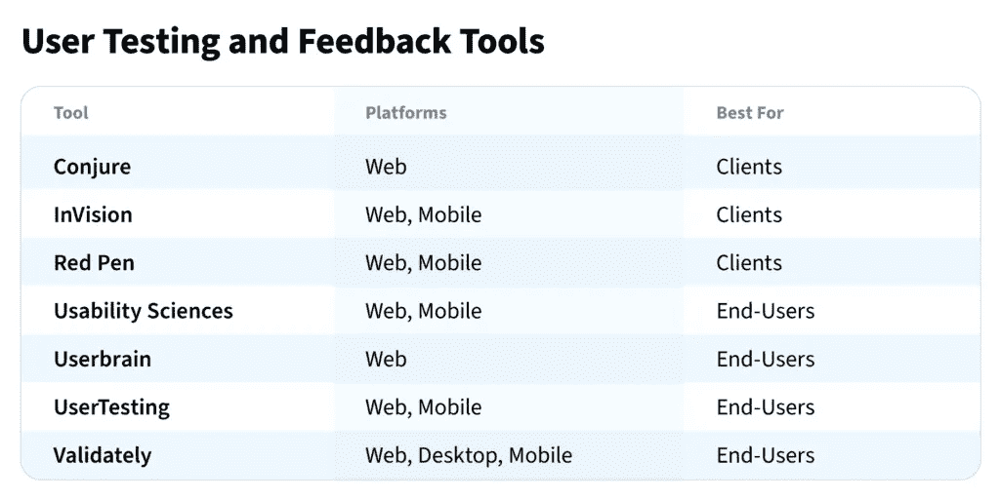
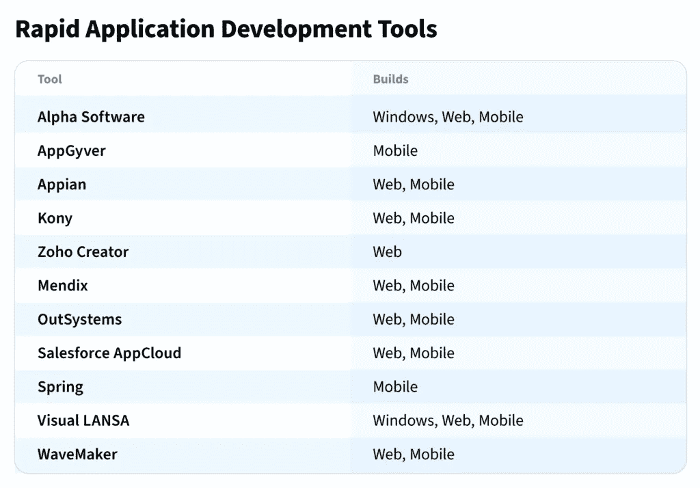

# 快速应用程序开发的终极指南

> 原文：<https://medium.com/codex/the-ultimate-guide-to-rapid-application-development-23f200739e57?source=collection_archive---------5----------------------->

当考虑软件开发时，许多人熟悉的方法是瀑布方法或瀑布方法论。现在被认为是软件开发的经典风格，它已经被一种被称为快速应用开发或 RAD 的新技术所取代。

快速应用程序开发的流行与现代世界的发展速度直接相关。今天，企业被迫以极快的速度创造新产品和服务。这部分是由于竞争加剧和进入全球市场，但也是由于消费者的行为。今天的客户总是在寻找最新、最新、最好的产品，想要生存和发展的公司不得不满足这些需求。

快速应用程序开发模式帮助了企业，帮助他们快速推出新产品和服务。事实上，这种模型不仅在开发中流行，而且在整个业务环境中也很流行。

# 什么是快速应用开发？

在讨论软件开发的时候，经常谈到的主要有两种类型。瀑布作为一种较老的风格依赖于详细的需求和长的计划周期。

以快速应用程序开发方法为特征的敏捷开发专注于迭代发布。随着应用程序的快速开发，重点放在更小的 sprints 上，即交付项目的小的增量部分。总的来说，这有助于加快项目交付，因为由于需求或业务需求的变化，不需要返工。

# 以弧度为单位的步长

当考虑快速应用程序开发方法时，需要理解一些关键步骤。这些步骤如下:

1.  **了解需求**——在不清楚结果应该是什么样的情况下开始一个项目是失败的原因。在这一步中，您将尝试定义项目的目标以及预算和交付时间框架。这一步完成后，各方都满意，然后你可以进入下一步。
2.  **创建一个 MVP**——一个最小可行的产品或 MVP 是最初的原型，你应该在开始开发时构建。当开发团队、项目领导和客户在构建阶段紧密合作时，原型成功的几率会大大提高。
3.  **征求反馈**——在这个阶段，开发人员正在寻求用户的反馈。这可能取决于产品的可用性，甚至是它的界面、外观和感觉。随着开发人员收集信息，可以对产品进行调整，以更好地满足用户需求。
4.  **测试和展示** —在测试阶段，需要根据所有客户要求仔细检查解决方案，以确保其功能符合要求。此外，测试还应该审查软件中的任何第三方集成，因为一个领域中的更改会影响其他领域。一旦您的成品准备好投入使用，您需要培训用户使用它，并确保所有正确的数据都加载到其中。

# 什么时候应该使用快速应用程序开发模型？

在某些时候，快速应用程序开发模型无疑是最佳选择。这些时间包括:

# 当项目需要快速完成时

如果您的截止日期非常紧迫，并且您几乎没有回旋的余地，那么快速应用程序开发方法就是一条前进的道路。通过选择 RAD 解决方案，可以减少规划和设计阶段，从而显著加快项目进度。

# 当你有足够的预算时

这并不是说 RAD 比瀑布或其他方法更昂贵。但是，在某些情况下，如果没有内部专家，资源成本可能会更高。在这种情况下，有一个灵活的预算为你提供了选择，可以帮助你的项目更加成功。

# 当你可以轻松测试时

快速应用程序开发需要在项目生命周期的所有阶段进行有效的反馈和测试。如果你有一个用户群，可以对你的原型和 MVP 提供反馈，那么你就更有可能在 RAD 上取得成功。

# 拉德 vs 瀑布

经典的瀑布方法与快速应用程序开发方法有很大的不同。在瀑布模型中，业务需求在项目的最早阶段被讨论，之后工作开始。在项目生命周期中，业务和开发团队之间很少甚至没有交互，最终产品只有在所有阶段完成后才交付。

然而，RAD 提供了更多的灵活性。快速应用程序开发模型的主要优势之一是开发团队和业务之间的交互的可能性。这种沟通有助于确保需求中的任何变化都可以被立即考虑，从而节省大量的返工时间。

此外，使用 RAD，开发人员能够在开发过程的许多不同阶段生产原型，从而有助于确保最终产品实际上符合需求和期望。

# 快速应用程序开发优势

当考虑快速应用程序开发的优点和缺点时，优点远远大于缺点。要考虑的一些最相关的优势包括:

1.  **速度**——快速应用开发能够快速生产原型和 MVP，使企业能够比通过其他开发模型更快地在现实世界中看到他们的产品。
2.  清晰可见的进展 — RAD 专注于冲刺和迭代工作，让开发人员不断展示进展。这与旧的方法有很大的不同，比如瀑布，公司需要等到最后阶段才能看到产品。
3.  **一致的反馈** —快速应用程序开发模型以用户反馈为中心，有助于确保随着开发的进展，原型会根据用户的需要和要求不断改进。

RAD 的其他优点包括它的适应性以及在项目生命周期早期与其他系统集成的能力。这有助于在开发过程的早期发现问题，以便快速解决问题。

# 快速应用程序开发的缺点

虽然 RAD 提供了许多优于其他旧方法的优点，但是仍然有一些缺点需要考虑。

1.  **大规模项目** —虽然 RAD 在快速周转方面表现出色，但不断变化的需求本质会导致设计上的调整，这可能会使一些大规模项目脱轨。
2.  **需要反馈—** 用户反馈是快速应用程序开发的必要条件，但是如果这些用户不可用或者不能持续地在项目上工作，这可能会影响交付的解决方案的质量。

RAD 需要考虑的其他缺点包括它对熟练开发人员的依赖以及对模块化系统的需求。

# 快速应用开发编程语言和框架

有几种不同的开发框架适用于快速应用程序开发方法。最流行的三个是 Ruby、Flutter 和 Python。

# 红宝石

说到 RAD 编程语言，Ruby 很可能是最好的选择。这种免费的开源解决方案自 2005 年推出以来越来越受欢迎，是一种允许开发人员快速开始工作的语言。

这种速度的一些原因包括它为开发人员提供了一个完整的框架，其中包含了开箱即用的所有关键元素。Ruby 在快速应用程序开发方面的另一个优势是开发人员可以使用的第三方组件的广泛和不断增长的集合。

# 摆动

Flutter 是 Google 为编码人员开发的解决方案，也是另一个越来越受开发人员欢迎的框架。作为一个为 Android、iOS、Linux、[、web](https://nix-united.com/services/web-development/) 和 Mac 构建应用的工具，Flutter 现在允许开发者为 windows 构建应用，进一步扩展其功能。

当迭代软件时，Flutter 的热重载选项是一个非常有用的工具。借助热重装，开发人员可以快速测试应用程序，而无需重新构建和重启。

# 计算机编程语言

Python 和它的 Django 框架通过许多不同过程的自动化帮助快速开发应用程序。对于希望构建复杂的数据驱动网站的开发人员来说，这可能是一个真正的好处，可以大大加快流程。

# 快速应用开发工具

根据来自 Google Trends 的信息，使用低代码开发平台进行快速应用程序开发的流行程度正在迅速增加。然而，找到合适的工具来帮助您成功使用 RAD 可能会很复杂，因为有许多选项可供选择。

# 设计和原型制作

有了这些工具，开发人员可以快速轻松地创建原型。在某些情况下，这些工具支持跨浏览器功能，这进一步扩展了这些功能。

# 用户测试和反馈

对于快速应用程序开发模型，在整个开发生命周期中来自用户的反馈是一个关键需求。这些工具有助于实现反馈，使开发人员更容易理解需要调整什么。

# 快速应用开发工具

为了帮助您的团队快速采用快速应用程序开发方法，您需要在工具箱中准备好合适的工具。这些工具就是你要找的。

# 结论

您准备好快速应用程序开发以及它所能提供的一切了吗？要了解您的组织是否已做好 RAD 准备，请查看此清单。

*   需要快速开发软件吗？你想在很短的时间内创造一个产品吗？如果是这样，RAD 可能是您正在寻找的解决方案。
*   您的内部资源是否熟悉 RAD 方法并熟悉 RAD 工具？他们能按照你的时间表工作吗？
*   如果你是一家软件开发公司，你的客户对采用 RAD 持开放态度吗？在整个开发过程中，他们是否能为您提供帮助，以便提供反馈？
*   您是否有合适的工具来成功部署 RAD？

如果您需要帮助回答这些问题，请联系我们。在 NIX，我们已经使用快速应用程序开发模型成功地部署了多个项目,并且我们对它的使用有很强的把握。让我们帮助您确定 RAD 是否是适合您和您的需求的解决方案。我们的[软件工程师](https://nix-united.com/services/software-engineering/)和商业分析师会很乐意评估你的项目，并提供一系列专门为你设计的建议。

*原载于 2021 年 1 月 27 日 https://nix-united.com***。**