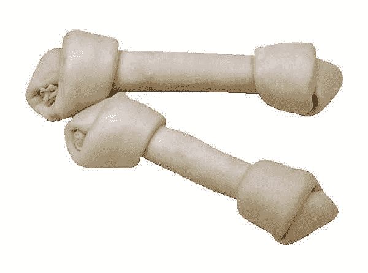

# 非传统的机器学习指南

> 原文：<https://medium.com/codex/the-unconventional-guide-to-machine-learning-15dcf29d8550?source=collection_archive---------9----------------------->

## 这是一个简单但非传统的指南，为那些开始这段旅程的人介绍机器学习。

每当我听到有人想知道什么是机器学习时，我希望他们尽可能多地解释这个领域，因为乍一看，这听起来很花哨。可能是因为听起来像，这可能会让他们走得更远。

换句话说，有时候听起来好像遥不可及。在这篇文章中，我将友好地解释什么是机器学习。

在我开始之前，为什么我选择的标题是*非常规指南？*基本上是因为我不想用技术或者复杂的概念。我并不是说复杂的术语是错误的。尽管如此，我还是想用最简单的方式解释一下今天提到最多的一个概念。

# 什么是机器学习？

据 [IBM 网站](https://www.ibm.com/cloud/learn/machine-learning):

> *机器学习是人工智能(AI)和计算机科学的一个分支，专注于使用数据和算法来模仿人类的学习方式，逐步提高其准确性。*

我的理解是，机器学习是从一组例子中学习如何执行特定的任务。换句话说，这是给东西贴标签的艺术:只要告诉计算机你想预测什么，它就会找到给定数据的模式。

事实上，对于大多数进入这个领域的人来说，这种机器学习的浪潮/趋势似乎是新的。尽管如此，这些年来，与这个领域相关的大多数算法、数学概念和统计基础都是在书本、论文和互联网上找到的。

如今，由于计算机比人类运行和解决更复杂的问题，它们在解决明确定义的问题方面要好得多。此外，当涉及大量数据时，性能比人好得多。考虑到这一点，我们可以期待机器通过识别数据库中的模式来提出更好的解决方案。

关于*贴标签的艺术*，我来给你演示一下我的意思。

如果你问一只狗这是什么:

不知何故，狗会试图告诉你，这是一根骨头，对不对？但是如果你问同一只狗这是什么:

嗯，估计狗很快就不知道了，连那只小狗都不明白那是什么。

现在，让我们和你一起试试！

尽量猜猜这是什么:

毫无疑问，你可以确定它是一条龙。尽管如此，不知何故你的大脑进行了一些复杂的计算来快速识别它并将其归类为龙。现在，你可以对龙的大小有一个概念，并且可能知道在哪里可以找到龙，这可能是因为你读过或者听过关于龙的故事。

记住这一点，你可以通过阅读和搜索书籍或故事来了解什么是龙，或者你可以通过例子来理解什么是龙。

对，只是举例，而且应该比较简单吧？

其实宝宝怎么学比较快？假设你有孩子、侄子或其他什么。在这种情况下，你可能会惊讶于这样一个小生物如何能够如此容易地识别一只狗如何“汪汪”，一匹马如何“嘶叫”，或一只猪如何“哼哼”，这是因为有例子！

同样的逻辑应该适用于计算机，因为当你开始通过例子教它们时，机器就更容易预测你想说什么。

# 机器学习可以分类吗？

绝对的！机器学习有许多算法和细分，但本质上最流行的两种类型是:

# 监督学习

监督是指使用包含带有适当关联标签的样本训练的数据集。标记的输入被给予算法以期望特定的输出。对于每个标签，我们知道要预测哪个输出变量。在监督学习中，有两种类型:

*   **回归:**回归类型只是预测一个没有分类的常规结果。简而言之，期望一个数字是一个回归案例。一个典型的例子是在给定诸如邻居、大小、房间数量等特征的情况下预测房价。
*   **分类:**结果被分类成机器学习分类类型，意味着目标变量在离散尺度上被预测。一个典型的例子是电子邮件是否是垃圾邮件。

## 流行的监督机器学习算法:

*   线性回归
*   决策图表
*   逻辑回归
*   随机森林

# 无监督学习

无监督是指使用算法从由输入数据组成的数据集(没有标记的答案)中进行推断。事实上，没有“人”参与学习反馈循环，也没有标签告诉计算机什么时候是正确的，什么时候犯了错误，以便它可以自我纠正。

## 流行的无监督机器学习算法:

*   DBScan
*   k 均值
*   k-中间值
*   分层聚类

# 结论

这篇文章打算给你一个友好的介绍和不那么传统的机器学习指南。请记住，这个领域与正确标记事物的艺术有关，以预测您想要的目标变量或检测或找到特定的模式。

我没有深入讨论很多术语或算法，因为我不想给你过多的信息。如果你有任何问题，请不要犹豫地问！

另外，如果你想知道我没有提到什么，一些主题可能是:

*   正规化
*   全体
*   强化学习
*   深度学习
*   降维
*   贝叶斯定理的
*   联合
*   神经网络

# 参考

凯西·科济尔科夫。"你会读到的关于机器学习的最简单的解释."黑客正午 2018 年 5 月 24 日，【hackernoon.com/the-simplest-explanation-of- …