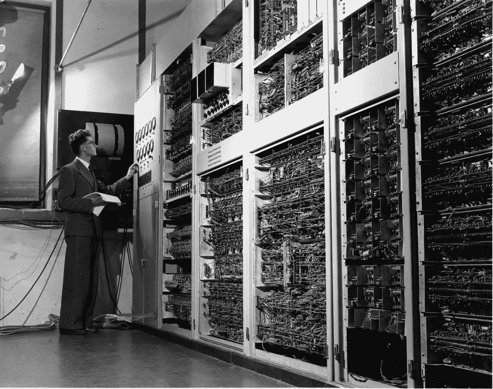

# 着装规范的完全陌生

> 原文：<https://medium.com/codex/the-utter-strangeness-of-dress-codes-ab54c2060075?source=collection_archive---------6----------------------->

软件工程师的着装形式永远不会奏效。

维多利亚博物馆在 [Unsplash](https://unsplash.com/collections/Q8KE4ZsQv2c/de-solution?utm_source=unsplash&utm_medium=referral&utm_content=creditCopyText) 拍摄的照片

今天，一封关于表达你自己以及为什么你和那些多年前开创这个行业，这个我们都在玩的大游戏的先驱者没有太大不同的短信。

# 记忆车道

在过去，当所有的软件工程师都是真正的计算机科学家时，我们…