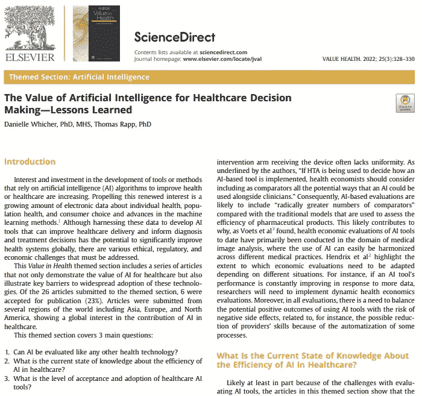

# 人工智能对医疗保健决策的价值——经验教训

> 原文：<https://medium.com/codex/the-value-of-artificial-intelligence-for-healthcare-decision-making-lessons-learned-b79a5ebc6b02?source=collection_archive---------8----------------------->

## [ai4 健康文章评论#0](/@sahika.betul/key-considerations-for-the-use-of-artificial-intelligence-in-healthcare-and-clinical-research-d838774b2ccb?source=your_stories_page-------------------------------------) 7

人工智能在健康领域的普及和这方面的研究与日俱增。虽然开发的新技术在提供保健服务方面发挥了越来越大的作用，但伦理和法律方面仍在继续讨论。

如何评估这些新技术对医疗保健提供者决策的影响也是一个重要的问题。在我评论的这篇文章中，Whicher 和 Rapp 提出了三个重要的问题。

## AI 可以像其他技术一样被评价吗？

✅卫生技术评估(HTA)机构在确定人工智能设备的价值方面面临新的挑战。相比医药产品，AI 产品的效率评估要困难得多。

✅如果卫生技术评估被用来决定如何实施基于人工智能的工具，健康经济学家应该考虑将人工智能与临床医生一起使用的所有潜在方式作为比较。

✅的盈亏平衡至关重要。光靠技术评估是不够的。应该考虑许多参数，例如医疗保健提供者将获得和失去的能力。

## 关于人工智能在医疗保健中的效率，目前的知识状况如何？

✅目前关于人工智能在医疗保健领域的经济影响的科学知识水平很低。

文献中关注人工智能设备影响的✅研究大多集中在它们对健康的影响上。基于经济影响的评估非常有限，原因之一可能是无法收集数据进行评估。

根据应用人群的不同，✅对这一问题的评估可能会有偏差。

✅研究大多进行了不到一年。虽然这一时期反映了短期评价，但不足以进行长期评价，并可能产生潜在的不可预见的影响。

## 医疗保健人工智能工具的接受和采用水平如何？

✅尽管展示医疗保健人工智能工具的价值和效率很重要，但这不足以促进这些工具在临床实践中的采用和扩展。

✅阻碍医疗保健领域普遍接受和采用人工智能工具的开发、部署和使用挑战之一是缺乏信任。增加透明度、公共沟通和利益相关方参与定义适当的数据治理将有助于增强医疗保健信心。

✅研究面前的另一个障碍是，数据在数量上增加了，但在质量上不足，而且很少共享。为了鼓励适当的数据共享，需要改善数据治理结构，以确保“[相关行为体]可以获得高质量的数据，而且这些数据是安全的”。

> 用于评估当前临床研究的方法在评估健康人工智能设备方面非常有限。制定针对该领域的评估方法，教育考虑这些评估的用户，以及收集有助于这些评估的高质量数据是该问题的关键部分，应该有专家来研究该问题。

🌺感谢这篇有价值的文章:
[丹妮尔·惠特尔](https://www.linkedin.com/feed/#)，医学博士，[托马斯·拉普](https://www.linkedin.com/feed/#)，博士

📑 [**点击此处获取文章**](https://www.valueinhealthjournal.com/action/showPdf?pii=S1098-3015%2822%2900012-2)的 PDF，Whicher D，Rapp T .人工智能对医疗保健决策的价值-经验教训。重视健康。2022 年 3 月；25(3):328–330.doi:10.1016/j . jval . 2021 . 12 . 009 . Epub 2022 1 月 31 日 PMID: 35227442。