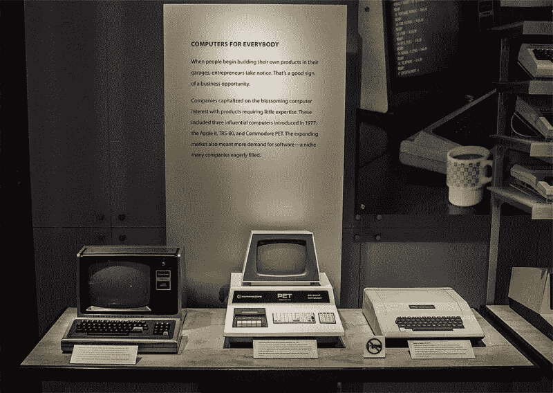

# 人工智能的 VisiCalc 时刻

> 原文：<https://medium.com/codex/the-visicalc-moment-for-ai-7cab57578160?source=collection_archive---------3----------------------->

# 黎明前的曙光

1977 年，苹果公司、康茂德公司和坦迪公司的三台家用电脑上市，这三台电脑后来改变了世界。尽管它们不会立刻产生效果。业余爱好者和爱好者发现它们很吸引人，并自学用 BASIC 编写了一些玩具程序。在全球范围内，他们每月购买几百台电脑。

1977 年的计算机三位一体。图片来自 Techspot。