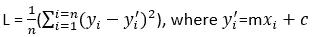
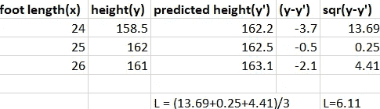

# 我学习梯度下降的方法

> 原文：<https://medium.com/codex/the-way-i-learned-the-gradient-descent-cb408e6149e4?source=collection_archive---------17----------------------->

卡伦·艾姆斯利在 [Unsplash](https://unsplash.com?utm_source=medium&utm_medium=referral) 上的照片

大家好！我也不知道怎么写搞笑:(所以就直接跳到正题了。

梯度下降是一种流行的迭代优化算法，它是机器学习中许多其他优化技术的基础。
这是什么意思？简单来说，优化是一个通过调整目标函数中的权重/参数来尝试在模型中获得最小损失的过程。我知道我说过这很简单，但看起来并不像。没问题，我会为你分解我所说的，我会确保它保持简单。

每一个最难的话题(梯度下降没那么难)都可以很容易地用一个相关的例子来教授。对于这个主题，我使用线性回归作为例子。希望你了解线性回归。如果你不知道，不要担心，我会在这里为你输入简单的台词。无非是找一条符合给定数据的线/面来预测未知数据的类标签。

我们如何知道一条特定的线何时符合数据？当它合适的时候，损失最小。

什么是损失？它是实际值和预测值之间的差值。

比如说，我们把脚长作为特征，把人的身高作为类别标签。现在我们需要找到一条线路，使其产生低损耗。对于线性回归，损失是损失的平方，即(实际值-预测值)的平方。众所周知， *y= mx+c* 是直线的方程。寻找符合数据的最佳直线就是寻找直线的斜率(m)和截距(c)的最佳值。斜率是直线相对于轴的陡度，截距是直线与轴的交点。

我们问题的损失函数是平方损失的平均值，即，

> 等等什么是损失函数？这是一个等式，它表明当我们改变该等式的权重/参数(这里是斜率和截距)时，我们获得了多少损失。请记住，如果损失巨大，这意味着实际值和预测值之间的差异很大。

预测值取决于拟合线，损耗取决于预测值，因此损耗取决于拟合线(斜率和截距)！！不要混淆 XD

因此，如果您找到这些权重(斜率和截距)的值，使损失(L)最小，那么我们的工作就完成了。

我们如何找到这些权重的值？这就是这篇博客的全部意义！XD 完整的走一遍。

下图举例说明了当直线的斜率和截距发生变化时，损耗是如何变化的。

[图片由作者提供]

x 轴代表人的脚长(以厘米为单位), y 轴代表人的高度(以厘米为单位)。

对于线 y=0.61x+145，(斜率= 0.61，截距=145)，均方损耗为 1.52。

[图片由作者提供]

脚长和身高是给定的数据。当 x(英尺长度)值被代入 y = mx+c 时，预测身高就是 y 的值。

对于线 y=0.29x+155.2，损耗为 6.11。

对于线 y=0.75x+139.5，损耗为 5.78。

看，损失函数明显依赖于斜率和截距(这里我们称之为参数或权重)。

这个损失函数的 3D 图(近似图)显示了当斜率和截距变化时损失是如何变化的。

[图片由作者提供]

斜率(w1)在 X 轴，截距(w0)在 Y 轴，误差在 Z 轴。

该图显示斜率(w1)为 0.6，截距(w1)为 145，误差为 1.58，其他点也是如此。

注意:我们只有两个权重(斜率和截距),因为我们只取了一个要素，在本例中直线是 2D，但在现实生活中会有许多要素，因此维数会很大，所以我们不能使用 2D 线来拟合高维数据，我们使用超平面。2D 线只有一个斜率和截距(因此有两个权重)，但是超平面有许多斜率和截距(许多权重)。所以，我们无法想象/画出具有两个以上权重的损失函数图。

现在，我们需要找到权重(斜率和截距)的最佳值，以使误差/损失较低。为了找到这些最佳值，我们利用梯度。梯度只不过是 3D 或 n-D 平面的导数(2D 的斜率)。

如果你对 2D 线求导，就会得到斜率

> 类似地，如果你对超平面求导，就会得到梯度。

我们知道什么是梯度，然后如何使用这个梯度找到最佳的权重是真正的问题。

曲线在局部或全局最小值处的梯度或斜率或导数为零。曲线的最低点称为最小值。

来源

[图片由作者提供]

这是从不同角度看的损失函数的 2D 图。

找到这两个单独权重的斜率等于 3D 损失函数曲线的梯度。我们做 dL/dw0 和 dL/w1，并且迭代地保持改变权重，直到我们达到这些导数的最小值，这仅仅是达到曲线的局部/全局最小值，其中损失最小。损失最小的权重值是最佳权重。(现在你明白为什么我的封面照片是一个山谷了吧？XD)

[来源](/onfido-tech/machine-learning-101-be2e0a86c96a)

到目前为止，我们已经了解了所有重要的概念，我们将把它们作为步骤。

第一步:最初，选择权重的随机值

第二步:求损失函数的导数(即梯度),即 dL/dW

其中 L 是损失函数，W 是权重。(这样做是为了知道我们离局部/全局最小值有多远)

第三步:将权重值放入导数中，得到梯度值

第四步:计算步长=梯度 x 学习率。步长决定了我们需要在一个方向上移动多远才能更接近局部/全局最小值。学习速度决定了移动的速度。现在不要对学习率有太大的压力，尽管它在其他优化技术中有着至关重要的作用。

步骤 5:现在用更新函数更新权重(新权重=旧权重-步长)，

重复步骤 3、4、5，直到重量收敛，即，

梯度下降就是这样！将渐变移动到较低的点。

这对于神经网络也是一样的，但是损失函数是不同的，就是这样。最初，我们随机化权重(有多种方法来随机初始化这些权重。如果你想知道，我会写一篇博客😊)向前传播并计算损耗。我们采用损失函数的导数，并通过反向传播迭代地调整/更新权重。

[来源](https://www.google.com/url?sa=i&url=https%3A%2F%2Ftowardsdatascience.com%2Fwhats-the-role-of-weights-and-bias-in-a-neural-network-4cf7e9888a0f&psig=AOvVaw29bqs-cDZh9eUbh1fmz3Rh&ust=1627659267657000&source=images&cd=vfe&ved=0CAsQjRxqFwoTCLid0rbNiPICFQAAAAAdAAAAABAD)

甚至还有梯度下降的变体:

1)随机梯度下降(SGD)

2)小批量 SGD

为了更新梯度下降中的权重，我们取损失函数的导数并将权重放入其中

在损失函数中，我们使用了所有的数据点(sigma(求和)中从 i=1 到 i=n)。但这需要大量的计算能力和时间来计算，因为数据由现实生活中成千上万的点组成。
新币来了。在 SGD 中，它只使用一个点，而不是使用所有数据点来计算损失。但是需要多次迭代才能达到最优值，因为它只有一个数据点。你知道准确性与数据成正比。

为了克服这个问题(需要多次迭代)，我们得到了*小批量梯度下降*。它不是每次迭代都获取全部数据或一个数据点，而是批量获取数据。例如，我们有 10k 个数据点，并使其成为 1000 个点批次，因此 10k 个点= 10 个批次(每个批次由 1000 个点组成),现在为每个迭代发送每个批次。如果发送完所有批次后权重仍未收敛，则再次发送，直到达到最佳值。(这里 1 个时期= 10 次迭代。一个时期=通过算法传递全部数据)

等高线图[ [来源](https://laptrinhx.com/understanding-optimization-algorithms-3818430905/)

总之，在 ML 和 DL 中使用梯度下降，通过获取损失函数的梯度(导数)在迭代过程中优化模型。梯度下降需要更多的计算资源来优化，所以我们得到了 SGD，它需要更少的计算能力，因为它只需要一个数据点来优化，但它需要很多次迭代才能到达目的地。小批量梯度下降是上述方法之间的完美平衡，它比 SGD 收敛需要更少的迭代，比梯度下降需要更少的计算能力。

感谢阅读，如果评论中有任何错误或更正，请告诉我😊。