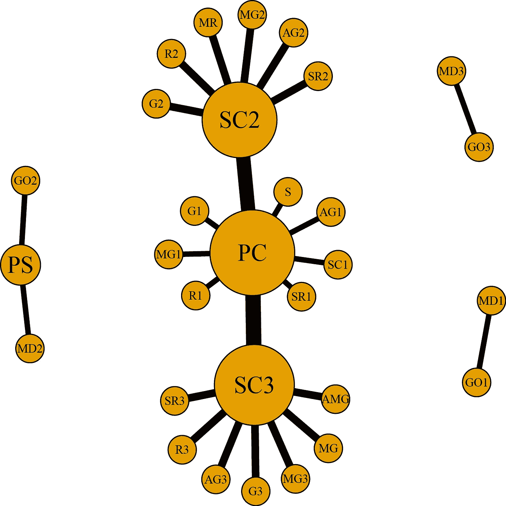
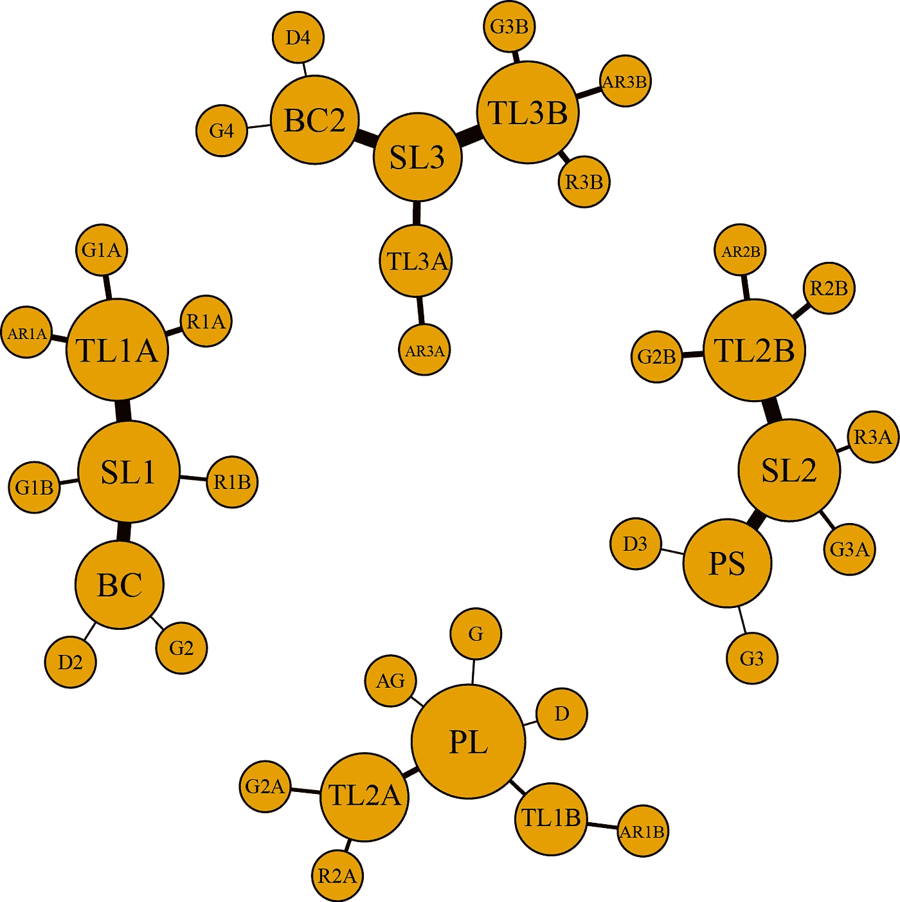
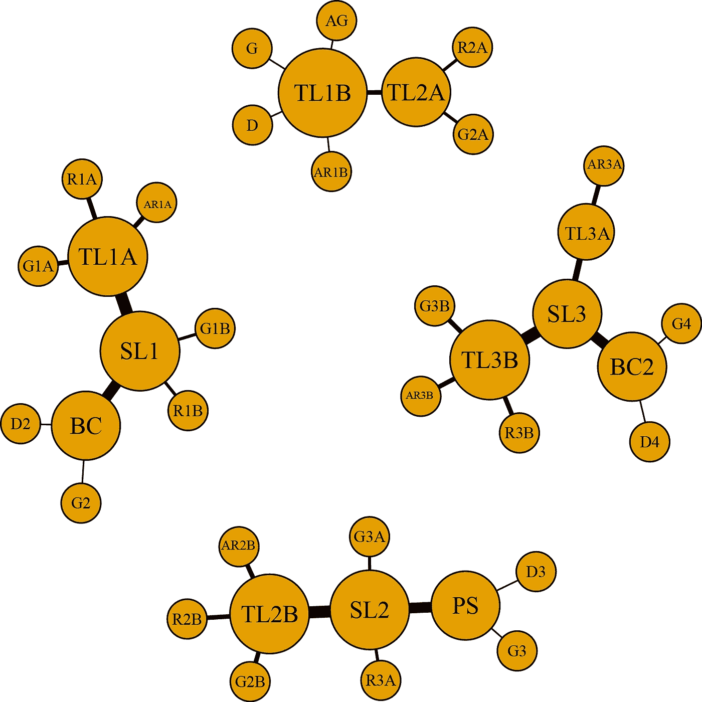
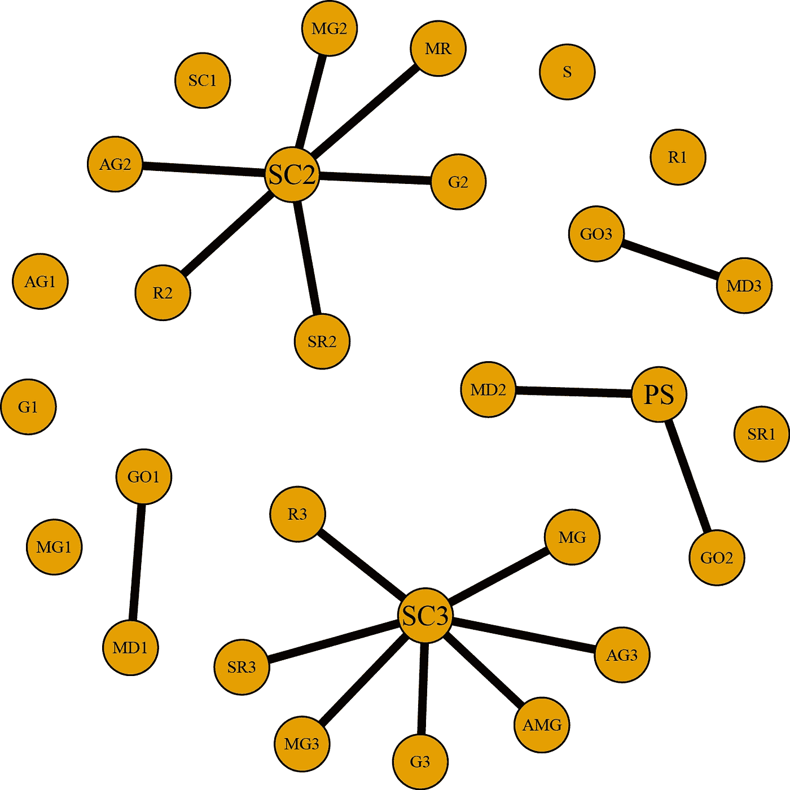
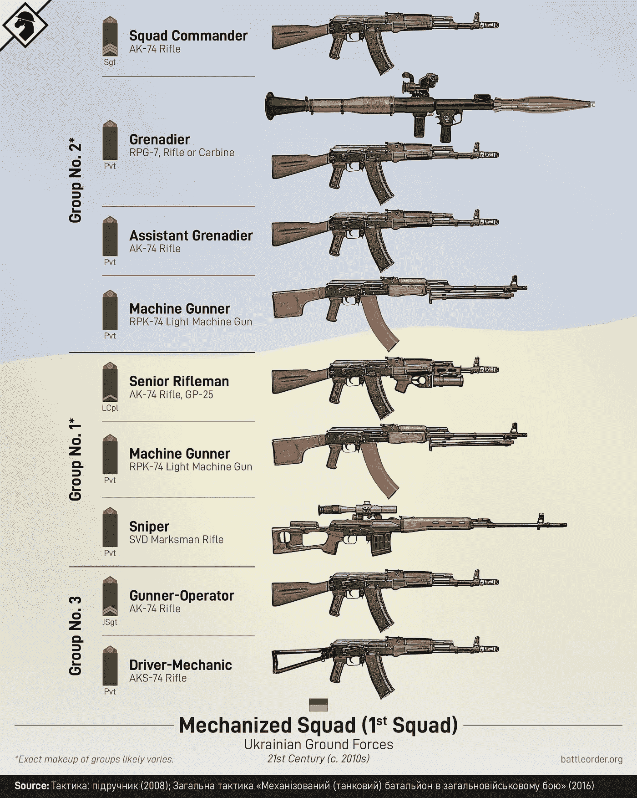

# 战争中集中决策的弱点

> 原文：<https://medium.com/codex/the-weakness-of-centralized-decision-making-in-war-f2b28f5cd4cc?source=collection_archive---------2----------------------->

## 使用社交网络分析来可视化俄罗斯入侵乌克兰是如何凸显中央网络的一个严重缺陷的

许多军事分析家、专家、权威人士，甚至像道格拉斯·麦格雷戈这样的前军人都预测乌克兰将在 2022 年 2 月 24 日俄罗斯入侵后的几天*内沦陷。它没有。自全面入侵以来，俄罗斯已经遭受了三次重大的耻辱性失败(基辅、哈尔科夫和赫尔松)。截至 2022 年 12 月，战争已进入第十个月。这么多“专家”怎么会犯如此令人尴尬的错误？一切都与数据有关。*

*数据及其分析在决策和意见形成中无处不在。快速浏览一下乌克兰/俄罗斯战争背景下的数据就能说明问题。[这篇文章](https://www.thesun.co.uk/news/17758188/how-big-is-the-russian-army/)称，与乌克兰相比，俄罗斯的军事力量“压倒性的强大”。俄罗斯注定会赢得这场战争，因为它拥有更多的一切。数字很精确。数据没有说谎，但它们并不完整。俄国人带着一个严重的劣势参战:决策。*

## *俄罗斯力量结构的历史背景*

*现代俄罗斯军队源于苏联红军，并从中继承了许多方面。其中一个方面是一种模式，在这种模式中，军官，而不是军士，是主要的小单位领导人和培训者。刚从俄罗斯军事学院毕业的新中尉们被立即要求训练和维持排里的纪律。俄罗斯军官扮演的角色类似于美国陆军排长和排长的混合角色。*

**

*2020 年在基辅拍的一张照片。前苏联的伤痕随处可见*

*俄罗斯采用混合征兵模式。一定年龄的男性在军队服役一年并接受训练，之后他们返回社会。在一场全面的冲突中，应征士兵被全体*动员*(据称)具有军事价值的技能。俄罗斯军队中还有一支由“合同制士官”组成的专业入伍队伍。这些职业士兵不担任应征士兵的领导职务。这些不同类型的入伍人员很少相互交流。合同士官是“扣扳机的人”，或者在一年的服役不足以训练和发展工作所需的高级技能的情况下担任技术角色。应征者从事几乎不需要培训的工作(例如，厨师、司机或商人)。*

## *军事单位作为[社会网络](https://en.wikipedia.org/wiki/Social_network)*

*用最简单的术语来说，网络由顶点(也称为节点)和边组成。在军事单位的上下文中，节点代表单个士兵，边代表他们之间的交互。单位组织决定网络结构。假设我们有一个特定单位的组织，网络和它的相互作用可以用图表表示出来。我将首先绘制一个俄罗斯机械化步兵排[的网络，其组织在 battleorder.org](https://www.battleorder.org/rus-bmp-platoon)网站上有概述。这是图表:*

**

*PC =排长，PS =排长，SC =班长。上面链接的文章提供了更好地理解首字母缩略词所需的所有信息。*

*记住，每个节点代表一个士兵，连接节点的每条边代表它们的交互。节点的大小基于它们的*度，*，它是节点的相邻边的数量。边的宽度基于它们的*介数*，这是一种测量节点对网络中的通信有多“重要”的计算方法。该图展示了俄罗斯机械化步兵排的骑乘队形。该网络由四个子网络组成，代表三辆 BMP 车辆及其乘员，以及由排长(PC)和两名班长(SC)领导的步兵分队。你注意到图表中的什么了吗？高度集中在排长身上。因此，俄罗斯谚语“指挥官去哪里，单位就去哪里。”由于缺乏实质性的士官领导，俄罗斯的单位比美国的小，以方便军官的指挥和控制，从而导致其更集中的形式。现在为了比较，让我们看一下美国陆军机械化步兵排的网络，[其组织也在 battleorder.org](https://www.battleorder.org/us-bradley-platoon)上有所概述。*

**

*PL =排长，PS =排长，BC =布拉德利指挥官，SL =班长，TL =小组长*

*关于这个图表，你注意到了什么？图表显示了排在一个安装的编队中，意味着他们在布拉德利战车(bfv)中。每个子网络是一个 BFV 和它的船员。美国编队有一名军官，排长(PL)，以及一系列士官和士兵。编队更广泛，但只需要一个军官，因为有强大的士官领导。该网络作为一个整体远比俄罗斯同行分散。同样，节点大小基于*度*测量，边宽基于*介数*测量。在这个网络中，你在哪里看到最粗的边？它们来自美国编队的班长，而最粗的边来自俄罗斯编队的排长。美国模式在适当的时候将决策权下放到最底层。美国的模式要求士官成为主动的领导者和技术专家。俄罗斯模式需要应征入伍的士兵成为各自领域的专家，并依赖军官进行领导、训练和决策。*

# *战斗中集权的含义*

*在陆军环境中，网络的强度取决于它能够承受冲击并持续有效运行的程度。再看一下美军排的图。如果 PL 伤亡不能战斗，网络会怎么样？副排长(PS)指挥整个排，最高级的队长(TL)控制 PL 的 BFV。网络因冲击而显著退化，但其组织允许它保持其功能(尽管不是最佳的)。生成的网络可能如下所示:*

**

*失去 PL 对编队来说是一个巨大的冲击，但是基本的结构会保持。*

*将同样的测试应用于俄罗斯排的图形。当军官遭受伤亡，无法维持指挥和控制时，这个网络会发生什么？类似这样的事情会发生:*

**

*整个事情会变得一团糟，使其在短期内变得无效。该网络将根据士官领导的力量进行改革，这在俄罗斯军队中是不可靠的，因为领导是军官团的唯一权限。如果有一个强有力的排长或班长，这个网络将会改革成有凝聚力的东西。如果没有人愿意承担官员的责任，整个网络可能会陷入混乱。这个网络不能适应它运行的环境。*

## *乌克兰的军事复兴*

*乌克兰军队也是 1991 年独立后苏联红军的衍生物。2014 年俄罗斯吞并克里米亚和入侵顿巴斯，促使乌克兰人需要实现军队现代化。他们开始接受来自美国、英国和加拿大(以及其他国家)的培训。这种现代化努力的一部分是建立和授权一个坚实的和专业的士官队伍。下面是一篇文章中的一段引文，这篇文章概述了一名乌克兰高级士官关于他们的后苏联模式如何在战争中证明了决定性优势的想法:*

> *“武装部队的士官们不等上面的指示，就主动”进行“独立的小规模行动”，并“独立而机智地”行动*

*以下是乌克兰机械化排中步枪班的等级结构图:*

**

*[这是图片的链接。](https://www.battleorder.org/ua-graphics)*

*在士官的带领下，这个班有一个明确的等级制度。实际上，乌克兰军队网络类似于之前描绘的美国编队。俄罗斯的网络高度集中。在军事行动中依靠军官作为其部队的联络点使俄罗斯人处于劣势，即使他们拥有“压倒性多数”的力量，因为信息的流动要慢得多。因此，俄罗斯部队无法像乌克兰部队那样迅速自信地做出决定。任何有战斗经验的人都明白快速决策是无价的。拖延有失去主动权的风险。此刻的成功需要行动的暴力，而不是请求许可或等待行动的命令。*

# *俄罗斯的回应*

*俄罗斯如何应对这些挫折？这里有一段引言可以提供一些见解:*

> *“他们没有用武力镇压我们，而是把愤怒发泄在手无寸铁的人民身上。杀害老人、妇女和儿童，毁坏房屋，焚烧庄稼。”*

*这句话不是乌克兰政治家或支持者的推文。这是大约 1984 年苏联阿富汗战争期间阿富汗圣战组织的指挥官艾哈迈德·沙赫·马苏德。马苏德的一名副手阿塔·穆罕默德·努尔认为，苏联对村庄的轰炸会激怒阿富汗民众，削弱苏联的控制(事实确实如此)。在马苏德发表这些评论的十年后，俄罗斯人在第一次车臣战争中对其平民实施了焦土战略。苏联-阿富汗战争和车臣战争是俄罗斯作战力量不足以处理分散的武装部队的例子。俄罗斯的手段是派遣更多的人投入战斗(绞肉机)并攻击平民，以削弱他们在战争中对俄罗斯的支持。截至 2022 年 12 月 16 日，俄罗斯正在对乌克兰平民实施同样的焦土策略。*

* [## 俄罗斯导弹袭击了乌克兰，摧毁了电力，使整个国家处于空袭之下…

### 周五早上，俄罗斯对乌克兰发动了新一轮导弹袭击，整个国家都处于空袭警报之中…

www.cnn.com](https://www.cnn.com/2022/12/16/europe/ukraine-russia-missile-strikes-friday-intl/index.html) 

# 最后的想法

军事网络中的集中化问题并不是一个原创的想法。斯坦利·麦克里斯特尔将军明白它在伊拉克战争中的重要性。这里引用了一篇文章中的一段话，关于他和他对网络决策的想法:

> 军队和商业组织的旧组织模式是，决策者在层级的顶端，实干家在底端，接受思想家的命令。但麦克克里斯托说，这种方法在一个快速变化的世界里行不通，在这个世界里，不仅要把事情做好，而且要足够快地把事情做好以赢得胜利。

本文概述的网络问题在战争背景下只是一个小变量。然而，它仍然是至关重要的，因为许多人在做预测时应该在他们的分析中考虑到它。这并不是说没人理解这个问题([将军马克·赫特林](https://twitter.com/MarkHertling?s=20&t=he8vQDtxnuwWYUWpJ8-FxQ)理解)。战斗中的集中决策是僵尸战术，砍掉脑袋，整件事就死了。俄罗斯军队更像僵尸，而不是不久前被吹捧的世界第二强军队。

## 笔记

我用 r 中的 igraph 包创建了本文中的图表。如果你想看一些样本代码，[点击这个链接](https://gist.github.com/BatonVatrushka/c3011785f5b21a01693f1fd3eccf081b)。

## 参考

陆军部，Grau，L. W .，& Bartles，C. K. (2019)。俄罗斯的战争方式:俄罗斯地面部队的力量结构、战术和现代化。独立出版。

费弗(2010 年)。*伟大的赌博:苏联在阿富汗的战争*(再版)。哈珀常年。*