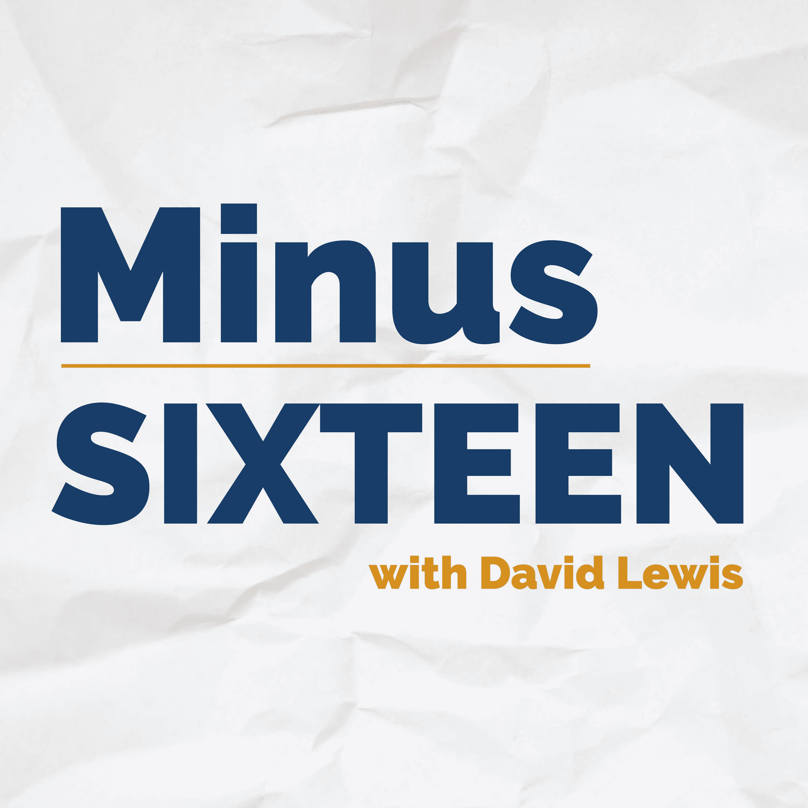

# 网站难题

> 原文：<https://medium.com/codex/the-website-conundrum-e8a309163f43?source=collection_archive---------12----------------------->

## 试图找出最佳路线

当我还是个孩子的时候，计算机课，当时是这么叫的，确实是一件非常新的事情。奇怪的是，它们一点也不吸引我，但我还是尝试了一下。这是极其乏味的。我在参加的考试中取得了一个 OK 的成绩，但只是通过一点创造性的外包…换句话说，在 IBM 找一个程序员(是的，我们可以追溯到那个时候！)替我做功课！

把它移到现在的时代，哦，天哪，我真希望我能看到未来，并意识到它将成为我和我们生活的一个重要部分。后知后觉的好处，嗯？

所以，对于我目前的困境；网站和向前发展的最佳平台。忍耐一下——我会尽力解释的。

## 全新的网站

当我开始建立这个新的 **talkingtech** 品牌时，我从一开始就知道我需要得到这个品牌。这属于我作为平面设计师的技能范围。我知道这个品牌需要品牌身份、颜色和字体，以便立即识别。除此之外，我还需要一个与这个品牌一致的 Twitter 账户，一个播客，一个博客，更重要的是，一个网站和域名。

网站是我的一个主要弱点。我从未真正“感受到爱”。在我的其他生意中，回到几年前，我让他们为我建造。它们从来都不合我的口味，似乎总是要花很长时间，很少或根本没有个性，而且还花了一大笔钱。

所以，在最近的时间里，我采取了拖放的方法，为了充分披露，我已经为三个或四个不同的品牌使用了 Wix now。我对他们也没什么不好的。快速，便宜，很少或没有以前的网站建设经验的要求。此外，在我需要支持的时候，他们总是在我身边。作为参考，我用了一个周末的时间建立了我的 talkingtechandaudio.com**站点(我承认，我说了一些脏话！).**

**那么，为什么我的脑海中会出现我是否应该改变的问题呢？我有计划，很多关于这个品牌的计划，我需要一个密室，一个网站，来支持这些野心。让我们继续浏览我的需求和愿望清单。**

** [## apple Music v Spotify…胜者是？

### 音乐流媒体大战——如何选择

medium.com](/@Davidtalkingtech/apple-music-v-spotify-the-winner-is-8968e7c739a9)** ****

## **易用性**

**Wix 是模板驱动的，很像这个领域的另一个巨头 Squarespace。Wix 编辑器使得将各种现成的格式拖放到您的站点变得非常简单。如果你正在寻找更多的功能，他们也有自己的应用程序商店，你会发现准备使用音频和视频播放器等。**

**扩展和插件是 WordPress 的代名词。当然，它们使用起来并不那么直观，我认为有些知识会派上用场。他们会随着时间的推移而改进，但截至目前，由于我的知识有限，WordPress 仍然让我有点害怕。我应该担心吗？**

## **搜索引擎优化**

**在谷歌上被找到很重要，但奇怪的是，这不是我的首要目标。我想，我的大部分流量将来自我的 CTA(视频或播客中的行动号召)。但是，被发现会很方便！Wix 在这方面做得很好，让你能够添加和编辑图片 alt 文本(谷歌查看的图片背后的措辞)、页面标题甚至 URL。WordPress *是*更全面，因为它可以访问大量超级强大的插件，如 Yoast SEO。在我看来，它们之间没有太大的区别，但是我认为 WordPress 会在 SEO 上胜出，如果我花一些时间去研究和学习所需的插件的话。**

****** [## iOS 15.4——你激动吗？

### 目前，仅处于测试阶段，但很快就会出现在你身边的 iOs 设备上！

medium.com](/codex/ios-15-4-are-you-excited-886be765138c)** 

## **博客**

**如果你正在阅读这篇文章，你会意识到，博客已经成为品牌的一个非常重要的部分，我非常喜欢它，我的网站需要支持它。Wix 很简单，但在这方面很基础。当然，我可以添加图片和图形，但除此之外，我是有限的。让我感到沮丧的一个地方是，我不能直接上传到我的 Wix 博客页面。我用尤利西斯写作。这是一个非常棒的写作工具，我建议你看一看。在它里面，我可以直接发布到 Medium，但是要把它放到*我的*站点，我首先必须创建一个文本文档*，然后*复制并粘贴到我的 Wix 站点。非常非常乏味而且时间效率低下。对我来说，至少我认为，前进的道路将是用尤利西斯写作，发送到 WordPress 网站，然后从那里发送，最后，发送到 Medium。这似乎是一个更加无缝和简化的过程。WordPress 是一个卓越的博客平台。它有能力添加标签，投票，类别等。这可能是我转向 WordPress 的一个原因，比其他任何事情都重要。**

## **应用和功能**

**这两家公司都很强大，Wix 的应用商店里有超过 250 个应用。WordPress 上有大量的应用程序，而且几乎每天都在增长。我想说的唯一一点是，第一眼看上去，再一次，一些技术上的知识会非常方便地实现这些，而在 Wix 上，只是简单地，是的，你已经猜到了，只是拖放。**

## **支持**

**失败的人。Wix 一直在一个自己的类与支持永远。据我所知，它甚至比它的直接竞争对手还要好得多。我最近遇到了一个问题，通过在线实时聊天*和*与一位支持人员交谈，这个问题很快得到了解决，他在周日晚上给我回了电话！令人惊叹的服务，他们还设法纠正了问题。由于 WordPress 是开源的，我可以自己保存一些视频和在线教程。我承认，这部分让我担心。我总是努力自己解决困难，你知道这是一件值得骄傲的事情，但这是一个可爱的安全网，知道帮助只是一个电话。**

****

## **价值**

**使用 WordPress，我需要找到我的托管公司，因为 WordPress 不会为我托管网站。很明显，有很多主机，但是在带宽和速度上做出适当的选择是很难的。有了 Wix，您只需提高定价层级；简而言之，你花的越多，你得到的存储空间、速度和带宽就越多。Wix 会为您提供一切服务。我不需要寻找和雇佣开发人员(我仍然认为我至少需要*一些*帮助)，设计和模板都将是我 Wix 包的一部分。**

## **走哪条路**

**我很纠结，真的。到目前为止，我对 Wix 非常满意，我想，对我来说，马上就要做好未来的准备。写博客是我最关心的事情。我需要一个网站来证明我写的博客的所有权，我喜欢 Wix 的更多功能。这周我又和他们的支持者谈了谈，看起来他们可能很快会支持从尤利西斯直接上传到我的网站。这将是向前迈出的一大步。其他领域，我想建立虽然是一个数据库邮寄视频通讯等。我不确定 Wix 中的这个过程有多自动化，尽管它是 WordPress 站点的核心。**

**所以，现在，我将继续使用 Wix 并监控他们的进展和功能。但是，你现在已经足够了解我了，我会在后台忙着阅读、观看和学习更多关于 WordPress 的东西。**

****出发前****

**[**加入我的幕后邮件列表**](https://www.talkingtechandaudio.com)**

****博客原载于 2022 年 2 月 13 日 https://www.talkingtechandaudio.com/blog******。******

********

*******最后一件事……查看并订阅我的 Minus-sixth podcast too 可在 Spotify、Apple Podcasts 和 Google Podcasts too 上获得***[https://podcast . Apple . com/GB/podcast/the-Minus-sixth-podcast/id 1608899642？i=1000550310853](https://podcasts.apple.com/gb/podcast/the-minus-sixteen-podcast/id1608899642?i=1000550310853)****