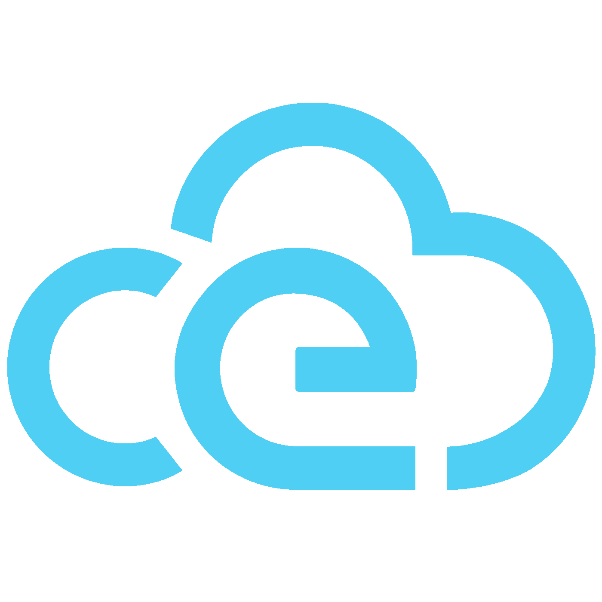
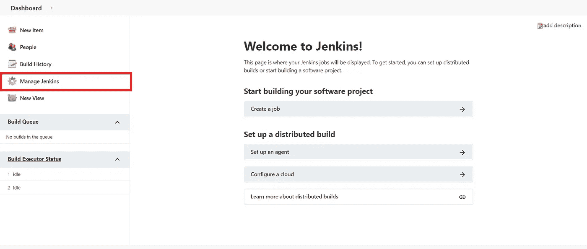
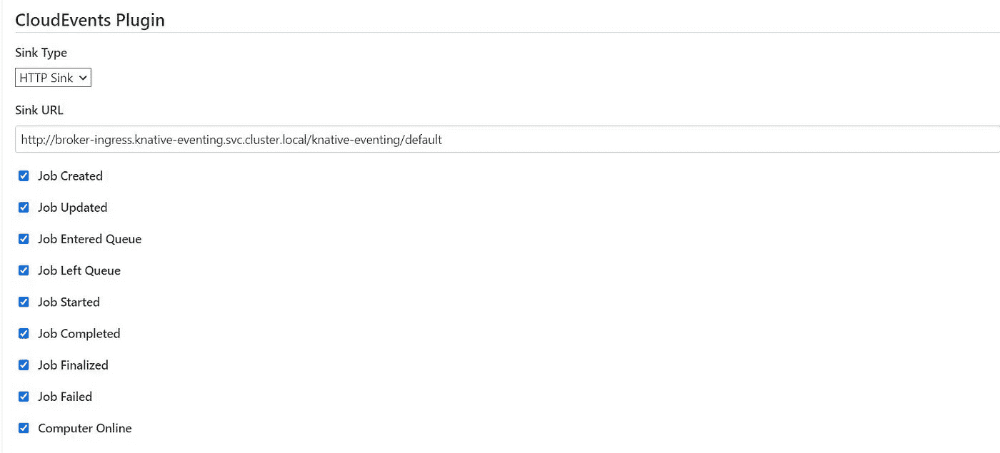
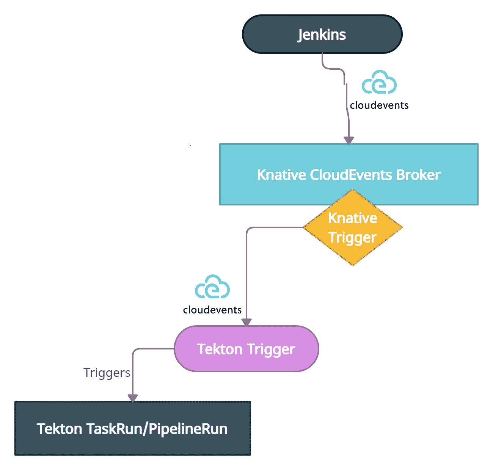

# 互操作性是什么，为什么和如何互操作，Jenkins 是如何互操作的？

> 原文：<https://medium.com/codex/the-what-why-and-how-of-interoperability-and-how-is-jenkins-interoperating-ab68002b663f?source=collection_archive---------16----------------------->

*   **什么**是互操作性？
*   我们真的需要互操作性吗？**为什么是**？
*   那么，**我怎样才能设计出可互操作的系统呢？**

如果这些问题曾经困扰过你，那么这篇文章就是给你的。在这里，我们将讨论技术互操作性的内容、原因和方式。然后，我们将了解 Jenkins 如何在云中实现互操作性，以使跨 Jenkins 和云原生 CI/CD 工具的工作更加容易。作为其中的一部分，我们将看看 **CloudEvents** 规范是什么，以及它在互操作性方面做了什么。🎉最后还有一个小奖励:我将为 Jenkins 介绍新的 **CloudEvents 插件，它是作为 GSoC’21 项目开发的，旨在增强 Jenkins 和 CI/CD 工具之间的互操作性！！！🎊(PS: [***插件***](https://plugins.jenkins.io/cloudevents/) 第一版现在出来了，可以在你本地的 Jenkins 安装中下载！)**

先回答第一个问题:**什么是互操作性？在我回答这个问题之前，我想让你和我玩一个快速的文字游戏。我称之为“破解猜测”。如果我们把这个词，*互用性，*分成两个独立而连贯的词，我们会得到-**


照片由 [NeONBRAND](https://unsplash.com/@neonbrand?utm_source=medium&utm_medium=referral) 在 [Unsplash](https://unsplash.com?utm_source=medium&utm_medium=referral) 上拍摄

*间*和*操作*！互操作性最简单的定义是不同实体一起操作或运行的一种方式。从更广泛的意义上来说，这里的实体可以是两种或两种以上事物共存的任何生态系统。互操作性的一个例子是我们与周围人的交流。我们每天都在使用各种形式的交流方式——声音、文本、图片——在我们的生态系统中进行“互操作”。不同的实体可以进行不同的通信，只要达到传递消息含义的目的。

这如何应用于技术互操作性，主要是云中的互操作性？这与促进交流的想法是一样的，这样系统就可以共存和协同工作。互操作性本质上定义了系统应该能够有效地通信以便协同工作。

既然我们已经理解了互操作性的含义，我们就准备解决下一个问题:**为什么我们需要互操作性？我们能没有它吗？**

> 语言发挥着隐藏的力量，就像月亮对潮汐一样。丽塔·梅·布朗

从第一部分我们了解到，实体需要交流才能共存和协同工作。对于大多数生物来说，这似乎是真的，但有趣的是，对于技术系统来说，这也是真的。大大小小的组织对云原生工具和技术的采用大幅增加。组织正在利用云原生工具完成各种任务，包括构建、测试、交付和管理应用程序。

随着工作负载变得越来越多样化和复杂，组织发现需要使用多种工具围绕生态系统构建应用程序。例如，一个组织可能使用 Terraform 来部署和迭代他们的基础设施，使用 Docker 来封装应用程序，使用 Jenkins 来测试稳定性，使用 Tekton 来交付。正如我们所见，这是一个非常多样化的工具生态系统。从我们对生态系统中合作的理解来看，服务必须能够相互交流。

如今构建的大多数应用程序都使用多种云原生工具来满足其交付和部署需求。这些工具通常是相互依赖的。考虑这一想法的一个非常简单的例子是自动化 CI/CD 管道。一旦 CI 系统完成了新变更的集成和测试，CD 系统就应该交付应用程序的新版本。让我们在这里暂停一下，想想如果两个系统不能相互对话/通信，这个自动化 CI/CD 管道是否还能工作？🙊


[梁杰森](https://unsplash.com/@ninjason?utm_source=medium&utm_medium=referral)在 [Unsplash](https://unsplash.com?utm_source=medium&utm_medium=referral) 上的照片

我们希望在云中实现互操作性，这样我们就可以在不同的用例中真正利用云原生工具所提供的能力。作为一名开发人员，我希望我的系统能够智能地协同工作。如果构建成功，我不想手动部署我的应用程序，或者如果测试失败，我不想取消发布构建工件。我更希望这些系统能够互操作，这样我就可以用最少的努力完成所有这些任务，而不会损失质量。显然，沟通是实现这一目标的关键！这就是我们需要互操作性的原因。

有了“是什么”和“为什么”的答案，让我们再来一次互操作性之旅，了解互操作性的 **' *如何*'**。我们可以在系统中实现两种形式的互操作性:

*   直接互操作性
*   间接互操作性。

我永远不会厌倦现实生活中的例子，所以这里有一个😃


照片由 [Renate Vanaga](https://unsplash.com/@whynottogoforit?utm_source=medium&utm_medium=referral) 在 [Unsplash](https://unsplash.com?utm_source=medium&utm_medium=referral) 上拍摄

这是一个例子，一群交易者在一个市场里，想要彼此做生意。也许是一个出售特制陶罐的市场😍。一些商人可能在卖生粘土，另一些可能在卖颜料。这个想法很简单:这些交易者想互相买卖原材料。然而，它不是一块🍰。所有从事这一行业的商人都说一种与众不同的语言。为了做生意，商人能够互相交流是很重要的。

卖生粘土的交易者想出了一个惊人的主意，与计分工具交易者交谈。生陶土交易商雇佣了一名翻译，他既懂生陶土交易商的语言，也懂计分工具交易商的语言。这样，这两个交易者之间的交流通过这个翻译器进行。两家公司之间的业务进展相当顺利。惊人的想法，的确！？嗯…

虽然原料粘土交易者已经能够通过她雇佣的翻译与评分工具交易者交流和做生意，但不能保证这个翻译会帮助原料粘土交易者也与市场上的其他交易者做生意。这个交易者可能需要从不同的交易者那里购买花盆的颜色。她雇佣的翻译很可能无法帮助她与其他交易者交流，因为每个交易者都使用一种独特的语言。因此，为了保持业务运营，原料粘土交易商将不得不投入更多的投资，雇佣更多懂多种语言的翻译，帮助我们的原料粘土交易商开展业务，而不仅仅是计分工具交易商。

这种促进交流的方法被称为直接互操作性。之所以这么叫，是因为正如我们所看到的，粘土商人不得不雇用一名翻译或一名服务人员直接与信息的接收者交流。就云中的技术互操作性而言，当服务必须设计特定的解决方案来与另一个服务进行对话时，我们会看到这种互操作性，并且该解决方案可能会(也可能不会)对其他服务有用。代理和客户端插件是直接互操作性的一些例子，其中特定的解决方案被设计来实现互操作性。然而，这种解决方案作为通用解决方案可能并不可行，从而增加了实现多个解决方案以与多个工具进行互操作的需求。不一定是最令人兴奋的，而且管理多个解决方案的额外成本显然会令人痛苦。

幸运的是，有一种更简单、更快捷、更好的方法可以做到这一点。那就是*间接互操作性*！想象一下，如果陶罐市场上的商人能找到一种他们都能使用的共同语言来相互交流，那该有多容易。不管他们说什么语言，所有的商人现在都理解这种通用语言，这实质上是一种与他人做生意所需的新的商业语言。新加入陶罐市场的交易者必须懂得这种语言，以便有效地与他人交流。这是一次性的解决方案。我提到容易了吗？

这就是间接互操作性，因为不再需要维护一对一的直接通信解决方案。云中的间接互操作性是通过定义所有相关工具都能理解的通用标准规范来实现的。这样，开发人员不必设计和维护特定的解决方案来与每个服务对话，而是让他们的工具支持并理解这种公共语言。一旦实现，它可以很好地与使用这种通用语言进行通信的其他系统一起工作。看看这能让设计可互操作的系统变得多么容易？

这正是[***cloud events***](https://cloudevents.io/)在多工具、云原生基础设施中帮助实现的。CloudEvents 是行业采用的标准规范，以通用格式描述事件。规范在 [***CNCF***](https://www.cncf.io/) 下开源。

CloudEvents 背后的想法是标准化不同服务之间事件的发出和消费方式。对于哪个服务可以发出或使用符合 CloudEvents 的事件没有限制。

*   *所有服务都用不同语言编写？*没问题！由于 CloudEvents 描述了一种通用的事件格式，所以用不同语言编写的服务之间的互操作性非常容易。
*   *什么样的事件可以遵循 CloudEvents-spec 有限制吗？*完全没有！CloudEvents 只是一个为事件定义通用格式的规范。事件可以是任何事情:分支创建/合并/删除事件；测试成功事件；测试失败事件(😢);生成完成事件；一个 DB 事务事件；请求/响应事件。真的什么都行！
*   *如果一些服务在本地，一些在云上，是否可以使用它？CloudEvents 是否意味着服务必须在云上？*您可以将 CloudEvents 用于任何基础设施，这正是有趣的地方！



描述事件的 CloudEvents 规范

> 以通用方式描述事件数据的规范。
> 
> “CloudEvents 是一种以通用方式描述事件数据的规范。CloudEvents 旨在显著简化跨服务、平台等的事件声明和交付！”-云事件

CloudEvents 彻底改变了服务之间的互操作性。使用 CloudEvents，我们可以将多个服务链接在一起，而无需构建额外的工具来相互通信。每个服务将确切地知道如何读取和/或发出符合 CloudEvents 的事件。实际的事件数据和元数据通常是不同的，但是每个事件的格式是相同的。

我们会很快回到我们的陶罐市场。就像上次我们在那里时一样，所有的业务人员都在用一种共同的语言相互交流。所以，虽然每个交易者可能说的是同一种语言，但他们说的是不同的东西。他们都在交谈的原料粘土交易者明白他们在说什么，但她必须以不同的方式处理每个对话，并相应地与他们做生意。

类似地，一组使用 CloudEvents 兼容事件的服务都将使用相同的事件格式。但是，根据事件的类型或事件的来源，每个事件都需要进行不同的处理。这将是接收器的工作，它将决定如何做到这一点。

## 我可以用 CloudEvents 构建什么？

任何可以围绕事件构建的系统都可以用 CloudEvents 来构建。正如我们前面看到的，任何一个动作的发生都可能是一个事件！一些支持 CloudEvents 的开源云原生集成包括:

*   [](https://knative.dev/docs/eventing/)
*   *[*泰克顿管道*](https://tekton.dev/)*
*   *[*蓉城事件*](https://github.com/argoproj/argo-events)*
*   *[*法鲁克*](https://falco.org/)*
*   *[](https://debezium.io/)*
*   **[*Keptn*](https://keptn.sh/)**
*   **[*OpenFaaS*](https://docs.openfaas.com/)**

**范围相当广泛的工具，用于事件、CI/CD、运行时威胁检测、数据流等目的。通过使用 CloudEvents 规范，在这些工具之间构建一个可互操作的、事件驱动的系统是非常容易的。如果一个事件从 Falco 发送到 Tekton、ArgoEvents、Kept 和 OpenFaas，我们将不必改变 Falco 的事件来构建特定于接收方的事件。类似地，我们不必改变任何接收者来接收特定于发送者的事件。接收者要做的就是浏览事件，并决定如何处理它。**

# **🔴前方有好消息**

## ****🎉 🎊 🎈** Jenkins 现在也支持 CloudEvents 了！！！**🎉 🎊 🎈****

**多酷啊！**

**Jenkins 是一个非常强大的开源 CI 工具，拥有一个强大的社区来支持这种美丽。作为一个云原生 CI 工具，Jenkins 一直支持与其他工具和服务的集成。然而，这些集成中的大多数都需要我们前面谈到的直接互操作性机制。想象一下，如果我们试图用 Jenkins 和多种云原生工具设计一个事件驱动的系统，那会变得多么复杂！**

**几个月前，CDF 社区的成员提出了一个惊人的想法，可以增强 Jenkins 的互操作性。想法是将 Jenkins 与 CloudEvents 集成在一起。该项目的目标是让 Jenkins 与互操作性的新标准兼容，这也意味着更容易与符合 CloudEvents 的工具集成。**

**该项目发展为[***CloudEvents-Jenkins 的插件***](https://www.jenkins.io/projects/gsoc/2021/projects/cloudevents-plugin/) ，它将允许用户将 Jenkins 配置为源和接收器，在一组云原生的、兼容 CloudEvents 的工具中发射和消费 cloud events。该项目作为 GSoC'21 项目下的 [***连续交付基础***](https://cd.foundation/) ***。*** 从 6 月份开始，我就一直在和非常棒的导师和 CDF 社区成员一起工作，通过 CloudEvents 插件扩展 Jenkins 以支持 CloudEvents。为 Jenkins 检查 CloudEvents 插件的 [*GitHub Repo。*](https://github.com/jenkinsci/cloudevents-plugin)**

**截至目前，该插件支持将 Jenkins 配置为源，发出 CloudEvents。我们还致力于扩展对 Jenkins 的支持，将它作为一个 sink，使用来自不同来源的 CloudEvents。当我们谈到 Jenkins 作为一个源时，这意味着对于 Jenkins 内部发生的事件，它将发出一个符合 CloudEvents 的事件，并将其发送到用户将在插件内部配置的接收器。**

**虽然 CloudEvents 支持各种协议绑定(行业标准、开源以及特定于供应商的)和事件数据的序列化格式( [*在此阅读更多信息*](https://github.com/cloudevents/spec/blob/v1.0/primer.md) )，但对于插件的初始阶段，我们选择了带有 JSON 序列化的 HTTP 协议绑定( *PS:我们还设计了一个 PoC，通过 Kafka 从 Jenkins 发送 CloudEvents，它工作得非常好☺️* 。**

**关于间接互操作性，CloudEvents 和 Jenkins 的 CloudEvents 插件，最伟大的事情是系统被不可知论地设计，或者彼此独立。詹金斯作为一个源是接收器/接收器不可知论者。只要支持相同的协议绑定，任何接收器都可以接收 Jenkins 发送的事件。**

**让我们深入了解一下，首先看看如何在 Jenkins 中配置 CloudEvents 插件**

****

**第一步:管理詹金斯**

****

**步骤 2:配置系统**

****

**第三步:奇迹发生的地方🎆**

1.  **选择仪表板左侧的**管理詹金斯**选项。**
2.  **然后在管理 Jenkins 页面上，选择**配置系统**。我们将在这里添加该插件所需的所有配置。**
3.  **当您进入配置系统页面时，向下滚动到 **CloudEvents 插件**部分。在这里，您将配置一个接收器/接收器，您选择的所有事件将以 CloudEvents 格式发送到该接收器。这里有几项内容需要配置:**

*   ****接收器类型** —下拉选择用于发送事件的协议。目前该插件支持 HTTP sink，并且正在与 Kafka sinks 一起测试。**
*   ****接收器 URL —** 事件将发送到的接收器的 URL。**
*   ****您希望接收器/接收器接收的事件**。**

> **注意:这个插件也支持 Config-as-Code，使得 Jenkins 作为源代码所需的配置变得更加容易。**

****

**克里斯蒂娜·特里普科维奇在 [Unsplash](https://unsplash.com?utm_source=medium&utm_medium=referral) 拍摄的照片**

**插件目前支持 Jenkins 中不同类型的事件。使用当前的 HTTP 绑定，每次 Jenkins 内部发生每个 select 事件时，都会向已配置的 sink 发出一个 post 请求，请求中包含符合 CloudEvents 的事件数据和元数据。这个插件使用 CloudEvents 的二进制格式来发出事件，事件数据存储在消息体中，事件属性作为消息元数据的一部分存储。**

> **注意:到目前为止，Jenkins 本身并没有实现瞬时故障，而是与 Knative Eventing 等其他工具一起实现了一种路由请求的容错方式。我们将看到我们如何使用它。**

**下面是作业进入队列事件的 HTTP 请求头的样子:**

```
**ce-specversion: 1.0
ce-id: c42d1f19-9908-43da-9a7f-404405c52b60
ce-type: org.jenkinsci.queue.entered_waiting
ce-source: job/test2**
```

**以下是这种进入等待事件类型的事件数据示例:**

```
**{
  "ciUrl": "http://3.101.116.80/",
  "displayName": "test2",
  "entryTime": 1626611053609,
  "exitTime": null,
  "startedBy": "shruti chaturvedi",
  "jenkinsQueueId": 25,
  "status": "ENTERED_WAITING",
  "duration": 0,
  "queueCauses": [
    {
    "reasonForWaiting": "In the quiet period. Expires in 0 ms",
    "type": "entered_waiting"
    }
  ]
}**
```

**这个插件支持特定于节点的事件，特定于任务的事件，特定于构建的事件，并且我们将会增加对其他类型事件的支持。每个受支持的事件都有特定格式的事件负载/数据和事件元数据，以使事件符合 CloudEvents。**

**我的天啊。那是相当多的事情要经历。但是请继续，我坚持，因为现在我将展示互操作性 IRL😄 💃。**

**当我们在开发 CloudEvents 插件(CDF 社区中的一个特殊兴趣小组)时， [***Events-SIG 团队***](https://github.com/cdfoundation/sig-events) 已经在为不同的云原生、兼容 CloudEvents 的工具之间的互操作性设计 PoC。他们一直在测试 Tekton 和 Keptn 之间的互操作基础设施，使用 Knative Eventing broker 处理网络和其他瞬时故障的逻辑。在 CDF [***此处***](https://github.com/cdfoundation/sig-events/tree/main/poc) 查看 Events-SIG 团队开发的 PoC。Events-SIG PoC 启发我们使用其他支持 CloudEvents 的工具来测试 CloudEvents 插件。这将是我们的试金石，以确保插件有助于实现我们的目标，以更容易的方式增强互操作性。PoC 脚本可以在插件的[***GitHub repo***](https://github.com/jenkinsci/cloudevents-plugin)中找到。**

**对于 Jenkins CloudEvents 插件 PoC，我们在 Kubernetes 集群中安装了 Tekton、Knative Eventing 和 Jenkins。让我们更深入地了解一下失败的事件经纪人。**

> **“代理是 Kubernetes [定制资源](https://kubernetes.io/docs/concepts/extend-kubernetes/api-extension/custom-resources/)，它定义了一个事件网格，用于收集一个[云事件](https://cloudevents.io/)池。代理为事件进入提供一个可发现的端点`status.address`，并为事件交付提供触发器。事件生产者可以通过将事件发送到代理的`status.address.url`来向代理发送事件。**
> 
> **- Knative**

**除了在生产者和消费者之间路由事件之外，Knative Eventing 还有助于在代理上设置触发器。每个触发器可以定义一个或多个过滤器，生产者将根据这些过滤器接收事件。例如，生产者可以被配置为只接收 ce 类型的事件(一个自定义的 CloudEvents 属性)*enter _ waiting。***

****

**对于 PoC，Jenkins 的 CloudEvents 插件通过 HTTP post 将符合 CloudEvents 的事件发送到 Knative Broker，后者默认情况下与 CloudEvents 一起工作。在 Knative CloudEvents broker 之上，我们还增加了一个[***Knative cloud events 触发器***](https://knative.dev/docs/eventing/broker/triggers/) 。**

**Knative 触发器允许基于 CloudEvents 属性对接收到的事件设置过滤器。添加 trigger 后，当且仅当事件在 Knative Trigger 中设置了属性时，才会将事件发送给生成器。在 PoC 中，Knative 触发器设置过滤器:`ce-type:org.jenkinsci.queue.entered_waiting` 。**

**任何匹配该过滤器的事件都将被发送到一个[***Tekton event listener***](https://github.com/tektoncd/triggers/blob/main/docs/eventlisteners.md#eventlisteners)，它公开了一个接收器，事件将从该接收器路由到 Knative Broker。我们还在 Tekton EventListener 上定义了 Tekton 触发器。Tekton 触发器允许用户指定当接收到某个事件时他们想要采取什么样的动作。PoC 还使用 Tekton 中的 TriggerBinding，它允许从事件负载或事件属性中提取值，并将其传递给 Tekton 中的指定操作。在 PoC 中，Tekton EventListener 一收到事件，TriggerBinding 就会从事件有效负载中提取值，并使用该值触发 Tekton TaskRun。**

**有趣的是，我们不需要修改 Jenkins 发送事件的方式，就可以用 Knative 和/或 Tekton 创建一个可互操作的系统。只需几个步骤，您就可以非常轻松地在您的生态系统中添加更多工具，这些工具在彼此之间推动运营。这就是 CloudEvents 和 Jenkins 的 CloudEvents 插件的强大之处。**

**在经历了一段漫长而又充满乐趣的旅程后，我们终于看到了这篇文章🎈。CloudEvents 插件的第一个版本现已发布，可供您试用！我们希望听到您的反馈和想法！如果你对插件有什么想法，或者有什么想分享的，请在 CloudEvents 插件❤️的[***github repo***](https://github.com/jenkinsci/cloudevents-plugin)开题！这个插件仍在开发中，我们将继续努力使互操作性更有效和更容易！保重！😄**