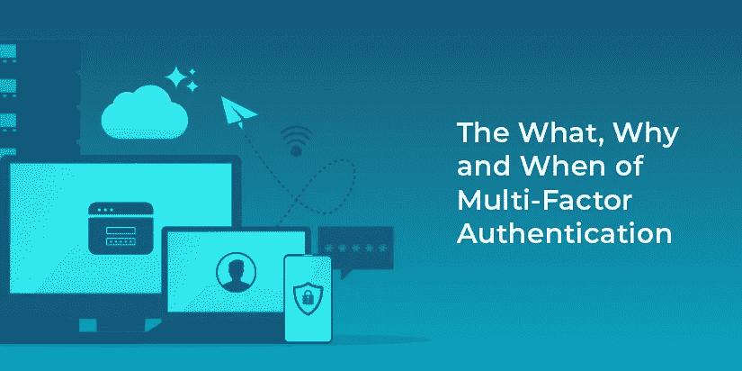

# 多因素身份认证(MFA)的内容、原因和时间

> 原文：<https://medium.com/codex/the-what-why-and-when-of-multi-factor-authentication-mfa-f4bd071655e0?source=collection_archive---------14----------------------->

随着我们越来越多的生活和数据转移到网上，多因素身份认证(MFA)对于帮助保护我们的帐户安全变得越来越重要。作为用户，您应该对具有重要数据的帐户启用 MFA。但是作为一名开发人员或软件创建者，你需要对 MFA 有更深的理解，为什么它很重要，什么时候需要它。

# 什么是多因素身份认证(MFA)？

当用户进行身份验证时，他们提供了身份证明。

这种类型的证明有几种不同的类别:

*   他们所知道的。例如，一个密码。
*   他们所拥有的，例如来自用户拥有的设备的代码。
*   它们是什么；类似指纹的东西。
*   它们在哪里，例如在专用网络上。

这些证明方法中的每一种都被称为“因子”。因素必须保密，不得共享，以便对用户进行身份验证。

多因素身份认证最好理解为需要两个或更多因素才能进行身份认证。

MFA 是双因素身份验证(2FA)的超集。对于 MFA，可能需要任意数量的证明因素。对于 2FA，因子的数量限制为两个。

多重身份认证不仅仅适用于在线用户帐户访问。当你去银行从保险箱里取出文件(或者钻石，如果你是一个詹姆斯·邦德恶棍的话)，你通常需要一把钥匙(你有的东西)和一个签名(你是什么东西)。如果你的签名不匹配，你也可以提供一个政府颁发的身份证(另一个你有的东西)。

然而，这篇文章的重点是在线帐户访问环境中的 MFA。由于这一点和密码的流行，这篇文章将假设你的用户的第一个因素是密码。

让我们更多地讨论一下，作为一名开发人员，您为什么应该支持并鼓励您的用户使用 MFA。

# 为什么要用 MFA？

构建安全、可用的系统的一个基本部分是确保只有授权的人员和软件代理才能访问它。身份验证和授权对于实现这一目标至关重要，身份验证确保用户就是他们所说的那个人，授权控制访问。考虑一个被入侵的帐户会对您的系统和用户数据造成什么影响，然后思考 MFA 如何帮助防止这种情况。

如果您的用户只提供一个身份验证因素，它可能会被坏人窃取。该参与者现在拥有与用户相同的系统访问权限。

用户知道的秘密，比如密码，经常被窃取。虽然系统可以通过[检测被盗密码](https://fusionauth.io/learn/expert-advice/security/breached-password-detection/)来帮助防止未经授权的访问，并且用户可以通过实践良好的密码卫生来保护自己，但需要另一个因素来增加系统上用户帐户的安全性。微软的研究人员发现，如果使用 MFA，帐户被破坏的可能性[【99.9%】](https://techcommunity.microsoft.com/t5/azure-active-directory-identity/your-pa-word-doesn-t-matter/ba-p/731984)。

实施 MFA 通常是与您的用户合作。某些形式的 MFA 对于系统开发人员来说更容易实现。其他的则需要用户付出更多的努力。

# 用户体验和账户安全之间的平衡

尽管 MFA 更安全，但作为开发人员，在要求所有系统访问都使用它时要小心。在这种情况下，您正在从事一项基本的工程实践:进行权衡。

您希望用户登录体验尽可能流畅，同时尽量减少帐户被接管的机会。认证过程中的摩擦会惹恼你的一些用户。他们使用你的应用程序来完成工作，而不是因为热爱你的安全登录过程。

当您讨论 MFA 要求时，请倾听您的用户。你不想让他们绕过 MFA。同时，他们可能需要了解这些好处。你们中有多少人知道仍然在便利贴上写下密码的人？我知道。

承认并解决用户登录体验的摩擦和帐户泄露风险之间的平衡。请在您的系统保护的数据环境中这样做；不同的数据需要不同级别的保证。如果你的网站允许用户对猫图片投票，MFA 可能永远都不需要。另一方面，如果你的网站让用户在网上向完全陌生的人转账，就需要额外的认证因素。

这些场景在安全性和用户体验范围上处于相反的两端，是否支持 MFA 是相当容易的。当答案不明显时，需要做出更困难的决定。

在哪些情况下，您应该考虑整合多因素身份认证？

# 什么时候我应该要求多重身份认证因素？

作为一名系统开发人员，在某些时候和情况下，您应该对登录者的身份有更高的要求。通常帐户类型是相关的，其他时候是请求的访问，有时是法律要求或公司政策。

# 管理账户

具有较高访问级别的特权帐户应该使用 MFA。

如果滥用或泄露，这些管理员或操作员帐户可能会造成严重破坏。

为了解决这个问题，要求所有管理员帐户都有 MFA。要求定期提供额外的因素，可能在每次登录时。在极其敏感的系统中，对系统的所有更改可能需要多个因素。

# 高价值账户

还有许多高价值帐户，MFA 有助于防止帐户泄露。与前面提到的管理员帐户不同，这些用户帐户在系统中不拥有提升的权限。相反，它们控制数据或允许采取对现实世界有影响的行动。

一个例子是网上银行账户。你不希望用户失去他们的帐户访问权，然后发现有人耗尽了他们的存款。

另一个例子是电子邮件帐户。除了收件箱中经常出现的私人信息之外，这些信息对许多其他系统来说也是一种风险。密码重置解决方案经常发送电子邮件；电子邮件帐户的泄露意味着该用户的所有此类帐户面临风险。

# 冒险的行动

当用户已经通过身份验证，但正在执行危险的操作时，MFA 会提供额外的安全性。这也称为“逐步授权”,因为在请求危险操作时需要额外的因素。例子可能包括:

*   更改密码或用户名
*   零用钱
*   重置密码
*   创建具有提升权限的新用户
*   更改系统设置
*   修改配置会影响其他因素，如用户的电子邮件或电话号码

当请求这样的操作时，系统需要确定请求者。这些行为可能是，而且经常是合法的。但是它们也可以被非法访问用户帐户的人用来巩固接管。

通过使用逐步授权，您可以帮助减轻受损帐户的损害。攻击者可能能够访问该帐户并从中读取数据，但是如果他们没有额外的因素，他们将无法采取会造成更多损害的行动。

# 法律或组织政策

如果您的应用程序被某些组织使用或存储个人身份信息，您可能需要对某些或所有帐户进行多因素身份验证。例如，作为 NIST 风险管理框架的一部分，认证者保证级别 2 要求:[“需要证明拥有和控制两种不同的认证因素……”](https://nvlpubs.nist.gov/nistpubs/SpecialPublications/NIST.SP.800-63-3.pdf)。

然而，有时 MFA 要求并不明确。如果您正在寻求 SOC2 认证，您将需要实施 MFA，尽管在 [SOC“信任服务标准”](https://www.aicpa.org/content/dam/aicpa/interestareas/frc/assuranceadvisoryservices/downloadabledocuments/trust-services-criteria.pdf)中从未提及多因素认证。

来自 SOC 文档的第 CC6.1 节:“在本地或远程访问信息资产之前，识别并验证人员、基础架构和软件”。该文件省略了具体的实施细节。向 SOC2 审计员咨询所需的控制措施。

# 当行动看起来可疑时

一个认证系统有很多关于谁正在登录的信息。在认证期间，提供凭证；最终结果是这个问题的答案:“这个身份验证请求背后的用户是他们所声称的那个人吗？”

一些数据，例如用户名和密码，被明确地提供给系统。但是也有一些有趣的隐含数据，例如:

*   访问的日期和时间
*   连接信息，如 IP 地址和用户代理
*   用户最近登录了多少次
*   该设备以前是否被用于访问该系统

这种隐式数据有助于确定身份验证请求是否合法。例如，如果一个用户从美国访问一个系统，24 小时后又有一个来自德国的相同凭证的请求，那么后者有效吗？有可能，但也有可能来自德国的请求是由于一个受影响的帐户。在这种时候要求 MFA 允许您对奇怪的请求进行额外的审查。

另一个可能需要额外身份验证因素的例子是当用户从新设备或 IP 登录时。流行的 SaaS 应用程序，如 Google 的 GSuite 和 Mailchimp，可以配置为只要求 MFA 在新位置进行初始身份验证。

# 应用 MFA 要求

将 MFA 需求配置放在应用程序的中心位置，以便于修改。此策略配置本身应该受到保护，并且只允许具有最近多重身份认证的特权用户访问。

将其与身份验证系统紧密结合通常是有意义的。关于何时需要 MFA 的选择随着系统的发展而改变。构建了新功能。支持不同类型的用户。

如果您没有组织或用户范围的策略，至少允许用户设置 MFA。这样做可以让有安全意识的用户保护他们的帐户。他们可以评估自己的安全态势，做出明智的选择。例如，一个人可能一生都使用 Gmail 帐户，而其他人可能只是偶尔使用 Gmail 作为一次性电子邮件地址。在前一种情况下，MFA 是有意义的；在后一种情况下，可能不会。

如果您担心受威胁的帐户会对您的系统或用户数据造成什么影响，您应该强烈建议或要求使用 MFA。

*最初发布于*[*https://fusion auth . io*](https://fusionauth.io/blog/2021/04/08/why-user-multi-factor-authentication/)*。*