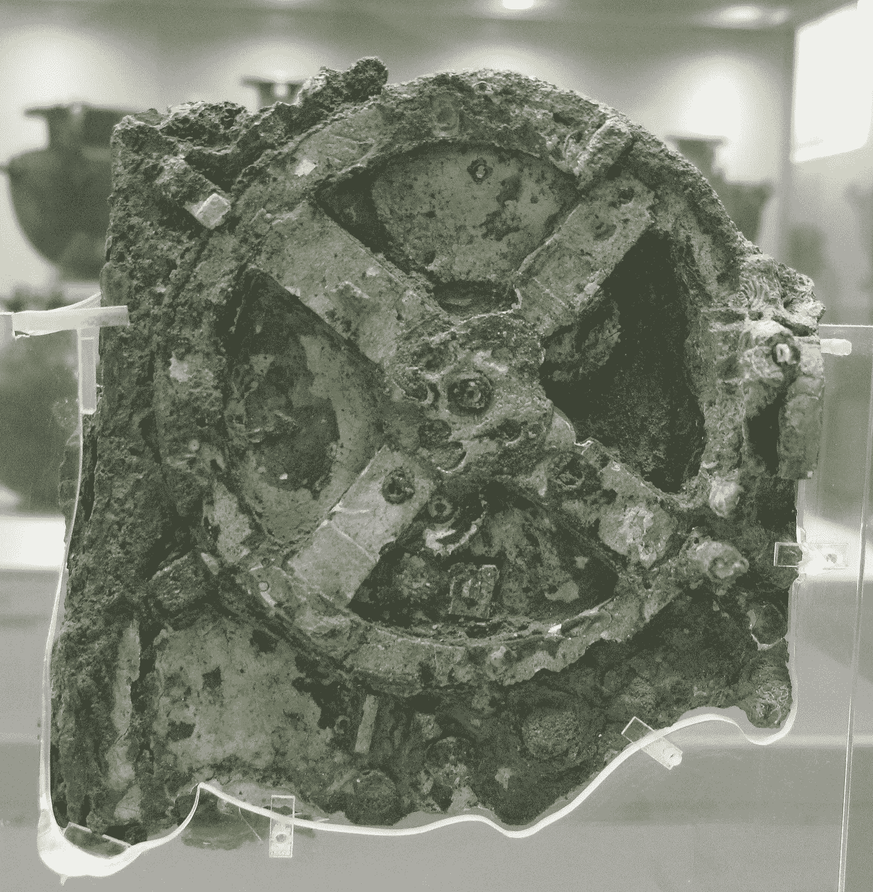

# 世界上第一台计算机:安蒂基西拉机制的故事

> 原文：<https://medium.com/codex/the-worlds-first-computer-the-story-of-the-antikythera-mechanism-7d4465acd8e5?source=collection_archive---------18----------------------->

照片:Tilemahos Efthimiadis，[知识共享](https://en.wikipedia.org/wiki/en:Creative_Commons)

公元前 1 世纪中叶，一艘可能从佩迦门驶往罗马的罗马商船遭遇风暴，在爱琴海水域沉没。大约两千年后，公元 1900 年，一场风暴再次迫使一群海绵潜水员在安提基希拉岛附近寻找避难所，安提基希拉岛是克里特岛和伯罗奔尼撒半岛之间的一个希腊小岛。当风暴平息后，潜水员潜入水中寻找海绵，意外发现了船只的残骸，并被他们在船上发现的众多文物惊呆了。在联系了希腊政府，确保得到教育部长斯皮里宗·斯泰斯的支持后，他们在几个月后返回了。在几个月的时间里，他们在历史上第一次水下考古挖掘中发现了大量的物品——雕像、玻璃器皿、陶器和珠宝。所有的发现都被转移到雅典的国家考古博物馆。

在从残骸中拖出的物品中，有一件由木头和青铜制成的物品，大约有一本电话簿那么大。直到 1902 年，斯皮里宗·斯泰斯在参观博物馆时注意到其中一个机械装置碎片上的齿轮，才引起了人们的注意。大约在 1905 年，德国语言学家阿尔伯特·雷姆研究了这个物体，提出了它是一个天文计算器的理论。1951 年，英国科学历史学家德里克·j·德·索拉·普莱斯开始研究这个装置，并在希腊核物理学家查拉兰波斯·卡拉卡洛斯的协助下，制作了 82 个碎片的 X 射线图像，发表了他们的发现。

X 射线扫描是二维的，显示了齿轮机构结构的扁平图像，只显示了齿轮的部分方面，所以 Price 只能猜测许多齿轮的齿数。尽管有这些问题，普莱斯发现了一组连接的齿轮，通过利用月亮在 19 年中 254 次旋转的关系，计算出月亮在任何特定日期的平均位置。这个装置似乎可以用来预测过去或未来某一天太阳、月亮和行星的位置。这台机器必须根据这些天体的已知位置进行校准，然后用户可以简单地将曲柄转动到所需的时间范围，以查看天文预测。

多亏了普莱斯，这个机制开始揭示它的秘密。

科幻作家亚瑟·C·克拉克对普莱斯的工作印象深刻，并把他介绍给《科学美国人》的编辑丹尼斯·弗拉纳根。弗拉纳根说服普莱斯写了一篇关于这个机制的文章，发表在 1959 年 6 月的杂志上。

2005 年取得了重大突破，当时以天体物理学家迈克·埃德蒙兹(Mike Edmunds)和数学家兼电影制作人托尼·弗里斯(Tony Freeth)为首的研究小组对普莱斯对机制的重建感到不满，呼吁使用更新的技术来推进对机制的理解。他们请求美国惠普公司协助进行高技术摄影成像，并请求英国 X-Tek 系统公司协助进行三维 X 射线成像。

托尼·弗里斯成功说服了 X-Tek 公司的罗杰·哈兰德开发出一种原型机器，用 X 射线照射安提基希拉装置。由于 Antikythera 机械装置极其脆弱，这台 8 吨重的机器必须运到雅典的考古博物馆。当他们到达雅典时，警察不得不清理街道，以便载有 x 光机的卡车能够通过，这台机器有一辆小货车那么大，重达 8 吨。

该团队与国家考古博物馆合作，使用了一种称为反射转换成像(RTI)的技术。RTI 是一种非侵入性成像技术，用于通过将源图像处理成交互式文件来检查文化遗产对象。它允许在各种照明条件下检查对象的图像，并使用计算机增强来突出和显示对象的属性。
通过使用这种技术，他们能够投影出机械装置的 3d 图像，并隔离设备内部的不同层，揭示齿轮齿的细节。此外，x 射线发现了隐藏在碎片中的 2000 多个新铭文。

新数据让团队大吃一惊。主要的突破是发现这种机制除了能预测天体的运动外，还能预测日食。由此产生的新型号 Antikythera 机械装置共有 69 个齿轮，揭示了一种复杂的天文计算工具，其中许多齿轮共同进行不同的计算，有些齿轮有双重用途。该设备的用户可以将日历转盘转到特定的日期，齿轮会移动指针和圆环来显示天体预测。

早在 1965 年，亚瑟·C·克拉克在双子座 5 号任务成功之际出席在雅典举行的一次会议时，就去国家考古博物馆亲自了解了这一机制。经过几天的寻找，他终于在一个盒子里找到了碎片，并且发现普莱斯告诉他的是真的。对克拉克来说，这是古希腊最重要的发现，是历史上最伟大的技术发明之一。克拉克震惊地意识到失去了多少东西——有了安提基希拉机制，希腊人如此接近现代技术，却倒退了这么久。几年后，他在史密森学会(Smithsonian Institute)发表了一次关于技术局限性的演讲，他说，如果希腊人能够利用他们的知识，工业革命可能早在一千多年前就已经开始了:“到那时，我们将不仅仅是在月球上闲逛。我们会到达更近的星球。

安提基西拉机械装置，有着精密的齿轮，完全不同于古代世界的任何东西。它是世界上第一台模拟计算机，在当时的发现中独一无二，改写了我们对古希腊技术的认识。