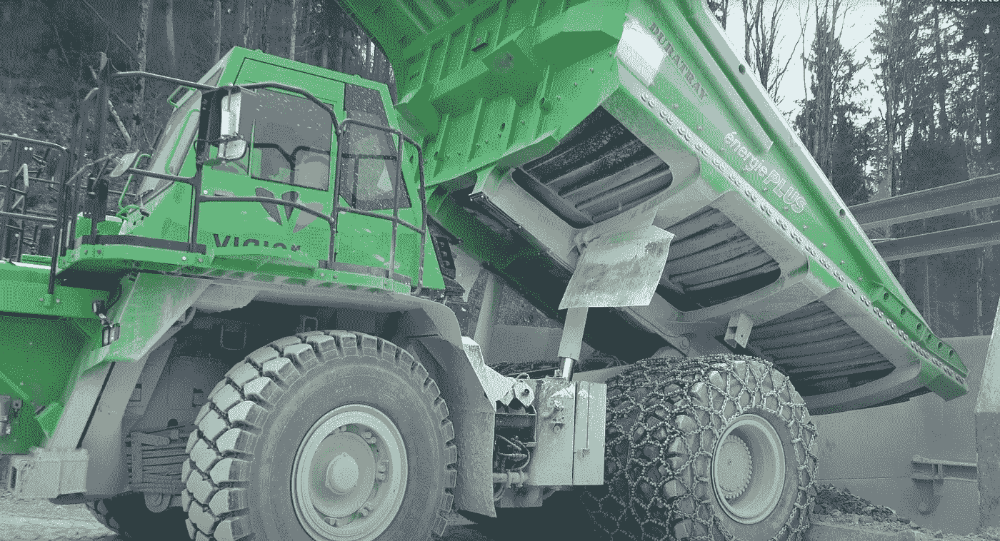

# 世界上最大的电动汽车 eDumper

> 原文：<https://medium.com/codex/the-worlds-largest-electric-vehicle-the-edumper-b36414543f6c?source=collection_archive---------5----------------------->

## “爱德华”号的有效载荷为 65 吨

[eDumper 65(埃明公司生产的培养基)](https://youtu.be/B0NWfloNL20)

你听说过世界上最大的电动车吗？它被称为“eDumper”，是一辆改装的小松 605–7 HD 自卸卡车。这辆巨大的卡车几乎完全依靠**制动系统产生的能量，只需要很少的充电。它的首航是在 2018 年在瑞士的一个采石场，它已经…**