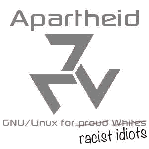
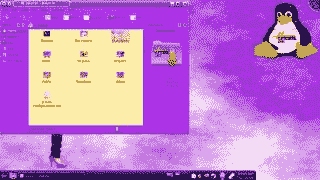

# 永远不要尝试的最差的 Linux 发行版

> 原文：<https://medium.com/codex/the-worst-linux-distributions-never-to-try-1da029f45793?source=collection_archive---------1----------------------->

## 这恰恰证明了凡事都有阴暗面

是的……有些发行版我从来没有想过要去尝试，我非常讨厌，你也应该去尝试。这…不是意见，我觉得大家都应该讨厌他们。不，我没有疯，你马上就会明白我的意思。

加布里埃尔·海因策在 [Unsplash](https://unsplash.com?utm_source=medium&utm_medium=referral) 上的照片

> 老实说，我不知道这篇文章会有什么反应。我只是想分享我对他们的想法(你知道，痛打他们)。

# 简介和免责声明

你知道……有一些 Linux 发行版，像 Arch Linux，Debian 等等，每个人都喜欢。我们有 Ubuntu，喜欢的人和讨厌的人一样多。我们也有像 systemd 这样的 init 系统，它被高度使用，但被许多“热情”的人所憎恨。但是我们从来没有比这更深入的了。这一次，我们深入兔子洞。那些我们不应该去的地方，还有那些被这些糟糕的发行版弄得很臭的地方。

总之这篇文章会和我其他的文章不一样。

我不知道如何写免责声明(我也不读任何)，但这篇文章需要一个，所以我会尝试写一个。

由于显而易见的原因，下面的 Linux 发行版不应该以任何方式存在。下面的发行版是完全无用的，并且可能是攻击性的。请考虑以开放的心态阅读这篇文章。我不会链接他们的网站，因为，再一次，显而易见的原因。

# 种族隔离 Linux

你知道吗，有时候我觉得我应该学会用更严厉的方式写文章。这是其中的一个时刻。

一个想基于种族、宗教、性别等进行歧视的人可能会竭尽全力。当然，Linux 也不例外。隔离 Linux 是一个不提供任何用例的 Linux 发行版。没有特色，没有吸引力，没有额外的东西。这只是为了…嗯…促进种族主义。这个无用的发行版使用了攻击性的、令人不安的、种族主义的壁纸和看似丑陋的布局。它使用 tor 作为其主要的网络浏览器(这并不奇怪)。

把自己想象成一个新的 Linux 用户。你来到这个地方，看到这个…你做的第一件事就是永远不要回来。是的……如果这个发行版对 Linux 社区有任何贡献，那完全是负面的。

我的意思是我对法律之类的东西不感兴趣，但我只想说…难道没有法律规定这是非法的吗？显然，不管它在哪个国家，都应该有。

# Ubuntu 撒旦版

顺便说一句，这些人吹嘘这个发行版是 Ubuntu se，这…很可能愚弄了一些人 SE 是第二版(我为他们感到难过)。

> Ubuntu 撒旦版收到了无数的抱怨和沮丧的信息。快速浏览一下新闻部分就会发现，Ubuntu SE 666.10“恋尸癖神经漫游者”在网上的基督教圈子里并不太受欢迎。—根据一些用户的说法

所以…很明显这个发行版冒犯了宗教。还是那句话，这不是违法的吗？

全世界撒旦崇拜者的首选发行版，当然是专为…至少可以说是世界上非常小众的一部分。你知道…魔鬼的崇拜者？(这里我觉得我是对的)。这个发行版的开发者一直认为脱离 Unity 和 GNOME 2 是 Ubuntu 非常糟糕的一步棋。那么他们做了什么？我猜他们创造了人间地狱。

# 汉娜·蒙塔娜 Linux

警告:盯着这张图片会让你失明

如何不惹人讨厌，却又是最差的发行版？别担心…我会掩护你的。这个 Linux 发行版是为汉娜·蒙塔娜(我都不知道)的粉丝们制作的。

> 标准的[**【KDE】**](https://www.makeuseof.com/tag/kdes-desktop-features-activities-widgets-dashboard-linux/)菜单变成了汉娜·蒙塔娜菜单，背景是病态的粉红色，据一位评论者称，缺少 GIMP、LibreOffice 或 KOffice 对一个教育发行版来说有点疏忽。
> 
> —由尝试它的不幸的评论家:(

如果你用谷歌搜索这个，你会看到一个满是粉色的桌面。从字面上看，它的每一个元素都是过度饱和的粉红色，这足以蒙蔽一个粉红色爱好者。壁纸是如此的苍白，纯粉色，白点，还有一张名人的照片，这个 Linux 发行版就是以他的名字命名的。

# “荣誉提名”

下面是一些其他“可敬的”发行版，他们尽了最大努力，但不可能是最差的发行版。

*   红星 OS:跟朝鲜有关系
*   Moebuntu:又是过度粉红发行版
*   萨比利:想想种族隔离的 Linux，但对于宗教
*   别编:贾斯汀比伯 Linux…真的吗？

我也会在我的 YouTube 频道上发布大部分关于技术/开发/设计/编辑的视频。这篇文章就讲到这里，下篇再见。

**你真棒:)**

> 法丁吉克