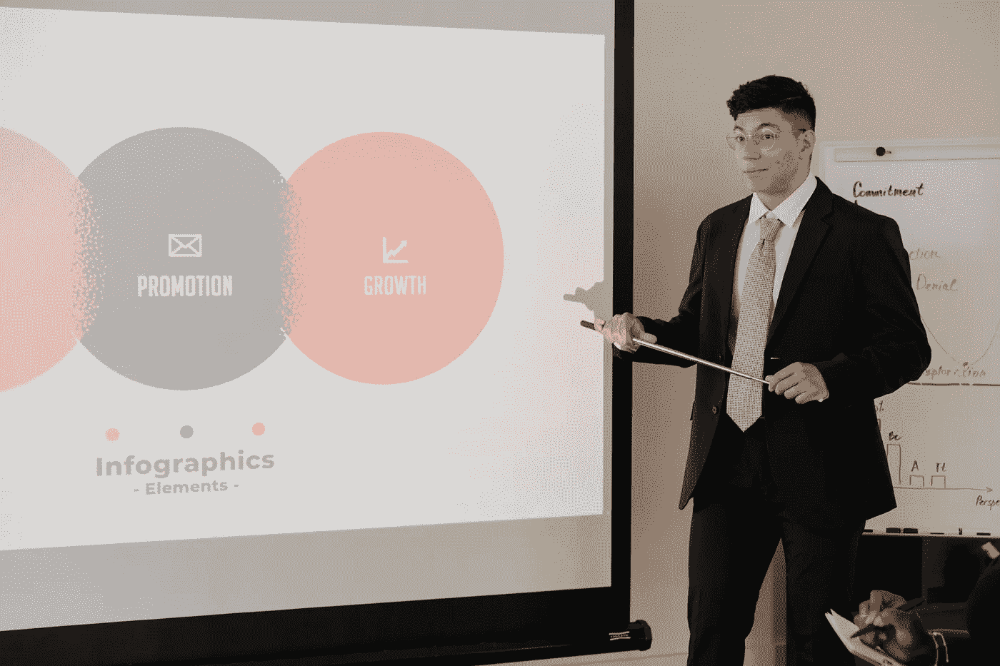

# 最差的幻灯片

> 原文：<https://medium.com/codex/the-worst-powerpoints-cc6b99a6e155?source=collection_archive---------3----------------------->

糟糕到你无法移开视线，就像一股难闻的气味，你无法停止嗅。

由[像素](https://www.pexels.com/photo/man-presenting-in-a-meeting-9034728/)上的[罗德尼制作](https://www.pexels.com/@rodnae-prod/)拍摄的照片

如果你以前没有遇到过[转喻](https://www.wordnik.com/words/metonymy)，让我们面对它吧，我不得不继续查找它，因为我自己也一直忘记这个词，尽管我很熟悉它的意思——那么它基本上是使用某物的属性作为事物本身的一种俚语的实践——使用共享文化中的预设关系作为捷径……