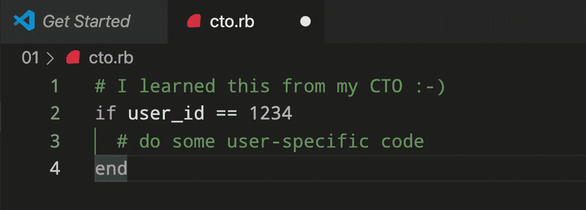

# 你能从首席技术官那里学到的最糟糕的事情，以及为什么这是正确的做法

> 原文：<https://medium.com/codex/the-worst-thing-you-could-learn-from-your-cto-and-why-its-the-right-thing-to-do-663beda7d911?source=collection_archive---------11----------------------->

## 不要把你的解决方案仅仅视为这个选项或那个选项。

我被代码中看到的注释行惊呆了。

这是我从我的 CTO 那里学到的。(作者)

我感到一阵欢欣鼓舞。这个代码是我们正在建立的文化的一个例子——快速运送并不断清理我们的垃圾。在这种情况下，我是首席技术官。

# 这个代码有什么问题？

我和我的同事会声称这段代码可以工作并解决手头的问题。那到底怎么了？

编程有很多罪。例如，全局变量、糟糕的命名和泄漏的抽象使得代码变得难以维护。在这种情况下，罪在于**硬编码**——使用特定的值而不是抽象。因此，这个代码块将只为标识为 1234 的用户运行。

这段代码为用户 1234 解决了问题。但是，不幸的是，它不能解决其他用户的问题，他们可能处于同样的困境。

# 什么是正确的设计？

没有唯一正确的解决方案。然而，有些解决方案更容易阅读，更容易维护，也更容易随着时间的推移而改变。

更灵活、更易维护的设计会将特定的值放在代码之外的某个地方。

我们可以重构这个设计，通过几个不同的步骤提取这些值:

*   根据值列表而不是单个值进行检查。
*   将这些值提取到配置文件中。
*   将值提取到一个环境变量中。
*   从数据库中检索值。
*   将逻辑封装到域模型中，完全避免 id 值。

每一种解决方案都使代码更加灵活，并为更多的用户和更多的情况开放了功能。

# 为什么硬编码是正确的做法？

我们正在解决一个生产问题。在对问题进行分类、找到受影响的代码并创建解决方案后，我们可以在 30 分钟内推出硬代码。更健壮、可维护的解决方案可能需要几个小时的开发和测试。

我们通过解决生产问题止住了流血。我们承担了**的技术债务**，使用硬编码快速修复**。**

****我们在上市时间和代码质量之间进行了工程权衡。****

# **如何才能两者兼得？**

**一旦我们部署了补丁，我们就返回代码来偿还债务。我们没有让债务拖延，累积利息、费用和罚款。我们没有让债务拖累我们。**

**随着年龄的增长，我意识到提升我的思维是有意义的。试图同时持有两种冲突的想法让我头疼。然而，拥抱紧张会带来创造性的机会。**

**不要只考虑这样或那样的解决方案。相反，开始寻找融合这种和那种的方法。**

**在这种情况下，我们快速推出了一个解决方案**，并随后推出了一个**健壮的**实现。****

*****👏🏻给我鼓掌，如果你喜欢这篇文章，请点击***。******

# *****📋关于米洛*****

*****我是一名科技高管、作家、演说家、企业家和发明家。我从 1995 年开始开发软件，十多年来一直在开发团队。🚀*****

*****我写关于软件、工程、管理和领导力的文章。*****

******你也可以* [*在 Twitter 上关注我*](https://twitter.com/milotodorovich) *。🐦******