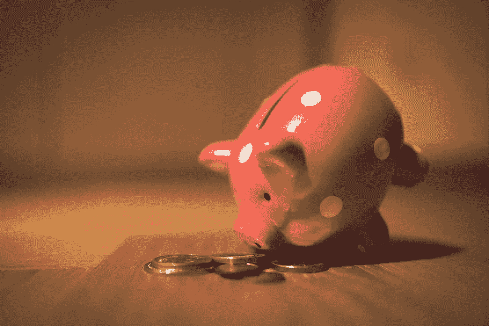

# 最糟糕的省钱方法

> 原文：<https://medium.com/codex/the-worst-way-to-save-money-c4451eca31a4?source=collection_archive---------5----------------------->

不是砍掉免费零食，是砍掉满满一堆(呻吟)。

安德烈·泰森在 [Unsplash](https://unsplash.com/s/photos/save-money?utm_source=unsplash&utm_medium=referral&utm_content=creditCopyText) 上拍摄的照片

首先，为那个糟糕的文字游戏道歉——我甚至不能称之为双关语，因为它实在太糟糕了。更糟糕的是，这实际上甚至不是剔除“全栈”开发人员，这才是我要谈论的问题。

无论如何，如果你能看完那篇介绍，那就继续读进步人士的文章吧…