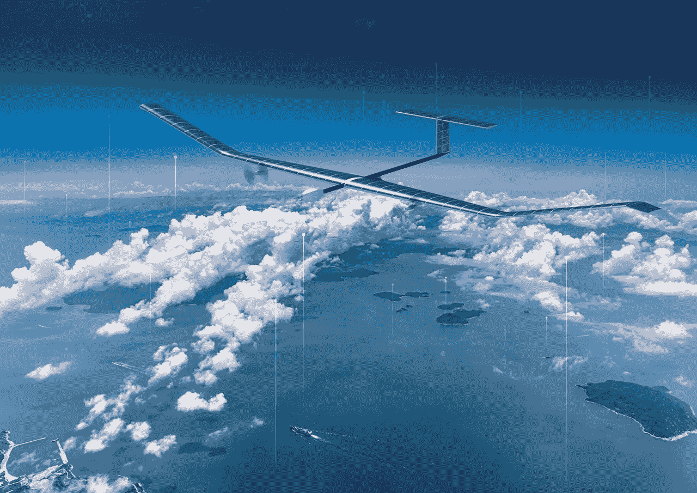

# 泽法:无人驾驶飞机和多种可能性！

> 原文：<https://medium.com/codex/the-zephyr-unmanned-aircraft-and-the-many-possibilities-8d2e57900bfc?source=collection_archive---------4----------------------->

## 空中客车公司向我们介绍了泽法，一种太阳能电力平流层无人驾驶航空系统。

[泽法(空中客车媒体)](https://airbus-h.assetsadobe2.com/is/image/content/dam/products-and-solutions/unmanned-air-systems/zephyr/Zephyr.jpg?wid=1280&fit=fit,1&qlt=85,0&fmt=png-alpha)

空中客车公司推出了无人驾驶飞机泽法，我立刻有了一百万个问题。这个太阳能-电力同温层 UAS(无人驾驶飞机系统)主要旨在为**提供新的视角、感知和连接** …