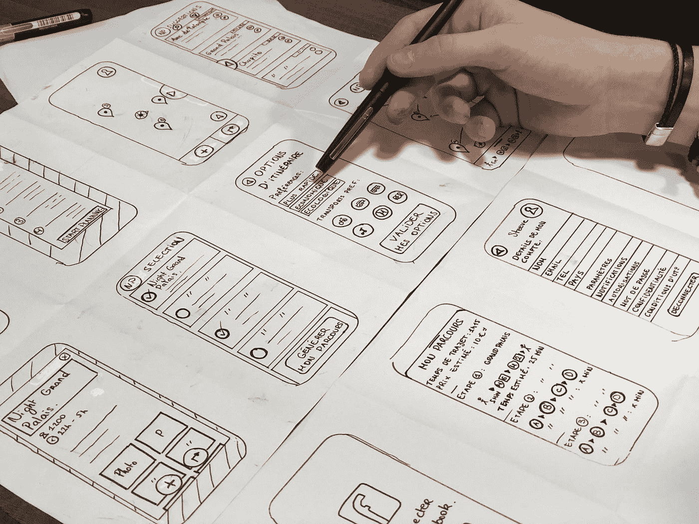

# 响应设计理论

> 原文：<https://medium.com/codex/theory-of-the-responsive-design-a56369793971?source=collection_archive---------10----------------------->

## 响应式设计的理论是一个让任何设备都可以访问网站的概念，不管屏幕大小如何。

照片由 [Unsplash](https://unsplash.com?utm_source=medium&utm_medium=referral) 上的[艾米利·莫里雄](https://unsplash.com/@amayli?utm_source=medium&utm_medium=referral)拍摄

你是否曾经在手机上浏览一个网站，并希望文本稍微大一点或者按钮更容易按下？如果是这样，那么你已经亲身经历了…