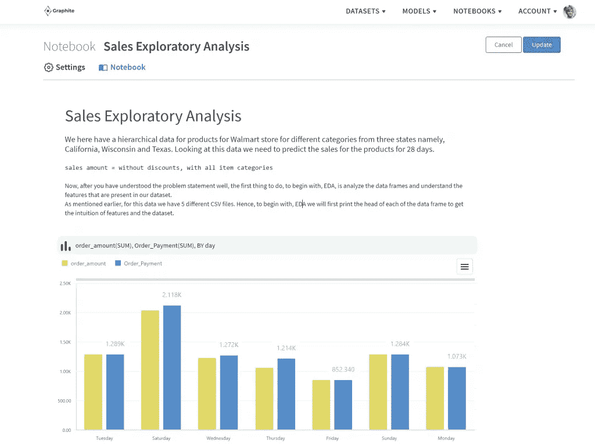

# 现在有一种方法可以提高公司的数据素养

> 原文：<https://medium.com/codex/there-is-a-way-to-improve-data-literacy-in-companies-today-1eb4813a511e?source=collection_archive---------7----------------------->

资料来源:联合国人类住区规划署

在过去的十年中，数据已经成为任何组织的重要组成部分。但在过去几年中，它已经成为全球公司增长、生产力和成功的关键。我们正在收集大量的数据，如果使用得当，这些数据可以洞察从消费者行为到公司财务的方方面面。商业智能(BI)技术和预测分析无疑正在帮助组织管理数据；然而，这仍然需要数据素养。

问题是公司缺乏人工智能和数据读写技能。Gartner 预测，到 2050 年底，50%的组织将没有足够的数据素养技能。这意味着公司将无法实现必要的价值。为了从数据和新技术中获得最大收益，公司必须开始提高数据素养。

# 什么是数据素养？

数据素养被认为是当今市场中公司的关键绩效指标(KPI)。虽然不久前，它还仅限于读写能力，但员工所需的技能现在已经扩展了。

> 为了成功和准确地解决问题，员工必须能够在相关的环境中读、写和交流数据。

他们还需要了解数据的来源，数据是如何构建的，以及用于分析数据的方法。最重要的是，知道如何解释用例、应用程序和结果值是很重要的。

更有可能的是，大多数公司已经开始创建一个数据驱动的组织，并且已经在利用更好的决策。他们还设法纳入了数据保护和透明度的道德和法律方面。多达 90%的数据和分析决策者意识到将[数据洞察作为决策的优先事项。尽管如此，对大多数人来说，这仍然是一场巨大的斗争。](https://www.forrester.com/report/Data+Literacy+Matters+The+Writings+On+The+Wall/-/E-RES149295)

资料来源:联合国人类住区规划署

# 为什么说数据素养是一种奋斗？

虽然每个人都意识到数据的重要性，但并不是每个人都意识到它在工作中的作用。不能再让数据分析师负责数据素养了。随着数据变得越来越重要，组织中的每个人都需要知道数据如何影响他们的工作。也有可能是数据专业人员对他们在业务环境中的工作没有足够清晰的理解。

随着数据量的持续增长，没有技术知识的人越来越难以跟上精通数据的人的步伐。 [Censuswide](https://censuswide.com/) 在对全球 7，000 多名业务决策者进行调查后，报告了数据素养调查结果:

*   76%的决策者没有信心处理数据
*   32%的高层领导被认为懂数据
*   16-24 岁的年轻人中只有 21%懂数据
*   78%的员工愿意投入时间来提高数据技能

# 如何在您的组织内提高数据素养

现在开始创建和实施数据读写策略是更明智的做法，因为您公司获取的数据量只会越来越多。虽然主要目标是帮助数据决策者，但也有必要提高那些不太懂技术的员工的知识。以下是开始提高数据素养的六种方法:

*   **让数据成为生意**。

全公司的员工都需要意识到数据的重要性。成为数据盲不仅仅是一个技术问题；这是一个将在某个时候蔓延到整个公司的问题。让每个人都看到这是公司的问题，而不仅仅是技术部门的问题，这将提高员工的参与度。数据素养的重要性需要来自高层，因此这是高管、经理和领导者的责任。为了培养数据驱动的思维模式，员工需要理解为什么数据是必要的，以及如何在所有业务流程中使用数据。

*   **意识到这不是一个一蹴而就的过程**

如果你某天早上醒来说，“从今天开始，我们都要懂数据”，你就冒着让非技术员工无法完成转变的风险。这是一个需要从小处着手的过程。你可能会觉得很匆忙，但当重大变革进行得太快时，就会出现错误，这会降低员工的积极性。最好从小处着手，让其他员工看到成功，这样他们更愿意成为其中的一员。除此之外，机密数据没有出错的余地，所以只有有经验的人才能处理。

*   **将数据放入上下文**。

对于那些不熟悉数据或相关技术的人来说，这可能是一种压倒性的体验，尤其是对于海量数据。根据他们的角色、经验和背景将数据放在上下文中很重要，以便他们能够更有效地使用数据。

*   **逐步增加员工对数据的访问**。

数据素养是一项将持续增长的技能。一旦员工和团队掌握了他们的数据集，就可以访问更多的数据，以便他们能够独立探索和学习。人们需要有机会通过尝试不同的策略来从自己的错误中学习，以便做好更充分的准备。也就是说，某些数据不能用于学习目的，例如机密信息。

*   **提供培训**

仅有准入是不够的。教员工如何最大限度地利用数据。毕竟，任何人都可以接触到数据；这并不能让他们识字。正如统计数据所表明的，大多数员工都渴望学习必要的数据技能，因此不太可能会有阻力。确保员工知道如何解读数据，并提供批判性思维培训。

*   **选择正确的系统和工具**。

并非每个系统或工具都适合您公司的需求。您选择的系统需要允许数据分析师将整个公司的数据共享给相关部门。同时，你所部署的系统需要对非技术人员来说是用户友好的。如果他们不能使用它，投资就不会被充分利用。

来源:[石墨](https://graphite-note.com/)应用内截图

# 为什么石墨是理想的数据读写工具

有了 Graphite，更容易发现隐藏的模式，更快地发现问题，并在原始数据中发现机会。运行预测分析，无需编写任何代码。

> 锦上添花的是，所有团队成员都可以看到您的数据故事。

分析师可以在 Graphite Notebook 中准备一个漂亮的数据故事，并与所有对处理数据没有信心、需要帮助才能理解数据的决策者和高层领导分享这些见解和结论。

我们开发石墨 SaaS 已经有一段时间了。如果你想亲自试用或者给我们反馈，你可以在这里获得一个免费账户[。](https://app.graphite-note.com/#/signup)

最初发布于:[https://graphite-note . com/there-a-way-to-improve-data-literature-in-companies-today/](https://graphite-note.com/there-is-a-way-to-improve-data-literacy-in-companies-today/)