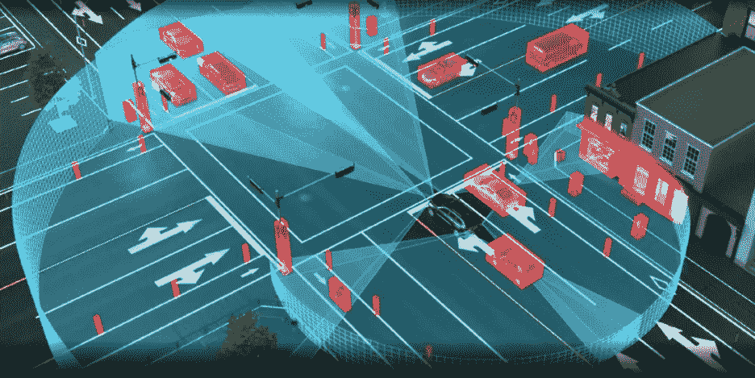

# 必须有 860 种方法来为自动驾驶汽车构建激光雷达传感器——第 1 部分

> 原文：<https://medium.com/codex/there-must-be-860-ways-to-build-a-lidar-sensor-for-autonomous-vehicles-part-1-182eaf028dbd?source=collection_archive---------7----------------------->

由[萨比尔·兰瓦拉](https://linkedin.com/in/sabbir-rangwala-73aa843)

DARPA 开创了这一切。十年前的大挑战——研究人员竞相驾驶机器人汽车通过不可预测的地形，有计划的障碍，尽可能快地行驶——没有人类驾驶员。

大挑战促进了商业活动，为常规道路开发自动驾驶。十年后，有了显著的进步。研究阶段最初的兴奋正转变为管理投资者预期、现金流、运营、产品开发和稳固客户收购的清醒现实。

在所有这些中，一个明显的赢家是对传感和感知的强烈关注，以及激光雷达作为自治乌托邦的关键推动者之一的作用。激光雷达能够实现高分辨率的 3D 传感，这是 2D 相机和雷达等其他传感器无法做到的。该领域的大多数研究人员认为，为了确保避障、定位和导航，激光雷达至关重要。声学扬声器制造商威力登为 DARPA Grand Challenge 开发了第一台激光雷达，这一经历使他们成为当今领先的激光雷达公司之一。

二十年前，随着用于通信、数据、视频和高速互联网的光网络的采用，光学成为一项关键技术。医药、工业传感和材料加工等辅助市场受益于电信投资。同样，“优化”未来汽车的前景也给光学行业带来了第二次新生和兴奋。最初专注于国防和空间应用的激光雷达有望成为主流设备，就像今天手机和汽车中的相机一样。自动驾驶汽车激光雷达的潜力已经吸引了超过 15 亿美元的风险投资。原始设备制造商、一级供应商和技术公司(通用汽车、丰田、博世、大陆、Waymo、Argo 和 Aurora)等公司也进行了类似程度的投资。

目前有超过 80 家风险投资的激光雷达公司，最初专注于汽车激光雷达。AV 革命的放缓[由 Richard Bishop 在最近的一篇 Forbes.com 文章中讨论，以及 Waymo、戴姆勒等公司最近的声明。]这些公司在汽车领域的客户吸引力有限，迫使它们转向其他应用，如安全、航空测绘、无人机和工业自动化。令人鼓舞的是，类似于 20 年前光学电信的繁荣，其他的应用也正在兴起。但显而易见的是，所有这些公司都无法在独立的基础上生存——最终的馅饼不够大，风险基金和公司也没有足够的“智能”资金来资助所有这些公司度过下一个工业化阶段。我的估计是，不超过 10 家公司将继续为 ADAS 和 AV 市场提供服务。

除了兴奋之外，还有其他原因可以解释为什么如此多的公司甚至可以让投资者相信他们应该存在。考虑到波长(4)、激光雷达类型(3)、激光类型(3)、探测器类型(4)和扫描方法(6)的各种设计选择，产生了 864 种组合。与其他技术选项(如 3D 点云处理方法)和功能(如基于事件的激光雷达)相结合，可以产生更多的组合选项。并不是所有的都是实际可行的或有意义的，但肯定至少是，这解释了为什么风投选择投资这么多公司(例如，威力登、Quanergy、Innoviz、Luminar、Aeye、Aeva、uster 等。).他们在最初阶段支持了一匹或多匹这样的马，现在需要弄清楚如何优雅地保护或利用他们的投资。

ohn Dexheimer 是光学领域为数不多的投资银行家之一，他经历了电信和 AV 时期光学行业的繁荣和萧条周期。我请他比较一下这两个行业: ***“我看到了汽车激光雷达与光学电信斜坡的相似之处。两者都见证了大中型企业的进入，以及风险和对冲基金对初创企业的大量投资。一个很大的区别是，电信繁荣有明确、直接的经济驱动因素，而在 AV 和 ADAS 中，经济因素在短期内不太明确，设计实验选择是基于感知的最终用户需求和愿望做出的”。***

电信对进入管道的产品有非常严格和结构化的标准，而 AVs 中的激光雷达还没有。约翰·德克斯海默(John Dexheimer)一直专注于 AV 激光雷达的标准，并提出了以下问题: ***“汽车行业有哪些有效的标准机构来帮助缩小可接受的测试指标，以便在试验和有限的地理围栏应用之外实现量产？***

AV 激光雷达领域何时以及如何整合？拥有大量资金、执行团队以及一流客户和供应商关系的强势参与者将会生存下来。但问题是，哪些弱势企业将被大型一级供应商或科技公司收购，或者与更强大的独立激光雷达公司合并。如果没有这些举措，企业将面临破产或知识产权出售的局面。本文的第 2 部分将对此进行探讨，主要是沿着感知和传感器融合的后处理软件堆栈以及 864 种设计组合的供应链方面将成为重要驱动因素的思路。但这还不是全部——在 864 个组合中，有一些组合有很大的前景，但还没有得到资助！

请继续关注第二部分。

在 LinkedIn 上关注我。

[*sab Bir Rangwala*](https://www.linkedin.com/in/sabbir-rangwala-73aa843/)*，是 auto M8(Fountech Ventures 投资组合公司)的董事会顾问。在过去，他一直领导普林斯顿光波的汽车激光雷达业务，直到 2017 年。目前，该公司是耐心咨询公司的创始人，提供 AVs、感知和激光雷达方面的专业知识。耐心点！*

[Fountech Ventures——你的深度技术人工智能创业之家](https://www.fountech.ventures/)

 [## Fountech Ventures -深度科技人工智能初创公司的风险建设者| LinkedIn

### Fountech Ventures -深度技术人工智能初创公司的风险建设者| LinkedIn 上有 312 名追随者。我们爱房子，迅速…

www.linkedin.com](https://www.linkedin.com/company/fountech-ventures) 

[富泰克风险投资(@Ventures_FT) /推特](https://twitter.com/Ventures_FT)