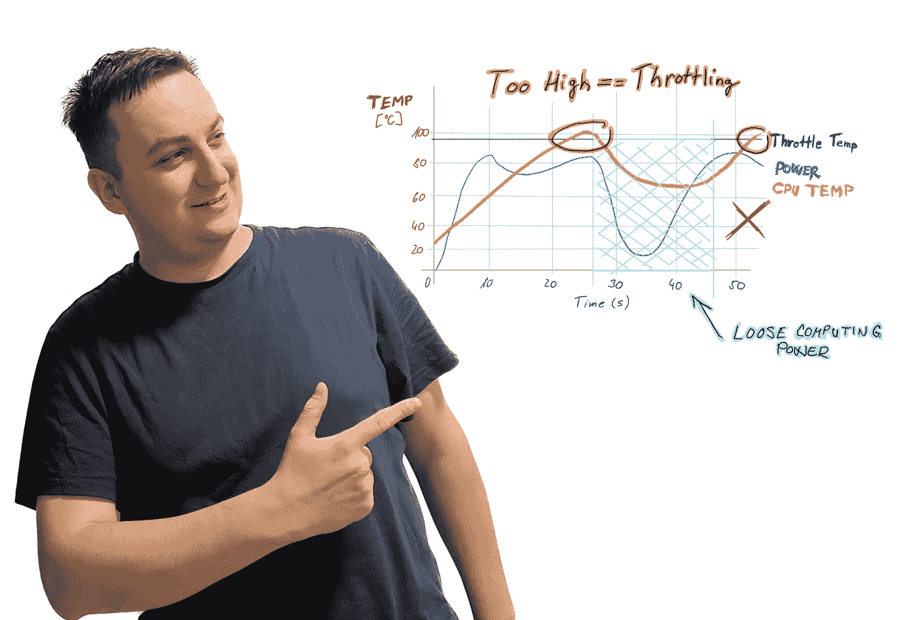

# 解释热节流

> 原文：<https://medium.com/codex/thermal-throttling-explained-253c2e0fd85c?source=collection_archive---------4----------------------->

## 它是什么，它如何表现自己的敌人，它如何防止它？

解释热节流——图片由作者提供

如果你不完全精通信息技术，但仍然想拓宽你的视野，了解什么是热节流可能是有用的。在苹果的世界里，你经常会在处理器中遇到这个术语，特别是 13 英寸的 MacBook Pro 和更新的产品…