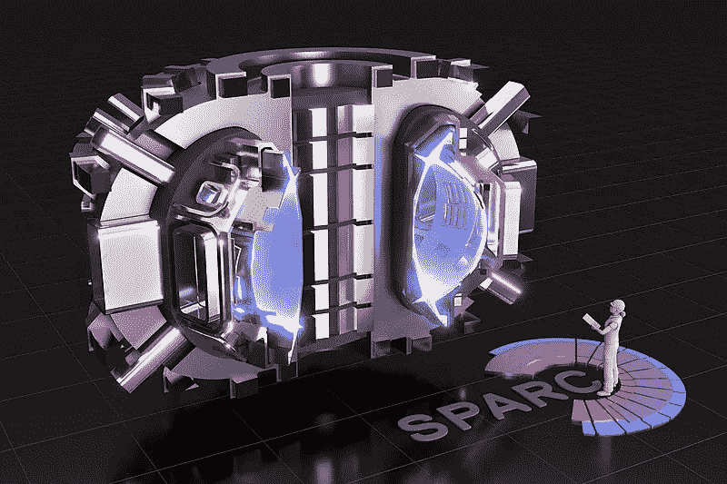

# 热核聚变？—等待是漫长的……

> 原文：<https://medium.com/codex/thermonuclear-fusion-the-wait-is-long-844c36418638?source=collection_archive---------1----------------------->

只有驯服核聚变才会是能源的真正突破。但几十年来，它始终是在四分之一世纪之外。

SPARC—[图片:来自美国洛斯阿尔托斯的史蒂夫·朱韦森，[由 2.0](https://creativecommons.org/licenses/by/2.0) 抄送，经由[维基共享](https://commons.wikimedia.org/wiki/File:A_SPARC_of_Fusion_Energy_(50402096131).jpg)

十几岁的时候，我对物理学非常着迷，包括核聚变能源。我记得在 20 世纪 60 年代末出版的一本书上读到过，很快——可能在 20-25 年内——我们将可以从这个来源获得**几乎无限的能源供应**