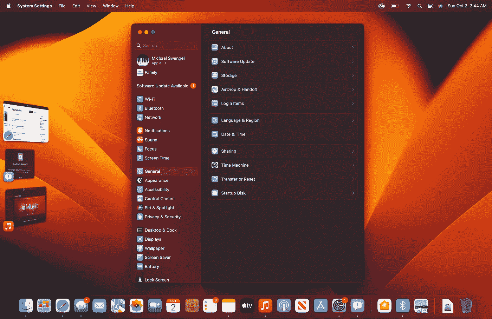

# 这些是令人兴奋的 macOS 13 Ventura 功能

> 原文：<https://medium.com/codex/these-are-the-macos-13-ventura-features-to-get-excited-about-bd4d15a25766?source=collection_archive---------0----------------------->

## 对于 macOS 来说，这看起来是一个伟大的一年。

图片由作者提供(来自 macOS Ventura 的测试版)

macOS 13 Ventura 是苹果最新的 Mac 操作系统，它为台式机和笔记本用户带来了大量新功能。像之前的每一个 macOS 版本一样，Ventura 为操作系统的许多不同部分带来了更新，从 Safari 到 Spotlight 到 Mail，等等…