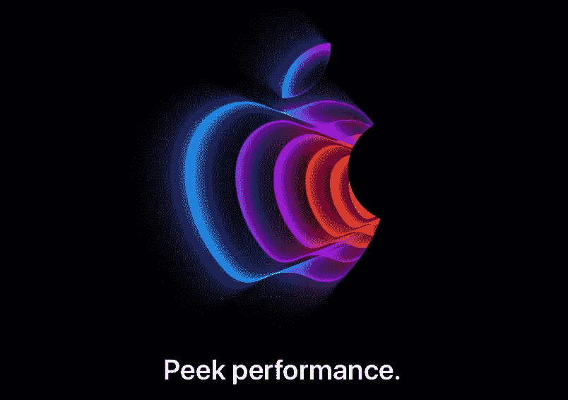
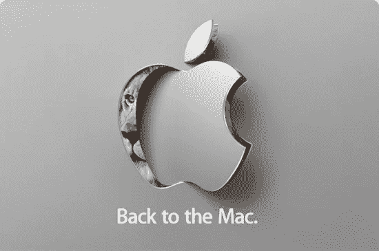
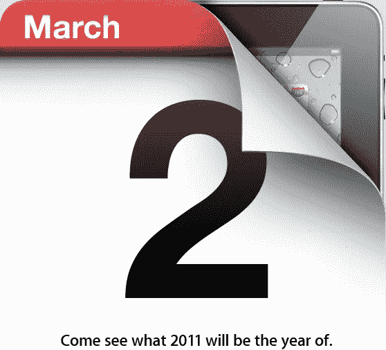
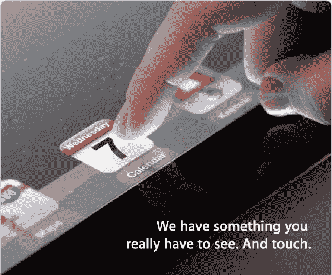
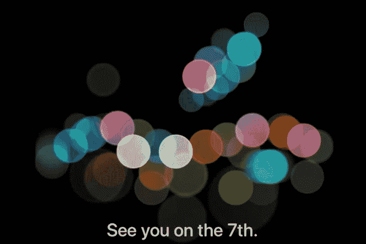
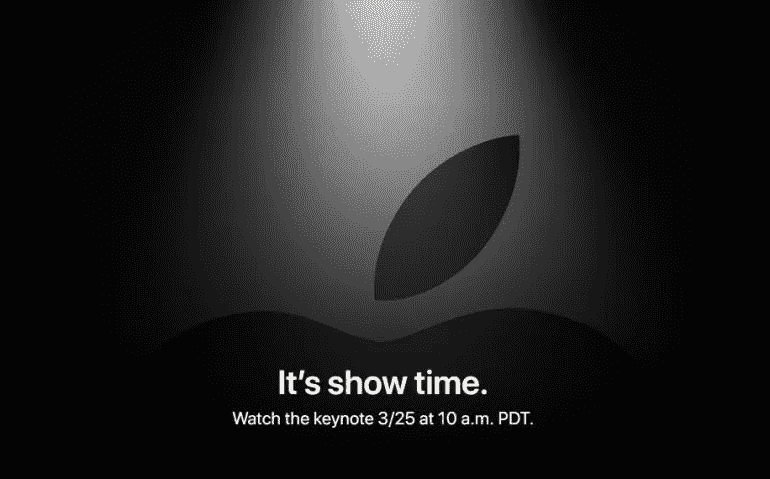
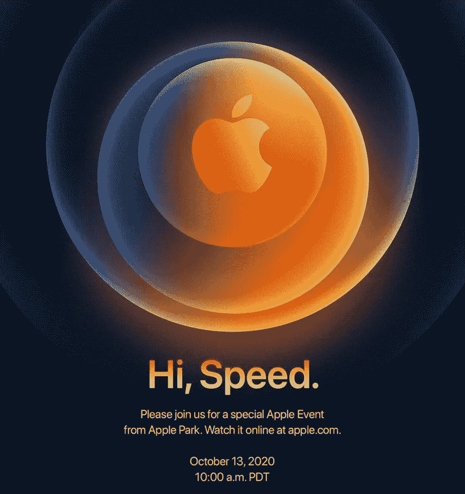

# 他们确实泄露了秘密

> 原文：<https://medium.com/codex/they-do-give-the-game-away-38cd06fad3b7?source=collection_archive---------7----------------------->

## 苹果的活动邀请，以及他们实际上意味着什么

写这篇文章的时候，我们距离下一次苹果发布会还有几个小时。请柬上周就发出去了，虽然晚了一天，但它们最终还是到了。这个名为 *Peek Performance* 的活动，让我们都想知道，如果有的话，我们应该在这个词中读到什么。

在这一周，或多或少，自从邀请登陆以来，无数的视频和博客被创建或撰写，猜测这两个简单的词可能意味着什么。你必须给苹果的一件事是，营销团队确实了解他们的东西。单词 *Peek* 的拼写可能意味着对今年将要发生的事情的展望。当然，这也是一个*的双关语*，很可能他们想让我们也潜意识地认为*峰*在顶峰。聪明的男孩和女孩，不是吗？至于性能，速度似乎是显而易见的选择。

一些人认为使用的颜色可能会令人伤感，另一些人认为图形看起来像备受期待的 AR/VR 耳机的一半。这个游戏现在已经非常成熟了，我们将在一天之内(在写作的时候)知道它意味着什么。现在，我们所知道的是事件将会发生，新的事情将会被宣布。

由于我们完全处于苹果活动模式，我认为回顾过去几年可能会很有趣，看看我们是否应该浪费时间过于仔细地看这个最新的邀请。

 [## 它已经准备好了——苹果的全新外部显示器

### 甚至有可能在本周宣布！

medium.com](/codex/and-it-could-even-be-announced-this-week-fb801693a773) 

## 我们回去吧

这些事件实际上早在 2005 年就开始了。显然，在那个时候，这些事件并没有引起太多的争议，但这是史蒂夫·乔布斯的另一个伟大想法。他非常清楚，获得全球媒体的关注，以及最近社交媒体的关注，将是多么的无价。在第一次活动中，乔布斯宣布他们将把 Macintosh 平台转移到英特尔 x86 处理器上。

其他著名的日界线包括 2007 年 Macworld 博览会。在那次活动中，该品牌更名为苹果公司(而不是苹果电脑公司)。我们看到了第一款 iPhone 的发布，也看到了 MacBook Air。在接下来的几年里，这些主题活动预示着一些非常重要的事件或设备。它们包括应用商店、iPod touch、新的 MacBook Pro 和新的 macOS。然后，在 2010 年，邀请游戏开始了复仇。

## 你明白了吗？

2010 年可能是我们第一次可以准确地说，邀请开始有隐藏的含义。随着**“回到 Mac”**的开场白，实际的事件变成了所有关于 Mac 的事情，给我们带来了第二代 MacBook Air、macOS Lion 和 Mac face time。从那以后，嗯，我们一帆风顺。

## 2011

那年有两件事。三月份，我们让**‘来看看 2011 年将会是什么’**年，在日历图标后面，左上角显示了一小块 iPad 主屏幕。当然，新的 iPad 发布了。10 月，**‘让我们谈谈 iPhone’**说明了一切。

## 2012

那年三月的标语是，**‘我们有些东西你真的得看看。和触摸。**图片显示手指在一个新的 iPad 上盘旋。然后那年晚些时候，邀请函上的日期显示了一个 5，结果是 iPhone 5 的事件。

 [## 苹果工作室是个东西！

### 苹果再次做到了这一点，并一直致力于一个全新的品牌线的 Mac Pro

medium.com](/codex/apple-studio-is-a-thing-82848e4db458) 

## 2013

标语**“这应该照亮每个人的一天”**原来是我们将在廉价 iPhone 5c 上获得的颜色的线索，在彩色圆圈中，有一个灰色的空圆圈。据透露，这将是新的主页按钮。

## 2016

今年两个非常聪明的邀请。**“7 号见”**的邀请有一个彩色的散景效果 iPhone 7 首次推出人像模式的活动。然后，一个月左右之后，就是**‘又见面了’**事件。这可以追溯到 1984 年最初的 Mac 标签。不可避免地，我们在活动中得到了新的 MAC 电脑。多云的标志是一个线索，表明我们也将获得新的壁纸，包括在最新的 MacBook Pros 上。

## 2018/19

2018 年我们有两个活动，其中一个邀请，我特别喜欢。**“聚在一起”**非常微妙。艺术品是金色的，这是 iPhone XS 系列中新的大颜色。2019 年，**‘该秀了’**邀请催生了新的 Apple TV+服务。我喜欢那部电影。

 [## 我永远不会折叠，事件和教训回来了

### 苹果观点——我对本周的看法

medium.com](/codex/never-will-ifold-the-event-lessons-are-back-69555dae31ce) 

## 2020

你还记得**‘嗨，速度’**事件吗？那一行中简单的逗号把我们难住了。最终，我们第一次引入了 5G。邀请函上的圆圈与新款 HomePod mini 的底部完全匹配，深蓝色背景是最新款 iPhone 12 & 12 Pro 的颜色。

## 结束的

这些只是历年来的一些亮点；一些我个人最喜欢的。但是，我认为这确实表明，毫无疑问，邀请确实很重要。几乎普遍的是，回想起来，这些“复活节彩蛋”邀请最终给了我们某种强烈的指引，告诉我们这个事件最终会为我们带来什么。

娱乐和游戏真正开始了，离 *Peek 表演*活动只有 24 小时了。我不打算撒谎，我有点兴奋地知道，在加利福尼亚州的某个地方，一份 MOV 的档案正放在那里，里面有我们所有问题的答案。

如果你有我的号码或电子邮件，不要想在 3 月 8 日格林威治时间下午 6 点到 7 点之间联系我。我可以绝对肯定地告诉你，我会很忙！灯光暗下来，苹果笔记打开，看着最新的苹果性能展开。

你希望或期待从这次活动中得到什么？我很想知道。

我会在本周晚些时候告诉你答案！

## 在你走之前

## 你订阅媒体了吗？

我只是高端博客网站 Medium 的众多作者之一。这是如此好的价值，你可以在这里加入 https://medium.com/membership

[T5 加入我的幕后邮件列表 ](https://www.talkingtechandaudio.com)

**原载于 2022 年 3 月 7 日 https://www.talkingtechandaudio.com/blog****的** [**。**](https://www.talkingtechandaudio.com/blog)