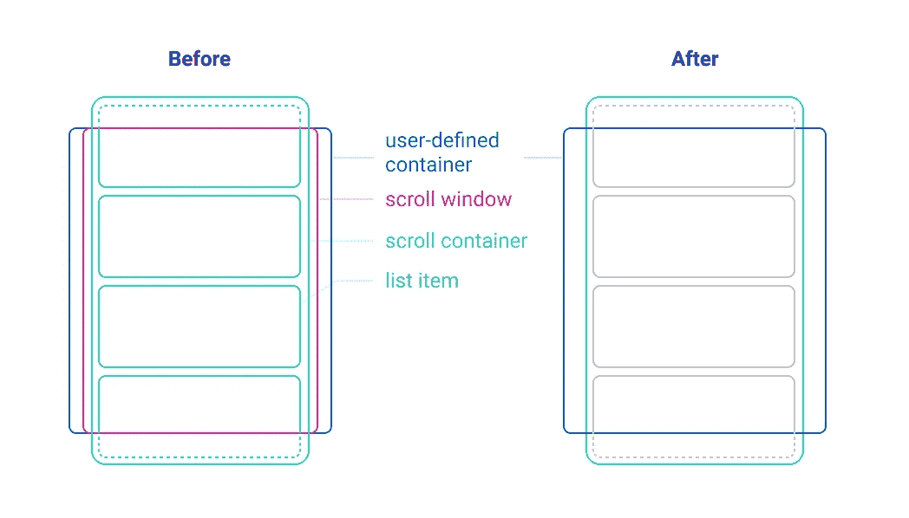

# 我学到了用 Svelte 构建拖放组件

> 原文：<https://medium.com/codex/things-ive-learned-building-a-drag-drop-component-with-svelte-2ad9169f1aff?source=collection_archive---------5----------------------->

# 我学到了用 Svelte 构建拖放组件

你好！我是 [Tubloo](http://tubloo.com) 的一名像素推广员，我们正在那里建立一个在线视频制作商。在 UI 方面，我们一直在努力解决的一个问题是拖放组件。我们有一些独特的要求:

*   允许一次拖动多个项目
*   支持垂直列表、水平列表以及二维网格
*   虚拟化开箱即用，因为我们可能会在这些列表中获得数百个项目
*   流畅和爽快(这是必须的，因为我们是一个视频应用程序！)
*   能够通过向列表边缘拖动来滚动列表
*   我们不需要拖放列表，因为在我们的应用程序中，每种类型的列表永远不会超过一个。

不幸的是，我们找不到合适的组件，所以我们决定自己创建一个。毕竟，这能有多难呢？

```
 ||||||||||||||||||||||||||
    ||            +             ||
  ||             +++              ||
  ||              +               ||
  ||            R.I.P             ||
  ||         1990 - 20xx          ||
  ||                              ||
  ||   "How Difficult Could It    ||
  ||        Possibly Be?"         ||
  ||                              ||
  ==================================
```

经过多次试验，我们得出了这个结论:

该组件还没有准备好公开发布，但是我们已经在生产中部署了它，并对其进行了改进。一旦足够好，我们将开源组件。如果你感兴趣，请关注我的[推特账号](https://twitter.com/DerekNguyen10)。

在那之前，这是我学到的教训:

# 1.本机拖动事件似乎不能很好地处理这种交互

我在这里措辞有点小心，因为不是原生 API 不好，很可能我只是…不好。我以前使用过这些事件进行文件上传&它们非常棒。然而，这里有一些我在使用本地拖动事件时遇到的问题(例如，ondragstart、ondragend 等)。)对于拖放交互:

*   如果列表的容器没有“ondrag”处理程序，则“ondrag”和“ondragend”之间会有一个滞后，其中位置被重置为[0，0]，从而导致奇怪的动画。
*   Firefox 不会将指针位置传递给 ondrag 处理程序，句号。
*   有些情况下，即使没有拖动任何东西，我的主组件也想知道当前的指针位置(例如，在悬停时在列表项之间显示一个按钮*)。)*

最后，我用`onmousedown`和`onmouseup`实现了一个自定义的拖动动作。我在窗口&上附加了一个`mousemove`处理程序来跟踪组件的全局状态。这样，指针的位置总是为组件所知。不可思议的是，这似乎不会在每次鼠标移动时触发重新渲染！

自定义事件的工作方式如下:

1.  在 mousedown 时，立即将 mouseup (A)事件附加到*文档*
2.  调用 async `dragUntil(x)`函数，当光标移动了至少 x 个像素时进行解析。
3.  如果在承诺解决之前*触发了 mouseup (A ),取消承诺&移除自身。*
4.  如果承诺得到解决，则移除 mouseup (A)并附加一个新的 mouseup (B)作为`ondragend`事件。
5.  在 mouseup (B)中，移除自身。

效果出奇的好！直到我们把它投入生产，并收到各种各样的'鬼'点击项目。当用户释放光标以完成拖动事件时，它还会在拖动的项目上注册一次单击，从而导致意外的 UI 更改。

再多的`stopPropagation()`或`capture: true`也无济于事。我都快气炸了(顺便说一句，我这么做是为了别的事)，直到我意识到这两个`mouseup`事件都是附加在*文档*上的，而不是项目本身。因为光标可以移动到项目边界之外，所以项目的`mouseup`事件不会被触发。

因此，解决方案是附加一个诱饵`mouseup` / `click`事件，在捕获阶段阻止传播。

1.  在 mousedown 上，立即将 mouseup (A)事件附加到*文档*上，并将带有 `**e.stopPropagation()**` **的 mouseup 附加到*项目*** 上
2.  如果 mouseup (A)事件在承诺解决之前*被触发，取消它，移除它自己**和 mouseup** 。*
3.  和以前一样
4.  在 mouseup (B)中，移除自身**和 mouseup** 。

但是，鬼咔嚓声还是发生了！结果是在 mouseup (B)过程中，诱饵 mouseup 在幽灵点击之前被移除。最终修复该问题的方法是将 mouseup 的删除安排在事件队列的末尾:

```
setTimeout(() => {
	el.removeEventListener('mouseup', handleElementMouseUp, true)
}, 0)
```

# 2.分离布局和拖动逻辑

如上所述，我们的拖动组件需要处理垂直列表、水平列表和 2d 网格。我们所有的列表目前都有统一的项目大小，但我们可能希望在未来改变这一点。对于支持所有这些用例的组件，拖动逻辑必须与布局无关(垂直、水平、网格)。

我把所有的布局计算放进一个叫做“策略”的文件里。他们将回答基本的布局问题:

*   知道了项目的高度和索引，它在列表中的[x，y]位置是什么？
*   知道一个条目在列表中的位置，它的索引是什么？但也有更有趣的:
*   当拖动一个项目时&光标在容器的一个边缘，知道光标的位置，容器应该向哪个方向滚动&滚动多快？
*   知道了列表容器的可见区域，可见项的索引是什么？

垂直“战略”可能看起来有点像这样:

```
const place = ({ index, itemDimension }) => {
	const itemHeight = itemDimension[1]
	const y = itemHeight * index
	return [0, y]
}const unplace = ({ cursorPosition, itemDimension }) => {
	const y = cursorPosition[1]
	const itemHeight = itemDimension[1]
  return Math.round(y / itemHeight)
}/* etc etc */
```

到目前为止，这种结构工作得很好&我认为当我们达到这一点时，为可变大小的列表传递类似位置缓存的东西不会太难。

# 3.设计一个灵活但又不太老套的 API

# 尝试#1

在我的第一次尝试中，我试图将我们现有的组件从 React 移植到 Svelte，它使用了 function props 模式:

```
<Sorter data={data} {...otherProps}>
  {({ item, order, isDragging }) => <MyListItem {...{ item, order, isDragging }} />}
</Sorter>
```

在研究了两天两夜的文档后，我想到了这个(已经告诉我是哪种开发人员了，是吗？):

```
import Sorter from './Sorter.svelte'
import MyListItem from './MyListItem.svelte'<Sorter {data} template={MyListItem} templateProps={{ foo: 'bar' }} />/* somewhere in Sorter.svelte */
<div class="wrapper">
{#each data as item (item.id)}
	<svelte:component this={template} item={item} />
{/each}
</div>
```

我盲目地试图复制一个反应习语&没有意识到在苗条时，你会这样做:

```
<Sorter data={data} let:item let:isDragging>
	<MyListItem {item} {isDragging}>
</Sorter>/* somewhere in Sorter.svelte */
<div class="wrapper">
{#each data as item (item.id)}
	<slot {item} isDragging={draggingIds.has(item.id)} />
{/each}
</div>
```

公平地说，对于过去的我来说，这种语法是不直观的&来自 React 的语法有点令人费解，我甚至没有意识到当`<slot>`在‘each’循环中时它还能工作🤯。在这里阅读揭露老虎机道具教程:[https://svelte.dev/tutorial/slot-props](https://svelte.dev/tutorial/slot-props)

我仍然不满意的一点是，用户需要告诉`Sorter`id 道具的名称，如果它不是字面上的“id”:

```
<script>
	let data = [
		{ aCustomIdFieldPleaseThankYou: "abcde1", value: "hi" }
	]
</script><Sorter data={data} idFieldName="aCustomIdFieldPleaseThankYou" ></Sorter>/* somewhere in Sorter.svelte */
{#each data as item, i (item[idFieldName])}
	{/* ... */}
{/each}
```

# 尝试#2

然而，在主应用程序中，我们希望在项目列表的末尾放置一个按钮。作为一个思想家，我认为最好的方法是让用户自己实现循环&让他们将一个“可拖动的”道具传递给底层组件。最大的灵活性！

```
<script>
	import { DragList, DragItem, DragIndicator } from 'svelte-sorter'
	import MyListItem from './MyListItem.svelte' let data = [/* ... */]
</script><DragList>
	<DragIndicator />
	{#each data as item, i (item.aCustomIdField)}
		<DragItem order={i}>
			<MyListItem {item} />
		</DragItem>
	{/each}
	<DragItem draggable={false}>
		<button on:click={handleAddItem}>Add</button>
	</DragItem>
</DragList>
```

这样，用户不必将`data`、`idFieldName`或`selectedIds`传递到包装器组件中。在内部，事情也变得更加简单。每个个体`<DragItem>`处理自己的定位，而不是持有一个巨大的状态对象。结果是，很容易将甜美的弹簧运动添加到单品中。我将在另一个要点中谈到这一点。

现在组件确实感觉更简单了，尽管有更多的样板代码…但这是一个很好的权衡，对吗？

对吗？

# 尝试#3

一个大问题(见第 5 条)导致我重写了组件的一大部分。由于我不得不改变 DOM 结构，这让我重新考虑当前组件的 API。

这也是我意识到苗条有什么反应不的地方:*命名槽*！

*成千上万身材苗条的开发人员面容姣好*

```
<Sorter>
  <MyListItem slot="item" />
  <MyCustomIndicator slot="indicator">
</Sorter>
```

以前的 API 非常灵活。然而，现在我们已经删除了滚动容器，这是不必要的。



之前我提到我们需要一个添加按钮。好了，添加按钮现在可以存在于我们分类器组件之外:

```
<Sorter
  {data}
  {selected}
  idFieldName="customIdField"
  let:item
  let:isDragging
  let:index
>
  <MyListItem slot="item"
	  {item}
	  {isDragging}
	  {index}
  />
</Sorter>
<button>add</button>
```

我们又回到了传入自定义的`idFieldName`，但至少现在我们达到了足够好的灵活性水平&我们可以去掉所有的样板文件。

备注:我也尝试过苗条的动作，比如这样做:

```
<div use:draggable={dragOptions}>
	{#each data as item, i (item.id)}
		{/* ... */}
	{/each}
</div>
```

…但是我没有找到一种不通过 DOM 访问就能管理这些项目的方法，而且时间不允许我进一步探索这个问题。我确实想在将来再次参观它。

# 2.虚拟化有一种错误的方式

“虚拟化”就是只让*和*看到列表的可见部分。假设我们有一个 1000 项的列表，但是只有 10 项对用户可见，那么我们将只呈现这 10 项，而不是整个列表。

虚拟化是我添加到组件中的最后一项内容。我认为这相对容易，因为我们已经完全定位了列表中的所有内容&列表项都有相同的大小。

我需要做的是在呈现列表之前过滤掉所有不可见的组件。这只是检查一个项目的位置是否在被拖动的容器*或*内的问题，然后使用一个过滤循环代替 th-

等等。当我开发这个特性时，用户仍然在处理循环。我不能在那里添加过滤器，因为它在我的分类器组件之外。

一个解决方案浮现在脑海中:导出一个用户可以用来过滤掉不可见项目的助手怎么样？

```
import { Drag, DragItem, virtualizer } from 'svelte-sorter'<Drag>
	{#each virtualizer(data) as item, i (item.id)}
		{/* ... */}
	{/each}
</Drag>
```

但是我如何与这个函数通信呢？如果成功了，API 现在就“更丑了”:在组件之上有了一个函数。

为了找到解决方案，我将每一项打包成另一个组件:

```
<Drag>
	{#each data as item, i (item.id)}
		<DragVirtualizer>
			<DragItem>
				<MyListItem />
			</DragItem>
		</DragVirtualizer>
	{/each}
```

`DragVirtualizer`通过上下文订阅商店&过滤掉不可见的项目:

```
<script>
	import { key } from './store' export let id const { store } = getContext(key)
</script>{#if $store.dragging.has(id) || $store.visibleIds.has(id)}
	<slot />
{/if}
```

你可以想象为什么这是一个坏主意:如果我有一个 1000 个订阅者的列表，那么每个卷轴上都有 1000 个订阅者。然而，它没有滞后，直到我用+500 个项目进行测试，所以我妥协并推出了这个解决方案。

重写之后，我可以正确地实现这个特性**因为渲染循环现在又在排序器的组件控制之下了。赢了！

*   :如果做错了，一切都会变得更容易和更困难**:我可以通过重用 DOM 节点来进一步优化这一点，但我还没有这样做

# 5.在编写大部分代码之前，不断评估所有需求并创建一个环境

在我着手虚拟化后不久，我们更新了 UI，这样一个滚动列表就*嵌套在另一个滚动容器内*。这就是一切失控的地方:

*   自动滚动失败，因为容器现在部分隐藏
*   当用户拖动一个项目时，它消失在空白中…因为偏移位置现在是错误的
*   虚拟化不再正常工作，因为它只考虑其父包装的维度

以下是我做错的地方:

*   假设组件不在多层滚动列表下。
*   仅计算直接滚动容器的滚动偏移量。在应用程序中，有多层滚动容器。

这让我回到了绘图板。

*   需要计算真正的可见区域，而不仅仅是包装容器。
*   该组件不应是滚动容器。它应该只是具有最大宽度/高度的项目列表。
*   自动滚动功能应该基于真正的可见区域，而不是包装容器。

考虑到这些，我第 n+1 次重写了这个东西。

首先，我处理了可视区域。在下面的剪辑中，它被标记为带有红色边框的橙色:

当视口剪辑组件时，可见区域会正确收缩。解决了这个问题，我现在可以准确地计算虚拟化的可见元素了(看到可见范围随着可见区域的缩小而缩小)。自动滚动区域现在也可以正确计算，所以拖动时总是可以滚动。

它在我们的应用程序中工作得足够好&我期待着这个项目的开源。感谢您的关注！

# 下一关

以下是我将要做的事情:

*   分组:将一个组件拖到另一个组件中以创建一个组
*   处理不同的大小:即使每个列表项目都是统一的，我们也希望能够处理具有不同项目大小的列表。
*   当然，还有修复所有未知的错误。

**关于作者**大家好，我是德里克。从图形设计背景进入编程，我正站在两者的交叉点:前端开发！我总是在网上寻找下一个很酷的东西。