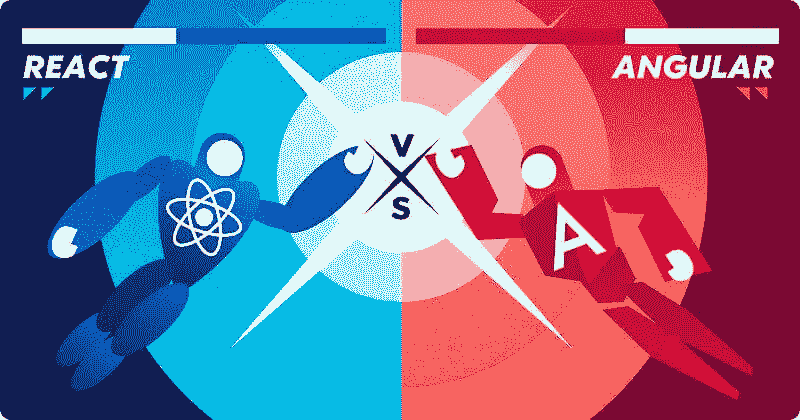

# 关于 Angular & React 你可能不知道的事情

> 原文：<https://medium.com/codex/things-you-may-not-know-about-angular-react-498ed930fce8?source=collection_archive---------8----------------------->

在当今世界，程序员主宰着网络。随着技术进步和市场需求，web 开发世界也发生了变化。然而，有一个正在进行的辩论。

Angular 和 React 是当今最流行的两种 JavaScript 框架。通常，你会发现很多正在进行的关于哪个更好的争论:[反应还是角度](https://www.clickittech.com/developer/react-vs-angular)？虽然双方都有…