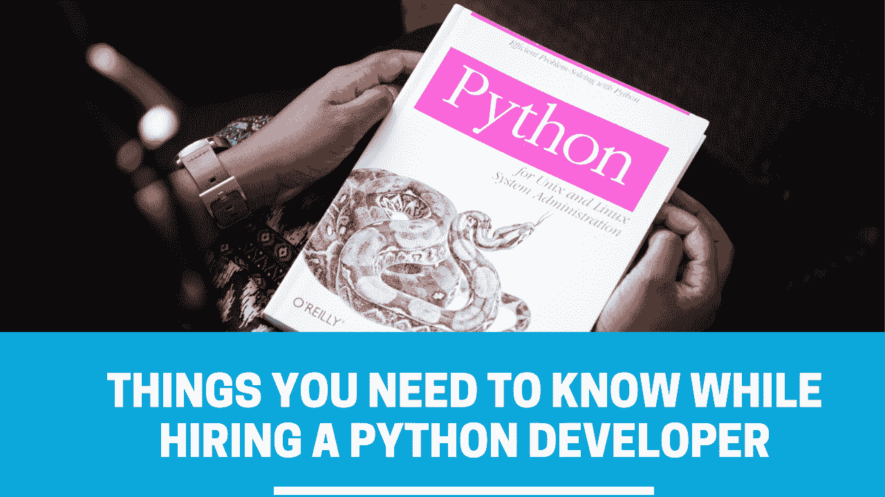

# 雇用 Python 开发人员时需要考虑的事情

> 原文：<https://medium.com/codex/things-you-need-to-consider-while-hiring-a-python-developer-7c0cb79ee737?source=collection_archive---------14----------------------->

多年来，Python 一直是一种流行的高级编程语言。它不仅仅是为单一任务量身定制的。从基础到更高层次或对于分析任务，Python 可以处理一切。这就是为什么谷歌、YouTube、网飞和其他一些流行的网站很大程度上依赖于 Python 编程语言设计。