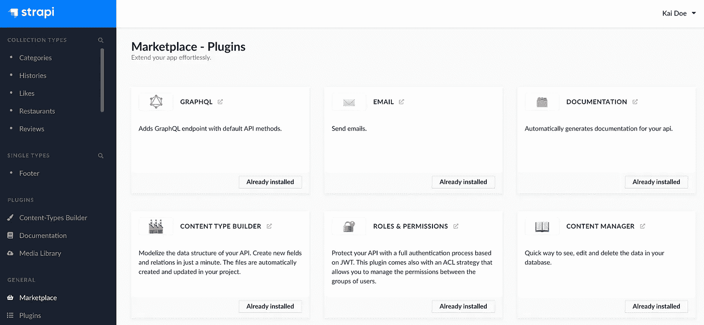
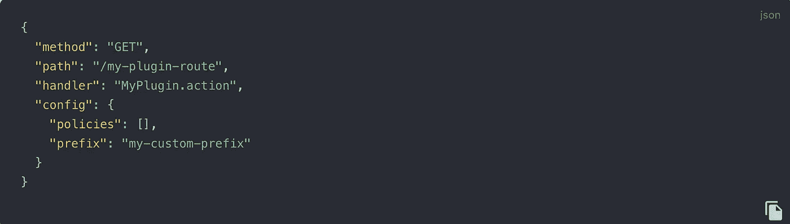

# 选择 Strapi CMS 之前您应该知道的事情

> 原文：<https://medium.com/codex/things-you-should-know-before-choosing-strapi-cms-25675876483c?source=collection_archive---------8----------------------->

对于不知道 Strapi 是什么的人来说，它是一个基于 Javascript 的无头 CMS。Strapi 是开源的，完全可定制。我假设你知道 CMS(内容管理系统)是什么，在这篇文章中，我将坚持我认为你在选择 strapi 作为你的 CMS 平台之前应该知道的特性。

# GraphQL 和 Rest 支持

Strapi 同时支持 REST 和 GraphQL。默认情况下，Strapi 为您的集合(数据模型)CRUD 操作提供 REST 端点。您可以启用 GraphQL 端点，但要使用 Strapi GraphQL 插件。插件可以通过市场获得。

来源:[https://strapi . io/documentation/user-docs/latest/plugins/installing-plugins-via-market place . html](https://strapi.io/documentation/user-docs/latest/plugins/installing-plugins-via-marketplace.html)

# 基于策略的路由

当您在 Strapi 中创建集合时，它会自动创建 CRUD 端点。如果您需要控制端点的访问，或者您想要应用任何定制的中间件，那么您可以创建策略并在您的路由配置中应用它们。下面是一个路由配置示例，您可以在策略阵列中添加许多策略。它将按顺序应用。

# 自定义插件

在 Strapi 中，你可以创建你的本地插件。当你想根据你的项目需求进行一些定制时，本地插件是很有用的。例如，如果您想要实现自定义报告或媒体集。你可以在这里探索更多关于创建自定义插件[的信息。](https://strapi.io/documentation/user-docs/latest/plugins/introduction-to-plugins.html)

# 轻松扩展管理用户界面

默认情况下，Strapi 为您提供了一个漂亮的用户友好的管理仪表板。它为您提供了必要的 UI 特性。但是如果你需要扩展用户界面，并根据公司的品牌和设计方针进行定制，你可以通过扩展管理用户界面来实现。这非常简单，因为您只需要遵循与 strapi 管理节点模块相同的目录结构和组件层次结构。你可以在这里阅读更多关于 T4 的内容。

# 国际化

为了让你的内容通俗易懂，你可以使用 Strapi 3.6+中免费提供的国际化特性。这使您可以控制字段本地化、版本控制等。如果你想知道更多，请点击阅读[。](https://strapi.io/blog/announcing-content-internationalization-v3-6)

# 自定义角色和权限

在开源版本中，strapi 提供了三种角色，即“作者”、“编辑”、“超级管理员”。但是，如果您需要更多的角色和自定义权限，您可以升级您的自定义角色和权限要求的计划。[这里的](https://strapi.io/pricing-self-hosted)是一个功能表。

# 单点登录身份验证

连接管理面板访问与企业认证提供商和协议，如 Auth0，Okta 等可在黄金计划，但你可以随时创建自己的插件，单点登录集成。我在上面分享了插件细节链接。

我觉得在使用 Strapi 之前，有几件重要的事情你应该知道。我会继续增加更多的分数。