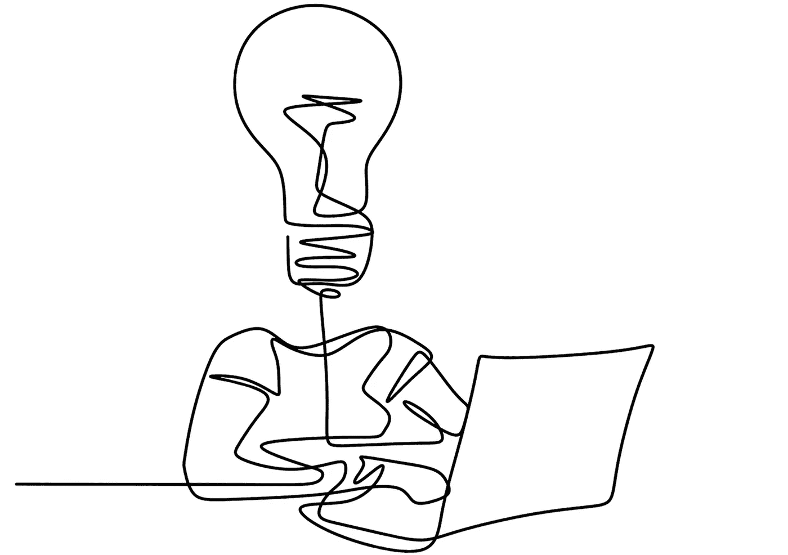

# 在反应中思考——有人没有思考

> 原文：<https://medium.com/codex/thinking-in-react-somebodys-not-thinking-17a08b7ddc01?source=collection_archive---------0----------------------->

我正在为一个潜在客户准备报价，他们有一长串的投诉和问题，这些都是他们的前*IT 主管留给他们的。我已经做了十年的可访问性和效率咨询，他们网站的“问题”其实并没有什么特别的。*

*这是一大堆错误！简单的事实是，这种垃圾基本上是“正常的”和…*