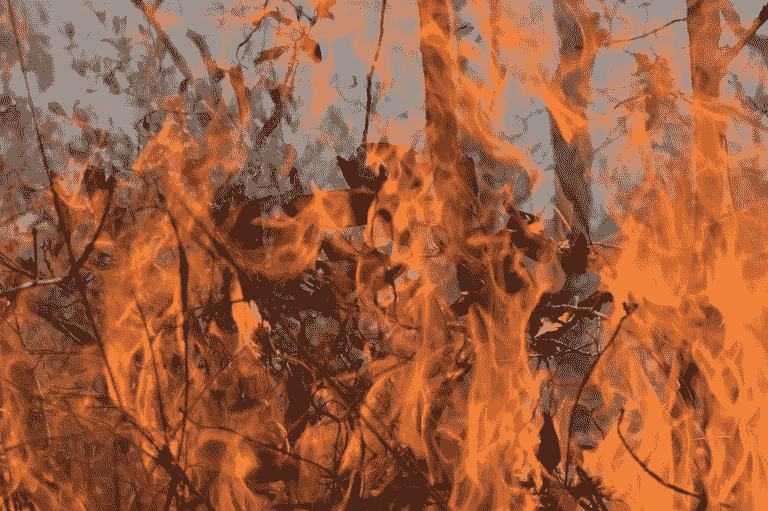

# 非理性、人工智能和气候危机

> 原文：<https://medium.com/codex/this-article-was-originally-published-in-the-monday-magazine-of-3-quarks-daily-see-here-aaf8b750d9be?source=collection_archive---------7----------------------->

*这篇文章最初发表在《3 夸克日报》的周一杂志上(见* [*此处*](https://3quarksdaily.com/3quarksdaily/2021/08/irrationality-artificial-intelligence-and-the-climate-crisis.html) *)* 。

人类是相当愚蠢的生物。当我们的星球燃烧时，我们中的一些人向太空中的亿万富翁欢呼。我们中的一些人认为疫苗会导致自闭症，地球是平的，人为的气候变化不是真的，新冠肺炎是个骗局，钻石有内在价值。我们中的许多人相信一些并不完全合理的事情，即使面对新的不利于我们立场的证据，我们仍然继续相信这些事情。也就是说，很多人都是可悲的不理性。然而，让这种状况更加令人沮丧的是，即使你认为自己是一个消息相当灵通的人，你仍然远没有完全理性。几十年的社会心理学和行为经济学研究表明，我们不仅是可怕的决策者，我们也一直是可怕的。这是有道理的:我们都有相当相似的“硬件”(以大脑、胆量和屁股的形式)，因此可以得出结论，在我们的推理能力中会有广泛共享的不一致性。

这就是说，以一种非常迂回的方式，我们把事情搞错了。我们选举了错误的领导人，我们相信错误的理论，我们以错误的方式行动。在气候变化的情况下，所有这些都变得尤其灾难性。但是，如果有一种方法可以摆脱这种悲惨的认知状况呢？如果使用人工智能监控状态，我们可以简单地让我们不可能做“错误”的事情，会怎么样？正如伊凡·卡拉马佐夫在《大检察官的故事》中指出的那样(陀思妥耶夫斯基的《卡拉姆佐夫兄弟》中)，天主教会应该受到赞扬，因为它“征服了自由……让人们幸福”。通过这样做，它“满足了人类普遍而持久的渴望——找到一个可以崇拜的人”。人类没有能力管理自己的自由。我们渴望别人告诉我们该做什么，因此，这种观点认为，拥有绝对权力统治我们的权威(如原著中的天主教会)最符合我们的利益。然而，这与自由民主规范形成了鲜明对比。我的目标是证明我们可以解决气候变化带来的问题，而无需重新发明自由民主之轮。也就是说，我们可以避免伊万·卡拉马佐夫设想的那种威权主义。

科学界和政界普遍认为，我们正处于气候灾难的边缘。通过我们自己的行为(以及越来越多的不作为)，我们掠夺了我们的星球，并进入了一些人所谓的“人类世”:一个我们拥有相当于地质力量的代理力量的时代。这给了我们主宰地球的能力，让人类文明带来的环境灾难遍布全球。然而，文明的一个良好特征是自由民主的建立(和捍卫)。这种参与式民主(至少在理论上)鼓励激烈的辩论、多样性和包容性。它们还保护个人自由:自由是一种重要的政治价值(尽管当然不是唯一重要的价值)，操纵和胁迫在追求某种或其他政治目标时会被视为不合理的(即使这一目标是减缓气候变化)。

这就把我们带到了我在本文开头介绍的问题:我们的自由民主框架，通过给我们“选择的自由”，导致了人类的愚蠢成为许多缓解气候危机的尝试的指导逻辑。放弃我们的自由，建立一个强制遵守全球气候目标的独裁国家，我们会过得更好吗？困境如下:有没有一种方法既能应对气候变化这样的生存威胁，又能维护自由民主？我自己的观点(以及马克·科克尔伯格在他最近关于这个话题的书里的观点)是，自由民主值得为之奋斗，我们有可能保护它而不灭绝。然而，要做到这一点，我们必须认真对待人工智能系统构成的威权威胁，将其作为气候危机的“解决方案”。

先进的人工智能系统无处不在。从社交媒体时间轴、YouTube 上的视频推荐，以及我们在网上看到的各种广告，人工智能在非常真实的意义上过滤了我们看到的世界。这个世界是玫瑰色还是红色，最终取决于算法认为什么能以最佳方式为其所有者实现收入最大化。这些系统也影响我们的情绪:我们被灌输信息，这些信息证实了我们的偏见，让我们暴露在非常狭窄的兴趣范围内，并促进极端的观点。这些内容通常具有煽动性、分裂性和两极分化。将这一点与社会心理学和行为经济学中的推动工作结合起来，你会发现人工智能驱动的威权怪物的潜力。轻推理论的支持者认为，由于人类的大脑是如此容易被“黑客攻击”，我们应该以这样一种方式设计我们的世界，使我们更容易“做正确的事情”。例如，我们可能会停止在商店里把含糖食物放在儿童眼睛的高度，希望他们不会看到这种合法的毒药，从而更容易降低他们对精制糖的摄入量。捍卫者称之为“自由家长主义”，声称这种方法不一定侵犯个人自由。

然而，很难理解让“轻推者”代表我们决定他们认为对我们这些“轻推者”有益的事情是如何不侵犯我们的自由的。轻推者为我们决定。为什么？因为我们不被信任。我认为，在这里，我们看到了迄今为止在我的讨论中一直有效的指导前提:我们不能*信任*人类。如果听之任之，我们将不可避免地把事情搞砸(这方面的证据可以通过四处看看或读一本书找到)。因此，我们的自由可以被合理地剥夺，因为当我们获得自由时，我们会用它做非常糟糕的事情。如果由监控国家操作的数据驱动的人工智能系统是实施这种限制的方法，并且能够缓解气候危机，那就这样吧(可以称之为霍布斯解决方案，以托马斯·霍布斯及其人性观命名)。

尽管如此，这种观点是基于对自由的贫乏理解而运作的。更确切地说，我们可以从正反两个方面来看待自由。在上面概述的对人性的不信任的观点中，自由被框定为纯粹消极的。消极自由是我们“远离”事物的自由:不受国家或其他人干涉的自由。另一方面，积极自由是关于我们“去”的自由。我们可以用我们的自由做什么，它的限制和可能性是什么。根据霍布斯的解决方案，规章和限制是合理的，但仍然被认为是侵犯了我们的消极自由。然而，这种方法没有提到积极自由。如果我们不是天生可怕的，那么我们理性的时候呢，我们做非常好的事情的潜力呢？如果我们*可以被*信任呢？

从民主的角度来看，这将是更可取的。对人性的信任意味着我们可以相信我们的领导人在关键时刻会把事情做好，我们可以相信公民会投票给有道德的领导人。当然，在实践中，这是很难实现的。然而，当我们透过积极自由的镜头来看我们的政治选择时，我们开始看到它是如何成为可能的。例如，一种方法可以是增强某些*的能力。通过这种方式，我们可以通过创造增强个人和集体福祉的条件和政策来增加我们的积极自由。此外，我们实现这一目标的手段应该是民主的。在杜威之后，我们可以看到像“有组织的智慧”这样的民主进程，在那里我们可以把冲突带到桌面上，公开解决它们，潜在地解决它们，并取得进步。因此，我们自由民主政治制度的目标应该是创造条件，使人类有能力提高整体福利。*

这样，就有可能超越霍布斯的解决方案，信任我们的民主制度。此外，我们可以看到缓解气候危机的约束和法规不仅仅是对我们消极自由的侵犯。相反，它们可以被视为通过为现有人类和后代保护我们的生物圈而加强积极自由。这并不是说我们应该将我们的政治讨论局限于人类中心主义的观点。人类造成的气候变化当然也对动物和植物造成了毁灭性的影响，我们必须将这些纳入我们的政治讨论中。应对气候变化带来的问题的一个重要部分将涉及建立非人类中心的政治话语。这将涉及保护自然的权利和动物的利益。考虑到这一点，盲目捍卫消极自由是没有用的，因为这种捍卫导致了我们环境的破坏。应对气候危机需要我们超越这种狭隘的自由。

这些和人工智能有什么关系？为了在气候变化方面加强积极自由，我们需要监管和监督，人工智能也是如此。虽然许多人吹捧新技术将使美好的事情成为可能，但我们也必须认识到这些技术如何加剧现有的社会不平等。不仅如此，过度依赖算法系统会让我们看不到可能没有技术解决方案的(社会)问题。气候危机不是一个我们仅靠科学就能解决的问题:它也是一个深刻的政治问题，一种“混合体”，所以如果我们想用人工智能作为改善它的手段，我们就不能忽视这样的政治问题。积极自由的概念为我们提供了一个*框架*，我们可以用它来评估将人工智能与人类价值观相结合的尝试以及为我们的生物圈服务的干预措施。我们不应该只关注消极的自由，我们还应该认识到限制、规定等等。也可能增强积极自由。

气候危机和人工智能等新兴技术的共同点在于它们质疑各种自由民主规范。在这两种情况下，一方面是威权主义，另一方面是不受约束的自由意志主义，这给我们的政治体制带来了压力。我希望在这里做的是表明，我们可以摆脱这种二元的框架方式，同时仍然保留民主参与的好处。