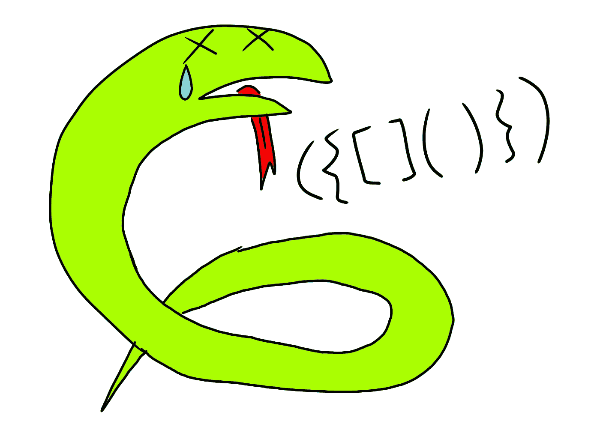

# 这个编码面试问题可能会让我失去在脸书的实习机会

> 原文：<https://medium.com/codex/this-coding-interview-question-might-have-cost-me-an-internship-at-facebook-383cbe26f81d?source=collection_archive---------7----------------------->

早在 2019 年的某个时候(我想)就有人给我出了这个问题，很遗憾我没能在给定的时间内解决这个问题，所以我甚至没有晋级第二轮面试。对于那些准备编码面试的新手来说，这里是我对这个问题的解决方案和解释。

# 这个问题