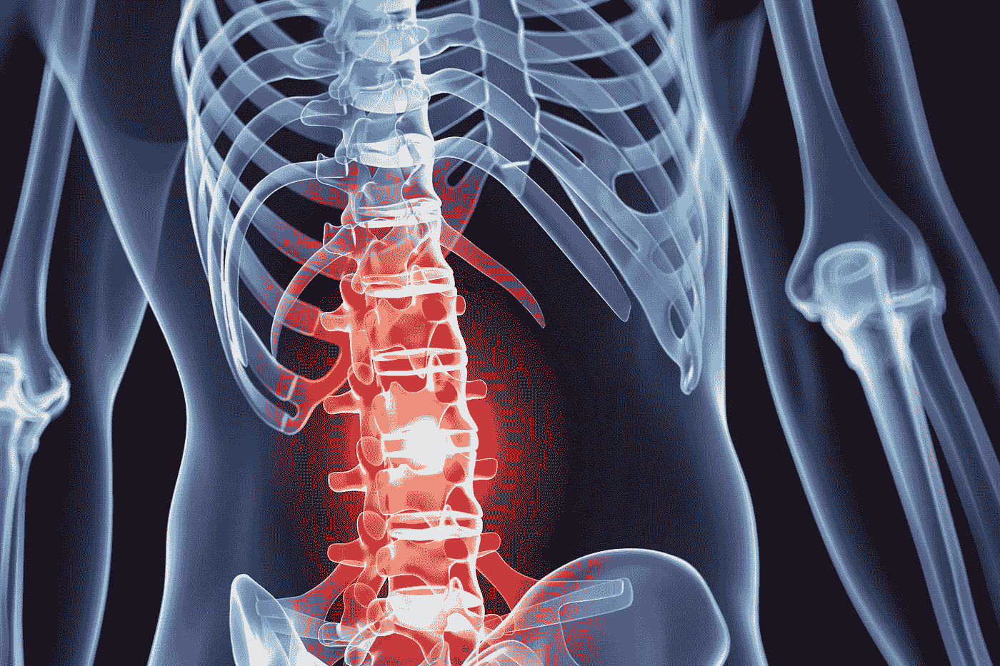

# 这就是人工智能将如何改变我们治疗脊柱损伤的方式。

> 原文：<https://medium.com/codex/this-is-how-ai-has-been-used-to-aid-in-the-enzymatic-treatment-of-spinal-damage-96cbf14a69ac?source=collection_archive---------10----------------------->

显示骨骼系统的人体插图，下部脊椎以红色突出显示，以指示痛点。图片提供:密歇根工程

## 共聚物结构-性质关系的机器学习策略的快速概述。

脊髓损伤是改变生活的事件，会引起生理和心理的变化。