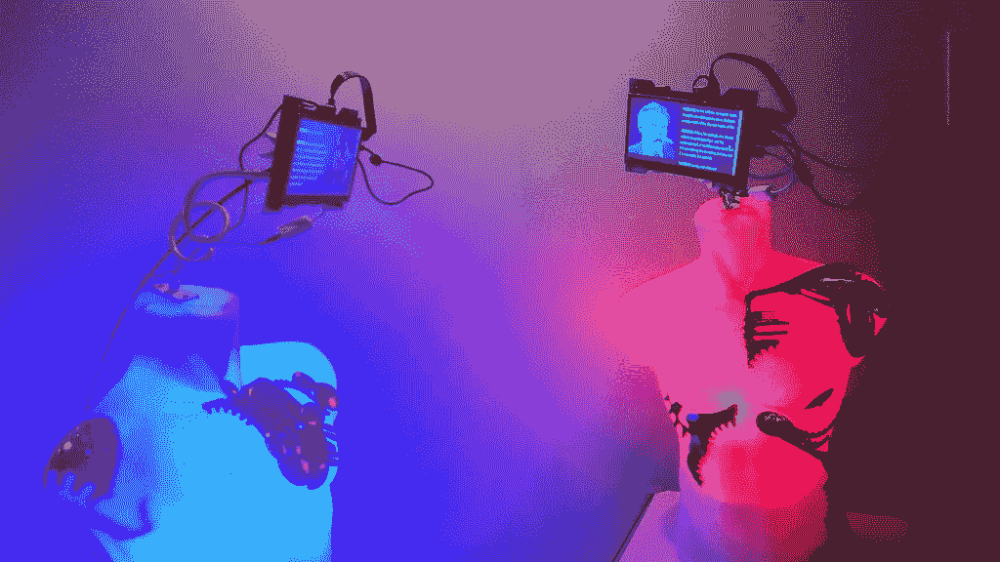

# 这就是我如何用人工智能来回答伟大的哲学问题

> 原文：<https://medium.com/codex/this-is-how-im-using-ai-to-answer-great-philosophical-questions-696d5e4c3543?source=collection_archive---------3----------------------->

来源:[电子艺术节](https://www.flickr.com/photos/arselectronica/)

## 我用 ChatGPT 回答了一些人类以前从未解决的最大的哲学问题。

我们能不能用人工智能去哲学的根源去处理对人类来说是根本的概念，像**反思、理性、自由、教育？**