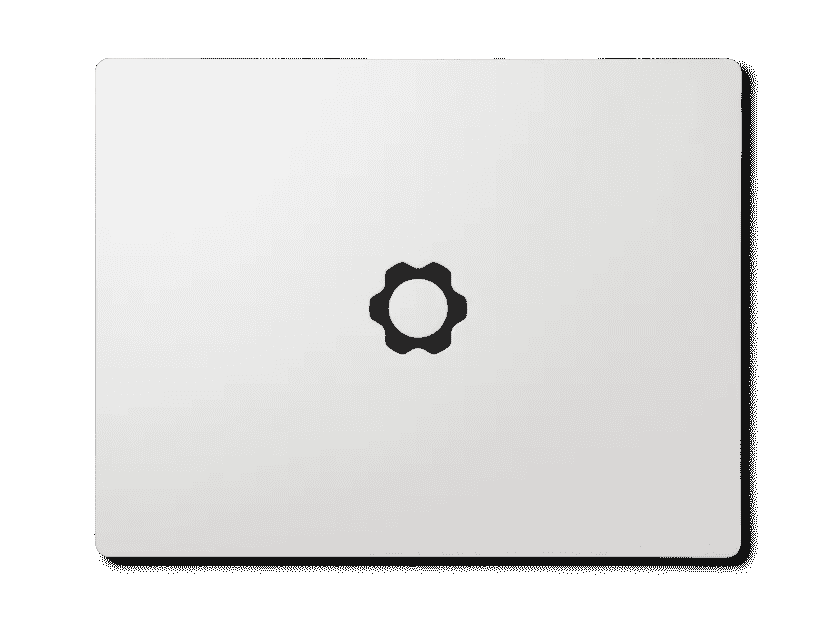

# 这就是反 MacBook，我爱它。

> 原文：<https://medium.com/codex/this-is-the-anti-macbook-and-i-love-it-7ea673e6a86b?source=collection_archive---------0----------------------->

## 但它能挑战苹果吗？

信用框架

几周前，我买了一台 14 英寸的 MacBook Pro。这是一台很棒的笔记本电脑，我不后悔。这可以说是我拥有过的最好的笔记本电脑之一。但它也有一些缺点——其中之一是它基本上是不可修复的，至少对我来说是这样。如果内存出现故障，或者如果固态硬盘决定它不想再玩了，我不能修复它…