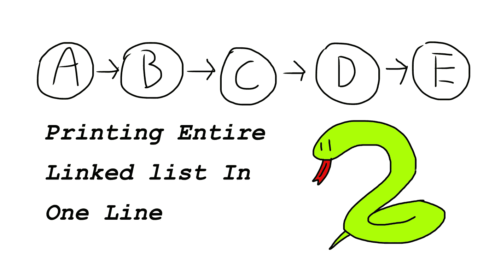

# 这个一行程序函数可以一次打印出你的整个链表

> 原文：<https://medium.com/codex/this-one-liner-function-can-print-out-your-entire-linked-list-at-once-2a4571355ee2?source=collection_archive---------15----------------------->

如果你刚刚开始学习链表，试图在一开始就把它可视化会是一件非常头疼的事情。这里有一种在一行中打印出整个链表*的方法。*

# 创建链表的代码

让我们尽可能把事情简单化。

## 节点类