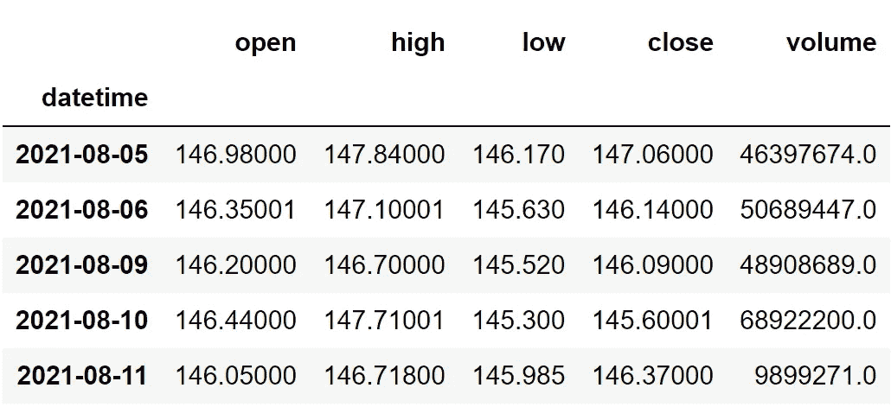
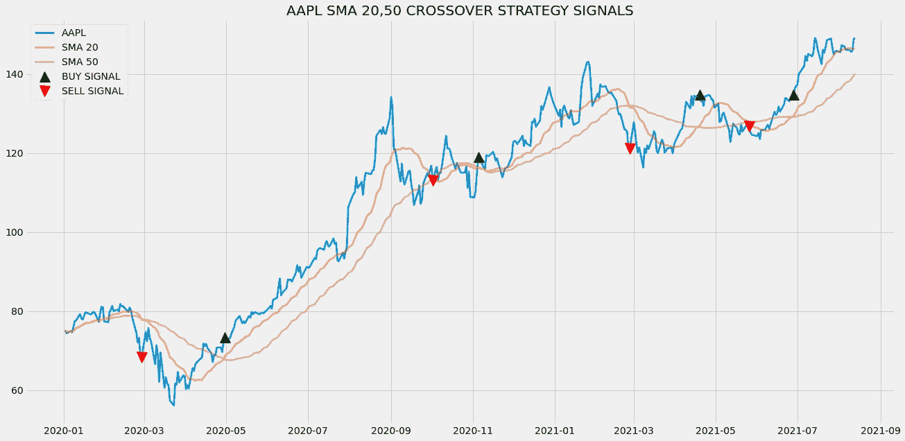

# 这个 Python 库将帮助你在一行代码中获得股票技术指标

> 原文：<https://medium.com/codex/this-python-library-will-help-you-get-stock-technical-indicators-in-one-line-of-code-c11ed2c8e45f?source=collection_archive---------0----------------------->

## 无缝提取基本股票信息到高级技术指标


照片由 [Alex wong](https://unsplash.com/@killerfvith?utm_source=medium&utm_medium=referral) 在 [Unsplash](https://unsplash.com?utm_source=medium&utm_medium=referral) 上拍摄

技术指标非常吸引人，总能抓住我的注意力。我对它们进行了大量的研究，并了解到研究技术指标的重要部分是将它们应用到现实世界的市场中，但在此之前，我们需要做一些称为回溯测试的事情，这只是通过对过去的历史数据进行测试来确定策略性能的过程。

现在要进行回溯测试过程，有几个平台，但我找不到我需要的灵活性。所以我开始使用 Python(我现在仍然是)来编写整个程序，顺便说一下，这非常灵活和有趣。

对我来说，使用 Python 编写整个程序的唯一缺点是从头开始创建技术指标。为了做到这一点，我们必须首先理解指标的基本思想，其次是它的数学公式(有些有两个或更多)。因此，我决定使用 Python 包来完成这项工作，但由于两个原因，我仍然无法找到值得注意的库。第一是安装和文件很差，第二是读数不规则。

我开始遵循我的传统方法，即从头开始构建指标，直到我遇到这个 Python 库。看，股票统计。它是熊猫数据框架的包装器，提供从基本股票信息到高级技术指标的数据。在本文中，我们将深入研究这个库并探索它的功能。事不宜迟，我们走吧！

# 导入包

将所需的包导入到我们的 python 环境中是一个不可避免的步骤。在本文中，我们总共需要五个包，它们是用于处理数据帧的 Pandas、用于进行 API 调用和提取股票数据的请求、用于高级功能的 NumPy 和用于可视化的 Matplotlib，最后是用于访问技术指标和其他基本股票信息的 StockStats 包。对于那些尚未安装这些软件包的用户，请将以下代码复制到您的终端中:

```
pip install pandas
pip install requests
pip install numpy
pip install matplotlib
pip install stockstats
```

安装完这些包之后，就该将它们导入到我们的 python 环境中了。

```
import requests
import numpy as np
import pandas as pd
import matplotlib.pyplot as plt
from stockstats import StockDataFrame

plt.style.use('fivethirtyeight')
plt.rcParams['figure.figsize'] = (20, 10)
```

# 提取股票数据

现在，我们已经导入了所有必要的包。让我们使用由[twelvedata.com](https://twelvedata.com/)提供的 API 端点提取苹果的历史股票数据。在此之前，关于[twelvedata.com](https://twelvedata.com/)的一个说明:十二数据是领先的市场数据提供商之一，拥有针对所有类型市场数据的大量 API 端点。它非常容易与十二数据提供的 API 进行交互，并且拥有有史以来最好的文档。此外，确保您在[twelvedata.com](https://twelvedata.com/)拥有账户，只有这样，您才能访问您的 API 密钥(使用 API 提取数据的重要元素)。

**Python 实现:**

```
def get_historical_data(symbol, start_date):
    api_key = 'YOUR API KEY'
    api_url = f'https://api.twelvedata.com/time_series?symbol={symbol}&interval=1day&outputsize=5000&apikey={api_key}'
    raw_df = requests.get(api_url).json()
    df = pd.DataFrame(raw_df['values']).iloc[::-1].set_index('datetime').astype(float)
    df = df[df.index >= start_date]
    df.index = pd.to_datetime(df.index)
    return df

aapl = get_historical_data('AAPL', '2020-01-01')
aapl.tail()
```

**输出:**



作者图片

在上面的代码中，我们做的第一件事是定义一个名为`get_historical_data`的函数，它将股票的符号(`symbol`)和历史数据的起始日期(`start_date`)作为参数。

在函数内部，我们定义了 API 键和 URL，并将它们存储到各自的变量中。接下来，我们使用`get`函数提取 JSON 格式的历史数据，并将其存储到`raw_df`变量中。在对原始 JSON 数据进行清理和格式化之后，我们将以干净的 Pandas 数据帧的形式返回它。最后，我们调用创建的函数从 2020 年开始提取苹果的历史数据，并将其存储到`aapl`变量中。

# 熊猫数据帧到 Stockstats 数据帧

在进行任何操作之前，最重要的事情之一是将 Pandas 数据帧转换为 Stockstats 数据帧。在前面的步骤中，我们使用 API 端点提取了苹果的历史数据，我们转换了 JSON 响应，并以 Pandas dataframe 的形式存储它。因此，我们首先必须将其更改为 Stockstats 数据帧，这可以通过调用包的主类`StockDataFrame`并将数据帧传递给它来轻松完成。按照代码片段来做:

```
aapl = StockDataFrame(aapl)
```

在实现了上面的代码之后，您会注意到您的数据帧几乎没有变化，除非您的列是用大写字母命名的，它们会被转换成小写字母。但这并不意味着这一步是可选的，事实上，将数据帧转换成 Stockstats 格式对于执行任何类型的任务都是强制性的。

# 获取技术指标

现在，我们都开始关注本文的主要部分。正如我在标题中提到的，Stockstats 以这样一种方式提供技术指标，我们只需编写一行代码，就可以得到想要的结果，顺便说一下，这不是一个虚假的希望，而是一件真实的事情。我们所要做的就是选择列名，就像我们在 Pandas 数据帧中访问列一样，Stockstats 会处理剩下的事情。为了说明它有多简单，让我们看一个例子，在这个例子中，我们将访问具有不同回顾期的 SMA 的读数:

```
aapl[['close_10_sma', 'close_20_sma', 'close_50_sma']]
```

上面的代码将为我们提供回顾期 10、20 和 50 的 SMA 值。与此同时，这些值将被附加到原始的 Apple dataframe 上，这是另一个技术分析库所没有的。代码的输出将是一个 Stockstats 数据帧，如下所示:


按作者分类的图像(显示数据帧的前五行)

Stockstats 希望我们遵循特定的结构来访问技术指标，即`{columnName_window_statistics}`，其中`columnName`是我们在计算指标时要考虑的数据框架中的列，`window`是回望期，`statistics`是我们要访问的指标。在上面的例子中，我们提到`close`作为`columnName`，意味着我们要考虑苹果的收盘价，`10,20,50`作为回望期，`sma`作为我们要访问的统计数据或技术指标。

Stockstats 不仅允许我们访问简单移动平均线等基本技术指标，还为许多其他高级指标打开了大门，如布林线、相对强度指数、威廉姆斯%R、移动平均线收敛/发散、商品通道指数等。以下代码片段将访问上述所有高级技术指标，遵循与 SMA 代码相同的结构。

```
**# 1\. BOLLINGER BANDS** aapl[['boll', 'boll_ub', 'boll_lb']]

**# 2\. RSI** aapl[['rsi_11', 'rsi_14', 'rsi_21']]

**# 3\. WILLIAMS %R** aapl[['wr_11', 'wr_14', 'wr_21']]

**# 4\. MACD** aapl[['macd', 'macdh', 'macds']]

**# 5\. COMMODITY CHANNEL INDEX** aapl[['cci_11', 'cci_14', 'cci_21']]
```

上述代码中的每一行都将访问不同回顾期的指标，并将这些值附加到原始数据帧中。可以注意到，我在访问技术指标时使用了双括号，这是因为 Stockstats 构建在 Pandas dataframe 类之上，并且仍然保留其功能，因此，当使用单括号时，输出将是 Pandas 系列的形式。因为我希望输出在 Pandas 数据帧中，所以我使用了双括号。

# 产生贸易信号

Stockstats 的独特之处之一是它能够从提到的交易策略中产生信号。这太棒了，因为算法交易就是产生交易信号，没有它，创造的交易策略就会过时。就像我们如何访问技术指标一样，这也只需要一行代码，但结构不同。当 SMA 20 在 SMA 50 上方交叉时，下面的代码片段产生进场交易信号:

```
aapl['close_50_sma_xd_close_20_sma']
```

上面的代码给出了一系列布尔值作为输出，如果条件得到满足，这些值就变成`True`，否则，这些值就是`False`。下面的代码将通过生成进场和出场交易信号使这一策略更上一层楼，从而使策略在本质上更加现实:

```
buy_signals = aapl['close_50_sma_xd_close_20_sma']
sell_signals = aapl['close_20_sma_xd_close_50_sma']for i in range(len(buy_signals)):
    if buy_signals.iloc[i] == True:
        buy_signals.iloc[i] = aapl.close[i]
    else:
        buy_signals.iloc[i] = np.nanfor i in range(len(sell_signals)):
    if sell_signals.iloc[i] == True:
        sell_signals.iloc[i] = aapl.close[i]
    else:
        sell_signals.iloc[i] = np.nan

plt.plot(aapl['close'], linewidth = 2.5, label = 'AAPL')
plt.plot(aapl['close_20_sma'], linewidth = 2.5, alpha = 0.6, label = 'SMA 20')
plt.plot(aapl['close_50_sma'], linewidth = 2.5, alpha = 0.6, label = 'SMA 50')
plt.plot(aapl.index, buy_signals, marker = '^', markersize = 15, color = 'green', linewidth = 0, label = 'BUY SIGNAL')
plt.plot(aapl.index, sell_signals, marker = 'v', markersize = 15, color = 'r', linewidth = 0, label = 'SELL SIGNAL')
plt.legend(loc = 'upper left')
plt.title('AAPL SMA 20,50 CROSSOVER STRATEGY SIGNALS')
plt.show()
```

让我们逐行分解代码。在前两行代码中，我们使用 Stockstats 生成进场和出场交易信号，并将值保存到各自的变量中。之后，我们将创建两个 for 循环，如果值为`True`，将使用股票的收盘价替换交易信号，否则，`False`值将被 NaN 替换。下面几行绘制了创建的交易信号，以及苹果的收盘价和计算出的 SMA 20，50，这将产生如下所示的输出:



作者图片

从上面的图表可以看出，每当红线(SMA 20)越过金线(SMA 50)时，买入信号用绿色绘制，同样，每当金线越过红线时，卖出信号用红色绘制。

# 最后的想法！

在本文中，我们简要地看了一下 Stockstats 库，更不用说，它确实是一个非常棒的库。值得一提的是，Stockstats 不仅支持技术指标并生成交易信号，还允许我们访问基本的股票信息，如价格、回报等的变化。

这个软件包目前唯一的缺点是它的文档很差，需要一千年才能完全理解。尽管这个包不像 Pandas 和 NumPy 那样庞大，但保持完美的文档是必不可少的，因为它是一个包装器库，所提供的函数很复杂并且与其他函数不同。非常感谢[艾里克·林森](https://medium.com/u/44bc27317e6b?source=post_page-----c11ed2c8e45f--------------------------------)通过他的[精彩文章](https://towardsdatascience.com/stockstats-a-handy-stocks-oriented-pandas-dataframe-wrapper-a879a06d9c3f)向我介绍了这个包(强烈推荐查看)。

总之，Stockstats 是独一无二的，对于任何刚进入技术分析领域的人来说都是一个很好的库，它提供了强大的功能，只需一行代码就可以访问，最终减少了程序员的工作量并节省了时间。话虽如此，你已经到了文章的结尾。希望你能从这篇文章中学到一些有用的新东西。

**赞助:** [EOD 历史数据](https://eodhistoricaldata.com/r/?ref=DHY3H8NT)是金融应用编程接口市场的领导者之一，提供各种各样的应用编程接口，从基本的每日市场数据到高度可定制的应用编程接口，如金融新闻应用编程接口和股票筛选应用编程接口。他们所有的 API 都是以一种本质上易于使用的方式设计的，因此初学者可以毫无障碍地使用它们。我个人使用过 [EOD 历史数据公司的](https://eodhistoricaldata.com/r/?ref=DHY3H8NT)API，从我的经验来看，他们的 API 既适合专业人士，也适合业余爱好者，用于辅助项目和构建企业级应用。