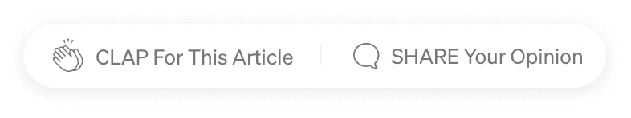

# 这个简单的技术把我从黑客手中救了出来

> 原文：<https://medium.com/codex/this-simple-technique-saved-me-from-hackers-489f8adb9f60?source=collection_archive---------19----------------------->

## 如何在 PHP 中防止 SQL 注入？


塞巴斯蒂安·斯塔姆在 [Unsplash](https://unsplash.com?utm_source=medium&utm_medium=referral) 上的照片

嗨，我是尼科，

伦敦(英国)一家票务经纪公司的高级工程师。

你在办公室看书！

这是我每天(几乎)例行发布的日志，记录我在办公室的日常生活中使用的技术。

# **这个帖子是给谁的？**

这里我们谈谈 PHP、MySql 和网络安全。

如果你已经对这个话题了如指掌，现在是时候通过阅读来提高技能了:

[](https://anastasionico.uk/blog/domain-driven-design-quickest-the-basics) [## 领域驱动的设计最快{基础}

### 让我对你做一个小小的猜测，你浏览这个网站并正在阅读这句话的原因是…

anastasionico.uk](https://anastasionico.uk/blog/domain-driven-design-quickest-the-basics) 

如果这篇文章对你来说太复杂，你可以选择这篇:

[](https://anastasionico.uk/blog/good-practices-php-security-manage-password) [## 良好实践:PHP 安全，如何管理密码

### 脸书-剑桥分析公司，2016 年美国民主党电子邮件泄露，2018 年谷歌数据泄露，2012 年雅虎语音黑客…

anastasionico.uk](https://anastasionico.uk/blog/good-practices-php-security-manage-password) 

# 问题是

这个故事有两个演员。

一个是你，一个友好、积极的 web 开发人员，想要构建安全的 web 应用程序。

另一个是露西

露西不那么友好，

她也喜欢科技，但她真正想要的是从你的应用程序用户那里获取数据。

如果您曾经参与过任何 web 开发项目，您会知道其中最重要的部分之一是管理数据。

> **密码就像内裤。不要让人看到，经常换，不要和陌生人分享。**
> 
> *克里斯·皮里略*

您将要处理一些数据是非持久化的，但是有时需要一次又一次地使用，

为了做到这一点，这些数据需要存储在某个地方。

大部分时间某个地方是一个数据库。

**数据库是通常保存在计算机中的一组系统化的信息。**
由数据库管理系统维护。

数据和 DBMS 以及与之相关的应用程序被称为数据库系统。

就像当你和你的朋友或熟人交谈时，为了有效地和数据库“交谈”,你需要一种你们双方都能理解的标准或语言。

在中，这种语言称为 SQL

**SQL 代表结构化查询语言，用于对数据库进行操作。**

它是目前数据库管理系统的标准语言。

SQL 由一系列语句组成，从执行创建、读取、更新和删除项目等操作的确定的关键字开始。

一些最流行的版本是 Oracle、Microsoft SQL Server 和 MySQL。

根据数据库中包含的数据类型，如果处理不当，与数据库通信可能是一项非常危险的任务。

有许多风险，只要看看在过去几年中有多少攻击和泄漏。

具体说到攻击，最常见的攻击之一是 SQL 注入攻击。

# SQL 注入是什么意思？

SQL 语言的形式相当标准…

…露西也知道这一点。

根据您需要做的事情，许多语句会有相同的关键字和结构。

看看下面这个例子。

`/api/users?role=admin`

```
SELECT *
FROM users
WHERE *role = 'admin'* AND permission = 'true';
```

即使这是你第一次看到一些 SQL 代码，我们在这里想要实现的也是非常简单的。

通过点击`*/api/users*`端点，我们告诉您的应用程序查找(`*select*`)所有拥有(`*where*`)角色*的用户(*等于' *admin '。*

**SQL 注入攻击是指攻击者通过客户端向应用程序的输入注入 SQL 查询的一部分。**

如果露西知道她在做什么，她可以很容易地从我们的数据库中读取、插入或删除非常合理的数据，甚至对服务器的 SO 做一些操作。

这是你不想要的！

她怎么能做到呢？

看看这个

`api/users?role=admin'--`

现在查询看起来更像这样；

```
SELECT *
FROM users
WHERE role *= 'admin'--'* AND permission = 'true';
```

双破折号的作用是排除其后出现的所有内容

这样，Lucy 有效地删除了我们查询中的权限部分。

好的，但是我的*用户的*表在 role 字段中没有 admin 字符串，所以她不能获得任何信息。我很安全！

是吗？

让我们重写端点调用，好吗？

`api/users?role=admin'+OR+1-1--`

这就变成了

```
SELECT *
FROM users
WHERE role = 'admin'
OR 1-1--'
AND permission = 'true';
```

现在，即使您的用户表中没有任何 *admin* 字段，查询仍然返回所有用户，因为 1 始终等于 1，并且通过添加双 dush，数据库从不检查权限。

# 热，以防止 SQL 注入袭击？

只有一种方法可以避免 SQL 注入攻击，每次使用数据库时都必须牢记这一点。

你必须把数据和语言分开。

数据就像句子的主题，它必须远离，这样 SQL 解析器就不会解释它。

您必须始终使用预处理语句和参数化查询。

这些语句与数据分开发送到数据库服务器。
这使得 Lucy 无法将自己的代码添加到 SQL 查询中

让我们用代码看一个例子来解释你刚刚读到的内容。

```
$mysqli = new mysqli("localhost", "my_user", "my_password", "world");$role = "admin";

$statement = $mysqli->prepare("SELECT email FROM Users WHERE role=?");$statement->bind_param("s", $role);

$statement->execute();

$statement->bind_result($email);

while ($statement->fetch()) {
    printf("the %s email is: %s\n", $role, $email);
    // The admin email is: admin@mail.com
}$stmt->close();
```

注意，当使用`*mysqli*`或`*PDO*`来访问 MySQL 数据库时，默认情况下不使用预处理语句。

您需要禁用模拟。

使用以下命令完成此操作。

```
// PDO
$dbConnection->setAttribute(PDO::ATTR_EMULATE_PREPARES, false);
$dbConnection->setAttribute(PDO::ATTR_ERRMODE, PDO::ERRMODE_EXCEPTION);// mysqli
mysqli_report(MYSQLI_REPORT_ERROR | MYSQLI_REPORT_STRICT); // error reporting
$dbConnection->set_charset('utf8mb4'); // charset
```

# 准备好的声明 SQL 注入

所以，

您现在知道了处理数据库存在风险，并且已经了解了如何编辑代码。

这一切意味着什么呢？

简单地说，传递给 prepare 函数的 SQL 语句将被数据库服务器解析。

> 人们总是问我，“是什么让你夜不能寐？”我说，‘辛辣的墨西哥食物，大规模杀伤性武器和网络攻击。’—荷兰卢比茨贝格

假设我们已经指定了要添加的参数，在我们的例子中是`*role=?*`、**，数据库引擎知道在哪里应用它的过滤器**(我们也可以使用语法`*role=:name*` )。

接下来发生的是，我们从那个 *mysqli_stmt* 对象调用 *execute()* 方法，该语句与参数相结合，在我们的例子中是角色。

**参数值与编译后的语句而不是 SQL 字符串相结合。**

这意味着在某种程度上，我们将实际的 SQL 与参数分开发送，从而限制了恶意执行的风险。

假设我们将 s 作为参数给出，那么在使用预准备语句时发送的任何参数都将被视为字符串。

我们比以前更安全了，你的敌人露西现在不能再注射任何东西了。

这是一张很好的照片！


[Elisa Ventur](https://unsplash.com/@elisa_ventur?utm_source=medium&utm_medium=referral) 在 [Unsplash](https://unsplash.com?utm_source=medium&utm_medium=referral) 上拍摄的照片

此外，在多次执行同一个语句时使用预准备语句只会被解析和编译一次。

这是一个很大的速度优势。

# 是时候分享你的观点了

你知道 PHP 中的预准备语句吗？

你觉得他们什么时候更有价值？

在下面的评论中写下你的想法。



我已经做了将近十年的网页开发员了。

与位于伦敦市中心的世界级企业和屡获殊荣的营销机构合作。

此外，我在我的博客和在线社区上写文章和教程，并帮助企业在网上建立他们的存在。

[点击这里阅读我博客上的 100 多篇文章](https://anastasionico.uk/blog)