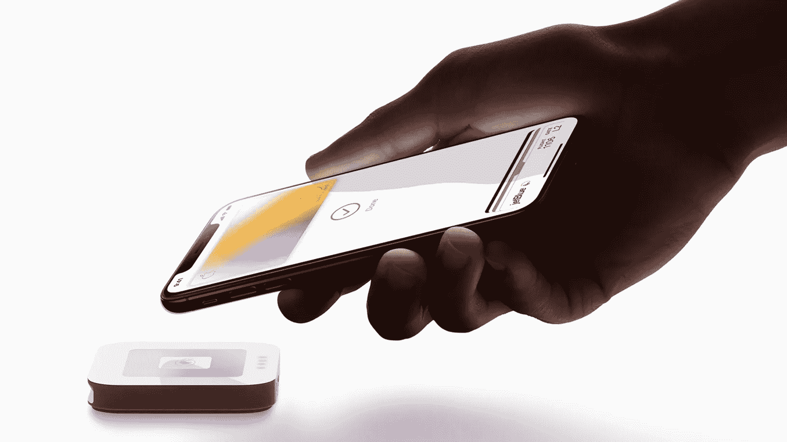
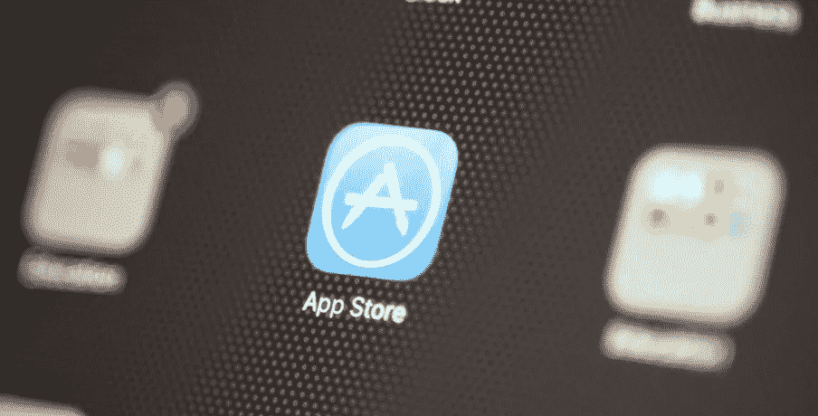

# 本周苹果新闻综述

> 原文：<https://medium.com/codex/this-weeks-apple-news-round-up-31a3534a07d0?source=collection_archive---------9----------------------->

## 苹果周新闻精华尽在一个博客中

## 直接向您的 iPhone 付款

即将到来的 iOS 15 更新中的一个奇妙的新功能将是直接支付到你的手机上。没错，根据马克·古尔曼的说法，很快你就可以接受信用卡支付，因为你的手机将充当信用卡终端。使用已经嵌入手机的 NFC 功能，现在应该可以摆脱过去传统的销售点支付。

## 钱多理智少？

好吧，如果你有，那么这个星期我看到了可能是我所听说过的最没用的苹果配件的发布(除了抛光布！).AirPods Max 本身是一个荒谬的 450- 550，现在你可以花一大笔钱买一个 Ophidia 古驰的盒子。它只在网上出售，价格高达 645 英镑！*动心？*

## 苹果诉脸书案中的隐私成本

据报道，苹果最新的 iOS 隐私措施让脸书花费了 100 亿美元，因为现在平台、网站和应用程序跟踪用户习惯变得更加困难。虽然宣布收入为 336.7 亿美元，但每股收益低于分析师的预期。*我的心在流血！*

## 跟踪案件中引用的航空标签

在康涅狄格州，一名男子试图使用无线标签跟踪一辆汽车，作为正在进行的家庭事故案件的一部分，他被逮捕。这名男子已经被指控违反保护令和*一级跟踪*两项罪名。这两项罪名都是重罪，他将在 3 月底面临判决。*我敢肯定，这不会是我们最后一次看到这些头条新闻了……*

## iMessage 反应和谷歌消息

到目前为止，如果一个 iPhone 朋友在他的旁边添加了一个“喜欢”或“笑脸”表情符号，谷歌信息的接收者只会在他们的屏幕上出现“被嘲笑”或“喜欢”的字样。然而，在过去的一周内，最新的 Google Messages 测试版*终于*增加了能够原生看到实际表情符号的功能。这是否意味着我们在未来向单一平台、跨设备的蓝色泡泡靠拢？

## 新款 27 英寸 iMac Pro 的延迟

根据屏幕分析师 Ross Young 的说法，备受期待的 iMac Pro 的发布预计将会推迟。现在从春季赛事往后推，至少最早要到 WWDC。当它最终登陆时，我们可以期待一个 27 英寸的迷你 LED 面板和 M1 Max & Pro 芯片的升级版。一旦发布，它将是苹果迄今为止最快的台式机。

## 苹果对 App Store 的控制放松

本周四，立法获得通过，如果通过，将迫使苹果首次允许 iOS 用户从应用商店之外安装应用。两党 21 比 1 的投票结果强烈表明，该法案很可能会获得通过。该法案旨在放松苹果和 Alphabet Inc .旗下谷歌对移动应用分发的双头垄断。

## CarPlay 升级

流行的车载信息娱乐系统正在寻求更多的功能，包括帮助设置气候控制、加热座椅、收音机等。我们也可能在今年的 WWDC 上听到更多。

## 苹果新的“以旧换新工具”

传闻即将发布的 iOS 更新 15.4 中的另一个功能是以旧换新工具。它将使用手机摄像头对您当前的设备进行外观扫描，如屏幕损坏或表面划痕，使整个以旧换新交易更快、更透明。这应该意味着，如果苹果公司对你的设备报价，那么它不太可能收到所述设备，而且在看到你的旧 iPhone 时，不得不浪费时间联系你修改报价。这个时机很恰当，因为他们的自我修复计划也将很快启动。

## 在你走之前

[**加入我的幕后邮件列表**](https://www.talkingtechandaudio.com)

**原载于 2022 年 2 月 4 日 https://www.talkingtechandaudio.com/blog******。****