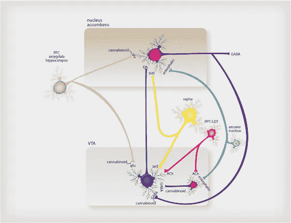

# 思想:物质滥用中跨腹侧被盖区、伏隔核和黑质的通路

> 原文：<https://medium.com/codex/thought-pathway-of-ventral-tegmental-area-and-nucleus-accumbens-for-data-viz-of-addictions-93e59707cba7?source=collection_archive---------23----------------------->

多巴胺能系统和奖赏处理通过 [Arias-Carrión 等人](https://intarchmed.biomedcentral.com/articles/10.1186/1755-7682-7-29)

访问腹侧被盖区{VTA}、黑质{SN}和伏隔核{NAc}的神经元，除了生化过程之外，它们还做什么？

以多巴胺——奖励协调而闻名的 VTA 人和 NAc 人，还有一些其他的东西，{他们的思维功能} [没有通过神经成像显示出来](/predict/mental-health-derivatives-1aea66bfc8e)，就像它对大脑的影响一样。

据说多巴胺在预期快乐方面很有效，但预期的范围各不相同。可能是文字，然后多巴胺被释放。它可以是看到的、闻到的或尝到的东西。多巴胺也可以在摄入后释放。

有远离快乐的预期体验:疼痛、寒冷、炎热、举起重物等等。预期与[预测处理](/codex/neuroscience-thought-basis-of-predictive-coding-theory-663dfbb6b89b)并行。预测通常来自已知的东西，从记忆到经验很快给出。预测可能看起来是自动的或被控制的，但通常是思想或它们的形式——来自记忆。

有些情况下，对某事的想法比物理或生物化学的情况更糟糕。认为必需品不可用的想法可能比在一段时间内不使用它更糟糕。如果有消息说它将会上市，这种担心就会消失。

这种改变不仅仅是通过思想，而是它在大脑中的归宿。记忆有一种方式阻止{活跃}的思想进入并停留在担忧的回路中，所以偏好是[对](/mlearning-ai/brain-robotics-neurons-thoughts-e62dc05931dd)常规或快乐中心。

对于[主动和被动](/mlearning-ai/ml-neuroscience-genetic-memory-thoughts-active-passive-5f0c55d08e62)思维，记忆也有一个调节机制，这样特定的一组思维就不会无休止地活跃。一些中枢的局部神经元可能会保持被动，直到外部神经元来访，传递一种引人入胜的活动。

记忆会产生想法，而想法的去向会导致什么样的感觉，或者什么样的释放，比如危险的情况，然后是肾上腺素。

有一种东西超过了神经元的生化过程。

VTA、SN 和 NAc 神经元的思维功能对对抗物质滥用和危险选择的新方法发挥作用。思维路径也是了解大脑分泌物的关键。

理论上，它是这样的:感觉到一些东西——听到或看到，这进入丘脑进行整合。这种整合可以被[假设](https://www.reddit.com/r/consciousness/comments/tqs8ar/how_does_consciousness_interact_with_objects/)为思想。这种想法被传递到大脑皮层，那里有一些记忆储存，从那里，到 VTA，然后是 NAc。多巴胺被释放是因为思想到达了那条路径。

这带来了快乐。但是这种快乐不是一种感觉，而是一种效果。

如果有人吃了一顿饭，可以分泌瘦素来产生饱腹感，这是基感，但可以有不满足的感觉效应；或者满足感，伴随着神经传递素的释放。

因此，有来自生化过程的基本感觉，也有由该过程的思想等价物产生的感觉效果。

大脑中有不同的部分负责[重叠功能](https://www.sciencedirect.com/topics/neuroscience/nucleus-accumbens)，但是一个中心功能是思想和它在什么时候去哪里。

[认为](https://writer.zoho.com/writer/open/dpbiea67ec9ee78fe4654b2649387ec49c7ca)思维功能在很大程度上负责感觉效果，因此如果任何东西的效果被感觉到，它必须是在大脑中心活动的思维或其形式。

思想传输是理解大脑如何工作的一个主要途径——因为其各部分的复杂细节有时无处不在。

现在，对于滥用，尤其是药物滥用，它以一种新的方式震动基本感觉和感觉效果，通过记忆允许它有更多的时间作为活跃的思想，驱使记忆想要更多。过一会儿，记忆可能会将其降级为被动，除非使用更多的量或混合物。

此外，上瘾并不总是带来快乐，特别是当它被降级为消极思想时，但许多人继续使用它，因为它可能会改变思想的目的地。

在一个已存在的上瘾的声音、视觉或嗅觉中，它变成了一个活跃的思想，带有一种主导性的参与，比某些回路的常规接触更直接。一个原因是因为在过去，记忆会带来最好的感觉效果，这可能就是原因。

如果成瘾的思维功能在 VTA、SN 和 NAc 被数据模拟，可视化地显示[思维运输](/mlearning-ai/neuroscience-thoughts-transport-research-lab-mlearning-ai-by-troic-5ab5467b0e64)那里可以为许多人打破物质滥用。

有几种针对成瘾的干预措施，但占主导地位的思维功能给人们带来了重新定向的希望和康复的机会。

数据，从思想传输中学习培养神经科学和机器智能的新希望。