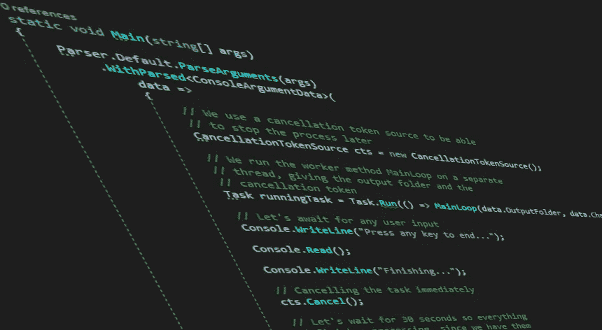

# 思维过程:C#中的高吞吐量数据获取和处理

> 原文：<https://medium.com/codex/thought-process-high-throughput-data-fetching-and-processing-in-c-33195919ac65?source=collection_archive---------8----------------------->

## 软件开发是一个过程，它可以而且应该发展。

让我们假设我们有一台设备，它以特定格式输出大量数据，这些数据需要实时加载到计算机上进行处理，然后保存到存储介质上。你的任务是创建一个. NET 5 程序，通过一个专用的驱动程序 API 从设备中获取上述数据，进行处理，然后输出结果。

如果以上听起来很吓人，那应该不是。软件开发几乎总是演进过程的结果。经验通常会让你在过程中开始得越来越晚，但是，在学习的同时，从头开始是每个人都应该做的。

# 设置

最容易想象的情况是图像采集设置。通常，专用硬件会有实时操作，而个人电脑没有，时间将成为成功的关键。

在未压缩的 1080p 帧每秒 60 帧(每帧大约 6MB)的情况下，需要传输、处理和保存的数据总量为:

> 6MB/f *60f/s = 360MB/s

因为我们谈论的是每秒 60 帧的实时，所以我们谈论的是:

> 1000 毫秒/秒/60f/秒= 16。(6)质谱/质谱

这意味着两帧之间的时间略小于 17 毫秒。

# 考虑

通常，由于 360MB/s 是一个相当大的负载，需要通过多个接口、驱动程序、操作系统层和软件层的多个链进行传输，并在其上进行处理，因此成功需要几个条件:

1.  应该有足够的缓冲区，以便在处理速度变慢时，有足够的空间来累积数据，使数据不会丢失
2.  必须应用足够快的处理周期或足够并行的处理周期，以便软件能够处理的后续时刻之间所花费的时间不会超过专用硬件的数据输入时间
3.  必须使用足够快的存储介质或足够好的压缩周期，以便将结果保存到非易失性存储介质所花费的时间不会超过数据输入次数

对于第一点，很多将取决于硬件。通常，专用硬件会有足够的缓冲区，以便它所连接的硬件有机会在相同的缓冲区被新数据覆盖之前读取数据。这通常是通过比实际接收的数据包大一定倍数的缓冲区来实现的(为了简单起见，我们假设每个数据包的大小(在我们的示例中是位图格式的 1080p 帧)是恒定的)。

第二点主要取决于软件因素。如果需求是处理成特定的格式(比如一系列 PNG 图像)，那么处理周期就定义了应该采用哪种策略。例如，静止图像编码需要的时间比 16.6 毫秒长得多，这是 60f/s 下两帧之间的差距。因此，在这种情况下，唯一能够确保正确计时的策略是并行处理。

另一个迫使并行策略的问题是软件平台的选择。如果您选择了托管平台，如。NET 中，您必须应对来自各种平台特定来源的各种时间偏差和延迟，如线程池管理、垃圾收集、编组、p/invoke 等。

第三点主要基于需求和可用硬件。如果你正在运行的机器有一个只需要 5 毫秒处理的专用编码设备，和一个专用的 API 来调用，那么，当然，你不需要在第二点上使用并行策略。但是，如果需求是定制编码，或者没有可用的硬件，那么您需要相应地进行规划。

最终，如果需求真的得到满足，那么对第 1-3 点的考虑将仅仅决定你需要多少资源，以及你使用它们的效率如何。

然而，在现实生活中，第 1-3 点的考虑因素将决定您的策略，因为无法在 PC 上提供专用硬件所需的速度或时间通常会极大地限制您的可用策略范围。

# 模拟的 API

让我们假设我们有一个遵循一些原则的驱动程序 API(用 C#翻译):

1.  驱动程序本身不推送任何东西——任何需要的东西都必须被获取
2.  驱动程序以阻塞方式通知可用的数据，并以非阻塞方式将数据写入指定的缓冲区—这确保了驱动程序本身的最大速度，同时允许 API 调用程序有最大的非阻塞时间，同时确保调用程序在收到通知时有数据可供读取
3.  驱动程序使用尽可能最快的数据传输策略，这意味着必须在其中分配和注册 PC RAM 才能使用

这些原则大多符合人们对专用硬件 API 的期望。它看起来会像这样:

```
public static class Acquisition
{
    #region Notification API

    public static DriverResponse WaitForNotification(DriverOptions options) => ...;

    #endregion

    #region Buffer pinning

    public static DriverResponse PinBuffer(
        byte[] buffer,
        DriverOptions options)
    { ... }

    #endregion

    #region Data fetching API

    public static uint StartFetchingData(DriverOptions options,
            byte[] buffer) => ...;

    public static DriverResponse EndFetchingData(
        uint fetchingId) =>
        ...;

    #endregion
}
```

我们将使用 *WaitForNotification* 来阻塞一个监听线程，直到数据可用。我们将使用 *StartFetchingData* 来启动将数据写入预定义的缓冲区，这将是非阻塞的，并且我们将使用 *EndFetchingData* 来阻塞(如果需要)直到缓冲区被填满。我们将使用的缓冲区将被预先分配，并用 *PinBuffer* 注册。

因为驱动程序需要选项集，并且可能希望以结构化数据类型的形式返回复杂的结果。出于示例的目的，我们将使用两种结构。

*   名为 *DriverOptions* 的结构，基本上是驱动程序 API 方法的输入:

```
[StructLayout(LayoutKind.**Sequential**)]
public struct DriverOptions
{
    public uint ChannelId { get; set; }

    public uint TimeoutInMilliseconds { get; set; }

    public byte BufferIdentifier { get; set; }
}
```

*   一个名为*的结构 DriverResponse* ，它是带有次要信息有效载荷的状态响应:

```
[StructLayout(LayoutKind.**Sequential**)]
public struct DriverResponse
{
    public byte ChannelId { get; set; }

    public ResponseStatus Status { get; set; }

    public byte BufferIdentifier { get; set; }

    public uint ResponseDuration { get; set; }
}

public enum ResponseStatus : byte
{
    Success = 0,
    Timeout = 1,
    NoData = 2,
    EquipmentNotInitialized = 3,
    HardwareFailure = 4,
}
```

*   一组关于 API 的常量:

```
public static class Constants
{
    public static int PayloadSize { get; set; } = 6291456; // 6MB
}
```

# 开始设计

为了简单起见，让我们做几个不太可能对我们产生长期影响，并且可以根据情况轻松调整的决定:

*   我们将使用控制台应用程序
*   我们不会限制正在使用的资源:CPU、RAM、线程
*   我们将跳过一些数据验证—进行数据验证总是一个好主意，所以请验证用户输入，但是，为了

从代码开始，我们将做一些简单的工作来获取一些输入参数。我发现 [CommandLineParser NuGet 包](https://www.nuget.org/packages/CommandLineParser)是一个简单解析命令行参数的好方法，通过创建一个包含参数数据或默认值的类。

让我们在程序静态类中定义这样一个类，带有选项，比如输出文件夹:

```
private class ConsoleArgumentData
{
    [Option('o', "output")]
    public string OutputFolder { get; set; } [Option('c', "channel")]
    public uint Channel { get; set; }
}
```

让我们也创建一个 Main 函数，它使用默认的解析器来解析参数，使用一个单独的线程来完成这项工作，然后简单地等待用户输入来完成对驱动程序的调用:

```
static void Main(string[] args)
{
    Parser.Default.ParseArguments(args)
        .WithParsed<ConsoleArgumentData>(
            data =>
            {
                // We use a cancellation token source to be able
                // to stop the process later
                CancellationTokenSource cts = new CancellationTokenSource();

                // We run the worker method MainLoop on a separate
                // thread, giving the output folder and the
                // cancellation token
                Task runningTask = Task.Run(() => MainLoop(data.OutputFolder, data.Channel, cts.Token));

                // Let's await for any user input
                Console.WriteLine("Press any key to end...");

                Console.Read();

                Console.WriteLine("Finishing...");

                // Cancelling the task immediately
                cts.Cancel();

                // Let's wait for 30 seconds so everything
                // finishes processing, since we have them
                runningTask.Wait(TimeSpan.FromSeconds(30));
            });
}
```

剩下唯一要做的就是实现等待通知的 main 方法，然后获取数据、处理数据并保存数据。我们已经调用了*主循环*方法，下面让我们为它写下一个基本框架。

# 初稿，一个简单但实用的版本

让我们试着在不考虑时间和性能的情况下编写我们的方法:

```
private static void MainLoop(string outputFolder, uint channel, CancellationToken cancellationToken)
{
    // Buffer and initial driver options
    byte[] buffer = new byte[Constants.PayloadSize];
    DriverOptions driverOptions = new()
    {
        ChannelId = channel
    };

    // Attempt to pin the buffer
    DriverResponse **response** = Acquisition.PinBuffer(
        buffer,
        driverOptions);

    if (**response**.Status != ResponseStatus.**Success**)
    {
        // Failure to pin
        Console.WriteLine("Buffer could not be pinned.");
        return;
    }

    // Let's read until we're told to quit
    int **fileIndex** = 0;
    while (!cancellationToken.IsCancellationRequested)
    {
        // Block while waiting for notification
        **response** = Acquisition.WaitForNotification(driverOptions);

        if (**response**.Status != ResponseStatus.**Success**)
        {
            // Missed frame
            continue;
        }

        // Set options for fetching
        DriverOptions nextDriverOptions = new()
        {
            ChannelId = channel,
            BufferIdentifier = **response**.BufferIdentifier
        };

        // Start data fetching (non-blocking)
        uint fetchId = Acquisition.StartFetchingData(
            nextDriverOptions,
            buffer);

        **response** = Acquisition.EndFetchingData(fetchId);

        if (**response**.Status != ResponseStatus.**Success**)
        {
            // Missed frame
            continue;
        } /*
         * Add processing here
         */        try
        {
            // Let's save the file
            using FileStream sw = File.Create(
                Path.Combine(
                    outputFolder,
                    $"{**fileIndex**++}.bin"));

            sw.Write(buffer);
        }
        catch
        {
            // Missed frame
            continue;
        }
    }
}
```

该方法做我们希望它做的事情:它创建一个缓冲区，向驱动程序注册它(“pins”)，然后开始一个等待通知的周期，在收到通知时读取数据，然后保存数据。

# 第一个改进，卸载到另一个线程

让我们在这里想一些事情:

1.  整个方法在一个线程上同步运行，这意味着它必须在 16.6 毫秒的时间间隔内执行，否则将会丢失数据
2.  该方法不使用驱动程序提供的阻塞/非阻塞机制

这两个都是我们可以利用的改进点，所以让我们尝试在方法的第二部分做一点小小的改进:

```
// Start data fetching (non-blocking)
uint fetchId = Acquisition.StartFetchingData(
    nextDriverOptions,
    buffer);

(uint, byte[], int, string) outerState = (fetchId, buffer, **fileIndex**, outputFolder);
**fileIndex**++;

ThreadPool.QueueUserWorkItem(
    state =>
    {
        var (fId, buf, fI, oF) = ((uint, byte[], int, string))state;

        var r2 = Acquisition.EndFetchingData(fId);

        if (r2.Status != ResponseStatus.**Success**)
        {
            // Missed frame
            return;
        }

        /*
         * Add processing here
         */

        try
        {
            // Let's save the file
            using FileStream sw = File.Create(
                Path.Combine(
                    oF,
                    $"{fI}.bin"));

            sw.Write(buf);
        }
        catch
        {
            // Missed frame
            return;
        }
    }, outerState);
```

现在看起来好一些了。一旦启动数据提取，就会创建一个值来保存应该传递到不同线程的数据。然后，该数据被传递给一个工作线程，该线程接管并等待(以阻塞方式)数据被带到系统内存中，然后处理并保存该数据，同时让原始线程继续工作并捕捉另一个通知。

现在，如果启动读取的驱动程序方法有足够的性能(几乎没有理由不这样)，这种编写方法的新方式将允许等待通知的线程以最小的干扰运行，并在收到每个通知时启动线程。

就资源而言，我们可以跟踪线程池中的线程，并自己进行一些计算。很明显，我们将同时处理多个线程，但是需要注意的是，多个处理线程并不一定意味着我们软件的性能会很差。这只是意味着我们正在利用我们的 PC 的优势(它可以大规模并行)来补充我们的设备的优势(它是实时的)，确保整个周期的高吞吐量将保持不变。

理想情况下，在这种情况下，并行处理线程的数量将在周期开始时急剧增加，然后逐渐减少，并在一段时间后围绕相同的值振荡。这意味着 PC 可以很好地处理负载。我们甚至可以计算将会有多少个线程:

假设 *Tp* 是处理一个有效负载所花费的时间(我们将在这里包括生成线程和保存数据所花费的时间)，假设 *Tn* 是两个连续通知之间的时间。因此，我们可以将 *Tmin* 和 *Tmax* 计算为:

> Tmin =上限(Tp / Tn)
> 
> Tmax =上限(总磷/总氮)

我们得到 *Tmin* 和 *Tmax* 作为并行处理线程数量振荡的间隔。

我们可以将此公式进一步扩展为处理或通知所用的非恒定时间，将 *Tpmin* 和 *Tnmin* 视为处理和通知的最小间隔，将 *Tpmax* 和 *Tnmax* 视为最大间隔。因此，我们得到:

> Tmin =上限(Tpmin / Tnmax)
> 
> Tmax =上限(Tpmax / Tnmin)

# 确保缓冲区不会溢出

如果您实际运行上一步中编写的代码，您会注意到数据是乱码，无法识别。这是因为我们使用相同的缓冲区来写入数据，然后进行处理。

让我们切换代码，在每次需要时使用缓冲区:

```
private static void MainLoop(string outputFolder, uint channel, CancellationToken cancellationToken)
{
    // Let's read until we're told to quit
    int **fileIndex** = 0;
    while (!cancellationToken.IsCancellationRequested)
    {
        // Buffer and initial driver options
        byte[] buffer = new byte[Constants.PayloadSize];
        DriverOptions driverOptions = new()
        {
            ChannelId = channel
        };

        // Attempt to pin the buffer
        DriverResponse **response** = Acquisition.PinBuffer(
            buffer,
            driverOptions);

        if (**response**.Status != ResponseStatus.**Success**)
        {
            // Failure to pin
            Console.WriteLine("Buffer could not be pinned.");

            continue;
        }

        // Block while waiting for notification
        **response** = Acquisition.WaitForNotification(driverOptions);... the rest of the method
```

这看起来像是在运行，但它似乎错过了相当多的帧。这是为什么呢？

# 深入挖掘垃圾收集

我们似乎忘记了我们的缓冲区大小是 6MB，每个！垃圾收集机制将它们直接放在大对象堆中，而且，正如您已经注意到的，我们在每次使用后都将它们丢弃。这促使 GC 继续寻找 6MB 的内存块来分配，这是它自然不想做的，所以它必须收集未使用的内存块。这反过来又会触发第二级堆收集，从而严重降低该过程的速度。

当然，解决方案是使用多个预先分配的缓冲区。但是你怎么知道有多少？

一个线索是我们在前一阶段计算的公式，并创建足够的缓冲区来容纳一个人可以拥有的最大数量的线程。不过，这是一个有风险的提议:处理速度取决于可用的 CPU 时间，所以只有当所有处理线程都有可用的 CPU 时间时， *Tpmax* 时间才会保持不变。一旦资源变得有限(例如，用户正在该机器上做其他事情)，那么 *Tpmax* 值将会增加，我们将会处于与之前完全相同的情况。

显然，最终需要一种缓冲器数量动态变化的解决方案。让我们开始为多个缓冲区准备代码。

我们之前计算的值可以用作参考点。 *Tmin* 值是我们将拥有的最低值，因此我们从该数量的缓冲器开始，并根据需要增加，这是合理的。

我们也可以使用 Tmax 作为起点，但是我们是否应该这样做取决于处理和通知的最小和最大时间是如何计算的。如果最大值是用严重的异常值计算出来的，那么预先分配缓冲区来提供这么多服务可能是一种浪费，因为您只会在边缘情况下从中受益。为了安全并以消耗更多 RAM 为代价获得高吞吐量，也许更聪明的方法是计算一个较高的平均值，并以此为起点:

> Tpmax = avg(Tp，其中 Tp > avg(Tp))

这样，我们将从在绝大多数情况下都能很好地服务于我们的已经很大的分配开始，并且只有在绝对必要的情况下才增加。这将是一个试错的决定，一个在开发世界中比你想象的有用得多的实践。

让我们修改 API 常量类，使其具有初始缓冲区数量的值:

```
public static class Constants
{
    public static int PayloadSize { get; set; } = 6291456; // 6MB

    public static int EstimatedNumberOfThreads { get; set; } = 8;
}
```

现在让我们修改我们的类，这样就有了缓冲区。我们首先在循环之外进行缓冲区初始化，然后在循环中遍历缓冲区:

```
// Initialize buffers
byte[][] buffers = new byte[Constants.EstimatedNumberOfThreads][];
for (int **i** = 0; **i** < Constants.EstimatedNumberOfThreads; **i**++)
{
    buffers[**i**] = new byte[Constants.PayloadSize];
}

// Let's read until we're told to quit
int **fileIndex** = 0;
int **bufferIndex** = 0;

while (!cancellationToken.IsCancellationRequested)
{
    // Buffer and initial driver options
    byte[] buffer = buffers[**bufferIndex**++];
    if (**bufferIndex** == Constants.EstimatedNumberOfThreads)
    {
        **bufferIndex** = 0;
    }

    DriverOptions driverOptions = new()
    {
        ChannelId = channel
    };
...
```

我们现在看到，软件在我们仍然有缓冲区的情况下正确执行，并且它也没有计时问题，但是我们已经用完了大量的 RAM。这可能是您为了保持最高性能而愿意做的一种折衷。

作为一个额外的奖励，我们保持了我们的应用程序相对无垃圾收集。让我们想一些方法来改善这一点，首先是切换到全动态缓冲器。

# 使用动态缓冲器

为了使用动态缓冲区，我们可以也应该编写自己的动态对象池。但出于这个练习的目的，我们将使用一个现成的: [IX。标准扩展](https://www.nuget.org/packages/IX.StandardExtensions/)。如果您想研究如何创建自己的动态对象池，您可以查看我们将使用的[*ObjectPoolQueue<T>*](https://github.com/adimosh/IX.StandardExtensions/blob/master/src/IX.StandardExtensions/StandardExtensions/Efficiency/ObjectPool%7BT%7D.cs)类(及其关联的[*pooled object<>*](https://github.com/adimosh/IX.StandardExtensions/blob/master/src/IX.StandardExtensions/StandardExtensions/Efficiency/PooledObject%7BT%7D.cs)类)。

使用 NuGet 包后，我们的代码变成了:

```
// Initialize buffers
ObjectPool<byte[]> buffers = new ObjectPool<byte[]>(
    () => new byte[Constants.PayloadSize],
    Constants.EstimatedNumberOfThreads);

// Let's read until we're told to quit
int **fileIndex** = 0;

while (!cancellationToken.IsCancellationRequested)
{
    // Buffer and initial driver options
    using var bufferObject = buffers.Get();
    var buffer = bufferObject.Value;

    DriverOptions driverOptions = new()
    {
        ChannelId = channel
    };
...
```

我们可以不断改进我们的算法。



# 一锤定音

正如你所看到的，一个复杂的问题已经以一种进化的方式得到了解决:我们从小处着手，随着每一个解决方案的出现，一系列新的问题或顾虑出现了，并且被一个接一个地解决了。

我们使用了 C#，我们使用了一些基本的数学知识，一些逻辑推理和我们自己对软件行为的分析。我们从一个简单的可行的解决方案发展到一个实际上可用和高性能的解决方案。

这种技术不是解决所有软件开发问题的灵丹妙药，但它是开始积累经验的好方法。

通过观察您的软件在第一个工作解决方案之外的表现，您可以发现新的东西来考虑。例如，在解决了缓冲区问题之后，您开始更多地考虑内存使用。在开始使用多个缓冲区之后，您突然想到了垃圾收集。对于你编写的每一个软件或组件，更多的考虑自然会出现在你面前，并且“第一个工作解决方案”会变得越来越复杂。反过来，这将打开新的考虑，以及更高水平的性能和完善。

我希望，在这篇文章结束时，你会意识到，即使是一个听起来复杂和有点可怕的问题，实际上也是可以解决的。