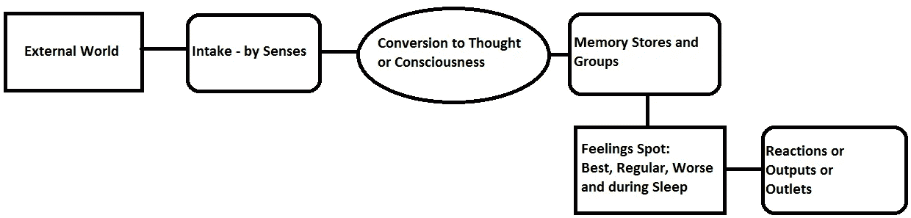

# 思想——作为意识的运动

> 原文：<https://medium.com/codex/thoughts-as-consciousness-b4ad5f7e0a14?source=collection_archive---------10----------------------->

思想:其细胞的规则

存在是某样东西的存在——房子、椅子、桌子等等。知道就是知道桌子是桌子，桌子不能。

意识——被一分为二地理解为存在和知道，是一些设备可以说具有的东西。智能设备存在并且它们知道。

声控人工智能知道它们是什么，并在被召唤时做出反应。尽管如此，一个设备是什么，或者能做什么，和哺乳动物是什么，或者能做什么，还是有区别的。

尽管人工智能在几个方面超越了人类，但它们仍然缺乏思想——或它们的形式——对人类或其他哺乳动物来说意味着的自主性。

可能会有去某个地方的决定，考虑如何去，并以很大的灵活性去做。设备无法可靠地做到这一点，至少目前还不能，即使是自动驾驶汽车。

如果一辆车决定出于某种目的需要去某个地方或带一个机器人去那里，它仍然会线性地运行，作为一个数据处理机器，而不是作为一个思想超集体系统。

人类的思想超过了神经网络的数据。

意识可以被定义为有思想——主动的或被动的，去了解。

如果一只小狗在成长，它会看到狗，并通过思想了解它们是同类。它看到其他动物，知道它们有类似生命的东西，但却是不同的种类。它还能识别物体。

思维是哺乳动物的认知方式，因为记忆储存了思维或其形式。

如果任何被感知的东西能够变成思想——或者它的形式，那就是有意识的。思想是意识的中心公园。

梦是睡眠中可视化的活跃思想。想象是清醒时可视化的活跃思维。

积极的想法在任何时候都只有一个，而消极的想法却有很多，而且毫无察觉。

对地板、桌子、椅子、环境声音等等的环境意识不是主动思考的，而是经过处理的。

这在睡觉时也是可能的，而不是做梦，因为事情得到处理，但不会变成积极的思想，导致做梦或醒来。

消极的想法至少是存在的——跨越所有的意识状态。

[廷杰律师事务所](https://unsplash.com/@tingeyinjurylawfirm?utm_source=medium&utm_medium=referral)在 [Unsplash](https://unsplash.com?utm_source=medium&utm_medium=referral) 上拍摄的照片