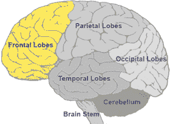

# 思想——理论:意识、人类、动物和人工智能

> 原文：<https://medium.com/codex/thoughts-theory-consciousness-human-animal-and-artificial-intelligence-e83e7010586?source=collection_archive---------26----------------------->

通过 QLD

可以假设人类比其他动物具有更高的智力，因为人类的大脑有能力将更多的外部输入转化为思想。

从科学上讲，大脑结构、相对大小和[复杂的](https://www.sciencefocus.com/nature/why-arent-animals-with-larger-brains-more-intelligent-than-us/)皮层为更高的智力提供了理由。

具体来说，人类思维的无序延伸带来了优势。有许多大脑功能以思维的形式存在或继续存在——感知、预测、记忆、多感官整合、语言等等。外部环境变成了大脑中的想法——需要处理、了解、感受和反应。

大多数动物没有任何类似或理解任何形式的人类语言[HL]的东西，因为它们没有将 HL 转化为思想的端口。

听觉不同于对记忆、感觉和反应进行输入、转换、加工的特殊能力。

如果有人得到了一个很棒的个人消息，多巴胺被释放出来，理论上，这个过程是这样的:阅读或听到这些话，转化为思想，前往储存先前情况的记忆。新思想的对比缩小了这种储存，然后远离目的地，最好的感觉是——导致或符合多巴胺的释放。

虽然哺乳动物有多巴胺，但它在人类中的功能的复杂性超过了它们，包括记忆储存和群体对快乐的影响。

哺乳动物使用四肢的能力不同于特定的人类功能，如写作、绘画、打字、运动中的脚步灵活、驾驶等。

虽然某些哺乳动物比人类有更好的感觉——嗅觉、视觉等等，但这些功能可以说是宽度，而不是聚集的体积。

狗的[嗅觉感受器](https://www.pbs.org/wgbh/nova/article/dogs-sense-of-smell/)比人多 40 倍，这使它们在嗅觉检测方面具有优势。然而，与额外的分支相比，人类的卓越感是有限的，不仅仅是为了食物或安全。

哺乳动物有意识——存在和知道。他们也有意识状态，类似于人类。尽管如此，积极和消极思想的延伸加深了人类的意识。

人工智能有很多能力，但还不知道它有意识。它需要数据，可以以多种方式处理数据，但人类有思想——其形式不仅仅是数据、信息、预测、感知、意识、记忆、想象、梦想、多模态整合、决策、技能等等。