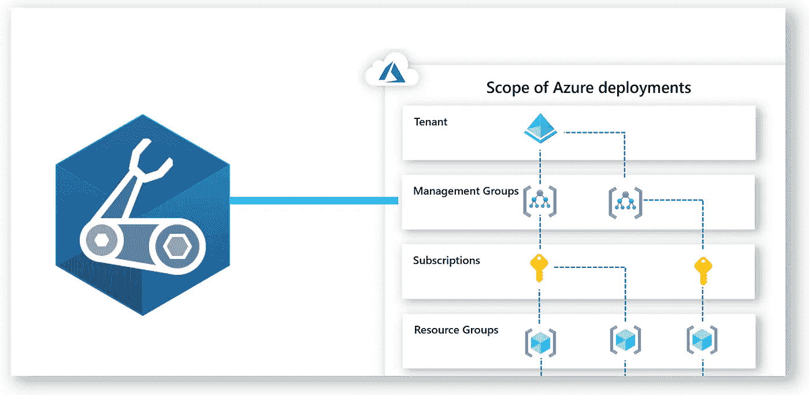

# 从 ARM 模板迁移到 Bicep 文件的三个最佳实践

> 原文：<https://medium.com/codex/three-best-practices-when-moving-from-arm-templates-to-bicep-files-4b58f3f99826?source=collection_archive---------9----------------------->

从 ARM 模板迁移到 Bicep 文件的技巧和经验。

在之前的文章中，我们一直致力于使用 Bicep 部署解决方案，Bicep 是用于声明式部署 Azure 资源的领域特定语言(DSL)。

本文将回顾从 ARM 模板转换到 Bicep 文件时可以采用的三个最佳实践。

# 1.检查 ARM 模板语法和本机二头肌等效

虽然 ARM 模板和 Bicep 中有一些熟悉的语法，但我强烈建议您在需要获取资源的资源 id 或声明属性值时检查语法。

这里列举了一些例子:[https://github.com/Azure/bicep/blob/main/docs/arm2bicep.md](https://github.com/Azure/bicep/blob/main/docs/arm2bicep.md)

# 2.验证 API 版本和属性值。

这里有一个例子，在以前的文章中，我们回顾了如何部署 Azure 机器学习工作区和数据存储。

在那个 Bicep 文件中，虽然建议使用 API 的最新稳定版本，但是在 ARM 模板中定义的一些属性在 Bicep 属性值中是不可用的，至少现在还不可用。

对于这些情况，我建议您验证资源中需要的属性，以及缺少的属性如何影响您在 Azure 中的环境。

好消息是，在大多数情况下，Azure for Bicep 和 ARM 模板的文档显示了支持的版本和模板格式:

 [## 微软。机器学习服务/工作空间-二头肌和手臂模板参考

### 工作区资源类型可以部署到:资源组。要了解资源组部署，请参阅 Bicep…

docs.microsoft.com](https://docs.microsoft.com/en-us/azure/templates/microsoft.machinelearningservices/workspaces?WT.mc_id=AZ-MVP-5000671&tabs=bicep) 

# 3.了解 Azure 资源是如何大规模部署的

与 ARM 模板类似，您可以根据环境将部署定位到不同的范围。

清楚了解具有多个管理级别的分层资源结构对于更好地管理您的部署至关重要。这些包括租户、管理组、订阅和资源组。

想象一个场景，其中有一个 Azure 租户，有两个管理组，每个管理组下有两个订阅。您需要根据环境类型部署一组不同的资源，如生产或测试虚拟网络、DNS、应用服务、虚拟机等。

当您完全理解层次结构的各个级别时，您可以使用 Bicep 灵活地控制 Azure 环境的管理方式。

例如，当您需要创建多个资源组并授予对订阅中所有资源的访问权限时，应该将订阅作为目标。

当需要提供对特定订阅中所有资源的访问时，可以将管理组作为目标。

在需要创建多个订阅的情况下，您可以将租户作为目标。

此外，考虑模块化，例如，定义虚拟网络的 Bicep 文件可以作为一个模块使用，并跨多个订阅进行部署。

一组 Bicep 文件可以用于在单个操作中跨多个作用域部署资源。

[*在此加入****azin sider****邮箱列表。*](http://eepurl.com/gKmLdf)

*-戴夫·r·*