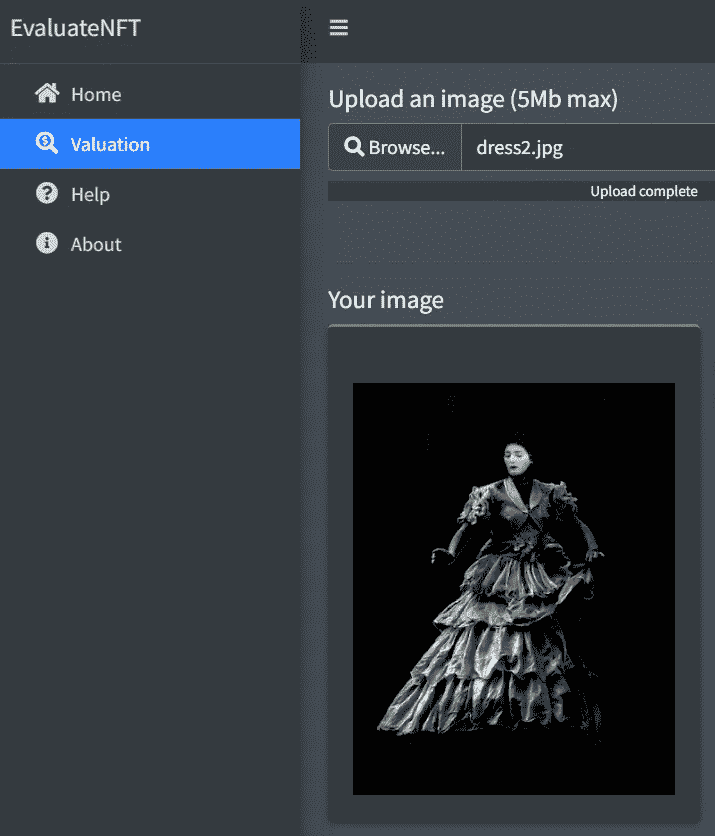
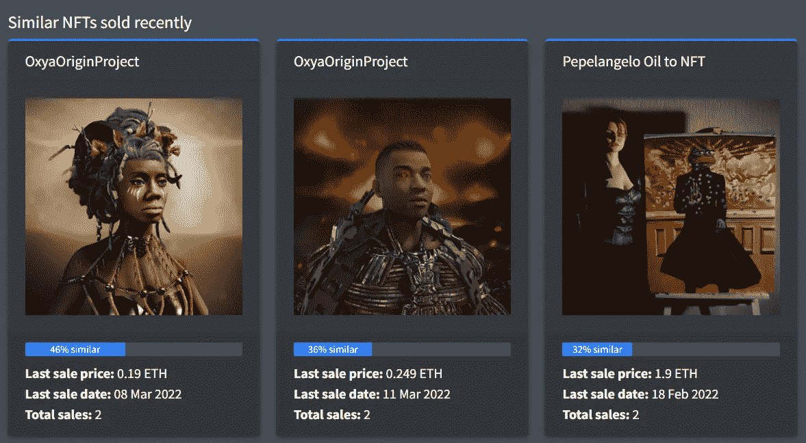
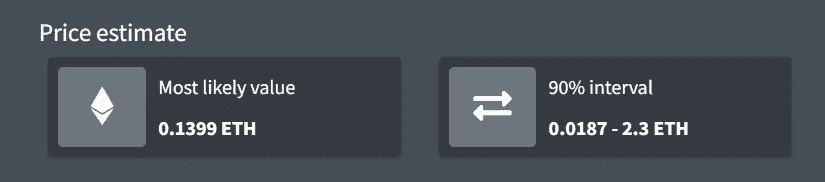

# 用 EvaluateNFT 可以做三件很酷的事

> 原文：<https://medium.com/codex/three-cool-things-one-can-do-with-evaluatenft-25d53c77072b?source=collection_archive---------19----------------------->

罗伯特·卡茨基在 [Unsplash](https://unsplash.com?utm_source=medium&utm_medium=referral) 上的照片

估算一件艺术品的价格极其困难。对于打算作为不可替代的代币( [NFT](https://en.wikipedia.org/wiki/Non-fungible_token) s)进行交易的数字艺术品来说，更是如此。EvaluateNFT 是一款帮助数字艺术家和 NFT 投资者对此类资产做出明智定价决定的应用程序。它通过模仿传统的艺术鉴定过程来做到这一点。本文提供了三个具体的例子来说明 EvaluateNFT 的用途。

***免责声明*** *:本文任何部分均不构成理财建议。使用或依赖此处提供的材料完全由您自行承担风险和判断。*

# 评估一件没有销售历史的艺术品的价格

如果你是一名数字艺术家，并且你正考虑在一个拍卖平台(如 OpenSea)上以 NFT 的身份出售你的作品，你需要选择一个初始要价。选择一个合理的价格非常重要:价格定得太高，你会吓退许多买不起的潜在买家；价格定得太低，你会向收藏家发出信号，表明买家对你的艺术品缺乏兴趣，不太可能进行二次销售。

EvaluateNFT 使用预测模型提供*现实*的价格估计，该模型已经从数千个 NFT 首次销售的历史案例中学习了有用的模式。要获得这样的估价，您只需使用标准上传界面上传您的作品文件(如 PNG 或 JPEG ):

该应用程序将返回最近在 OpenSea 上销售的最多 3 幅*相似的*艺术作品，以及它们的相似程度、最后销售日期、最后销售价格和迄今记录的销售总数等信息(见下文)。这些以及一些附加信息是 EvaluateNFT 的预测模型所使用的。

该模型计算三个量:上传图像的*最可能*价格(以 ETH 表示)，以及 90%预测限制的*下限*和*上限*。这些限制定义了实际销售价格以 90%的概率可能落入的范围。在我们的例子中，上传的图像最有可能以 ca 的价格出售。0.14 ETH，虽然有 90%的几率实际价格低至 ca。0.019 ETH 和高达 2.3 ETH:

因此，在这种特定情况下，将初始拍卖价格设置为 0.14 ETH(或稍低一些以吸引更多的投标人)可能是有意义的。当然，竞拍者可以在拍卖期间提供更低的价格，但是根据预测，艺术家不应该同意低于 0.019 ETH 的价格。拥有 90%的预测区间也很有用——它显示了该物品可以卖出的最高价格，从而表明该物品是否值得拍卖。

# 寻找低估和高估的 NFT 资产

如果你是 NFT 投资者或收藏家，了解你考虑购买的艺术品价格是低还是高是很重要的。这也是 EvaluateNFT 的预测有很大帮助的地方。

如果你发现一件艺术品的拍卖价格低于 EvaluateNFT 给出的预测下限，你可以将该信息作为一个很好的“立即购买”信号，因为你有机会在未来转售该资产以获利。继续上面的例子，任何低于 0.019 ETH 的价格都可能表明 NFT 被低估。

同样，如果你看到一件艺术品的拍卖价格高于 90%的上限，那件艺术品很可能被高估了(潜在地，人为地由于[抬价](https://en.wikipedia.org/wiki/Shill#Auctions)或[洗盘](https://news.sky.com/story/nft-fraudsters-making-millions-by-wash-trading-new-study-finds-12531135))。在我们的例子中，任何高于 2.3 ETH 的价格都应被视为这类危险信号。

# 通过浏览最近出售的艺术品做市场调查

作为一名数字艺术家，你可能对自己的下一个作品有一个想法，打算作为 NFT 作品出售。你甚至可能已经开始工作了，并画出了草图。但是，你如何知道目前是否有与你想象中相似的艺术品需求呢？

你可以通过浏览热门的 NFT 市场，搜索最近出售的类似商品来找出答案。但手动完成这项工作将是一项艰巨而耗时的任务，因为主要市场有数百个集合，其中许多包含数千种商品。

相反，你可以做的是将你的草图或完成的作品上传到 EvaluateNFT，让它的搜索算法为你做艰苦的工作。EvaluateNFT 中使用的数据库定期更新，包含数万件最近售出的艺术品 NFT(即过去 3-4 个月)。如上图所示，该应用程序将返回多达 3 个与您上传的图像相似的项目。通过查看这些搜索结果，你可以更好地了解你是否正朝着正确的方向前进，以及你的工作是否会引起市场参与者的兴趣。一些结果可能会令人惊讶，甚至可能会激发新的想法！

我们在 [Next Game Solutions](http://nextgamesolutions.com/) 的团队希望听到您对我们如何改进 EvaluateNFT 的反馈和建议——只需[给我们留言](mailto:info@nextgamesolutions.com)或在这篇文章下发表您的评论。

在推特上关注这个项目: [@evaluate_nft](https://twitter.com/evaluate_nft)

## 您可能还喜欢:

 [## EvaluateNFT:帮助数字艺术家和 NFT 投资者做出定价决策

### 众所周知，作为不可替代代币交易的数字艺术品很难定价。EvaluateNFT 旨在解决这一问题…

mastitsky.medium.com](https://mastitsky.medium.com/evaluatenft-helping-digital-artists-and-nft-investors-to-make-pricing-decisions-4d3455407b9)  [## 区块链的数据科学:了解当前形势

### 数据科学和区块链技术是天生的一对。但是有多少和什么样的真实世界…

towardsdatascience.com](https://towardsdatascience.com/data-science-for-blockchain-understanding-the-current-landscape-c136154c367e)  [## 8000 种加密货币的市场数据，触手可及

### 介绍 geckor，一个查询 CoinGecko API 的 R 包

medium.com](/geekculture/market-data-for-8000-cryptocurrencies-at-your-fingertips-c76d7e8f43ca)