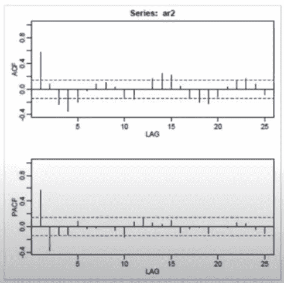
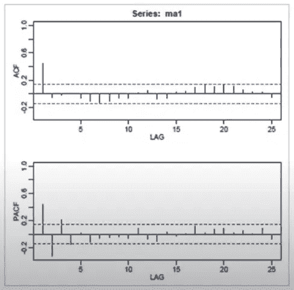
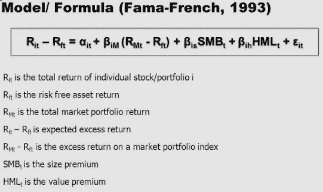
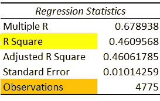
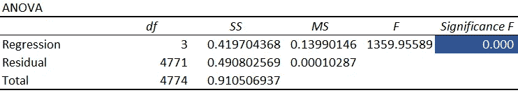
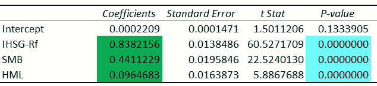

# 印度尼西亚证券交易所的 CAPM 三因素模型

> 原文：<https://medium.com/codex/three-factor-model-for-calculating-stock-return-d2a711e86b81?source=collection_archive---------14----------------------->

克里斯·利维拉尼在 [Unsplash](https://unsplash.com?utm_source=medium&utm_medium=referral) 上的照片

*股票的回报取决于股票市场回报、账面市值比和规模。这是 Fama 和 French (1993)在一篇题为“预期股票收益的横截面”的论文中发展 CAPM 模型的思想。这个三因素模型应用于印度尼西亚证券交易所数据集，其结果是账面市值比(HML)和规模(SMB)的独立变量代理支持本文。*

# AR 和 MA 模型

为了确定股票收益，我们使用时间序列数据分析。根据数据集的相关性，我们可以使用自回归(AR)模型和移动平均(MA)模型。AR 模型是根据两个时间点之间的相关性专门建立的，不承认这两个观察到的时间点可能受到另一个时间点的影响。在 MA 模型中，预测变量被假定为与当前值和过去值具有线性相关性。它也是根据过去值的平均值创建的。AR 和 MA 模型都用于单变量时间序列(只有一个变量)。为了确定我们的时间序列数据应该使用 AR 模型还是 MA 模型，我们需要使用 ACF 和 PACF 函数来度量数据的相关性。

# 平稳性

然而，在数据准备的开始，我们需要确定数据集中是否有明显的趋势，这通常被称为数据平稳测试，一种统计测试，以确保数据具有一致的统计测量，这在具有趋势的数据中是找不到的。文具店数据是一个没有趋势的数据。因此，将股票价格运动数据转换成股票回报数据是很重要的。

# ACF 和 PACF

回到 AR 和 MA 模型，为了度量时间序列中观测值之间的相关强度，我们可以使用 ACF 和 PCF。ACF 测量当前时间点的观测值和先前时间点的观测值之间的相关性。有一种潜在的情况，即先前的时间点与另一个先前的时间点观察相关或受其影响。如果我们想消除这种相关性/影响，我们可以使用 PACF 测量时间序列数据的相关性。因此，PACF 往往被用来评估 AR 模型，而 MA 模型是由 ACF 函数评估的。

AR 模型考虑昨天、前天、三天前的自变量或 AR (3)。例如，我们可以看到 PACF 函数 AR (2)的可视化。它在昨天和前天有显著的相关性，而 ACF 正在衰减。

AR (2)示例

另一方面，在 MA 模型中，我们只需要考虑昨天的误差项。因此，如下图所示，在昨天的观测值或 MA (1)上存在显著的 ACF，而 PACF 值正在衰减。

马(1)举例

# **三因素模型**

这个模型是 Fama-French (1993)设计的，是从 Fama-MacBeth (1973)的 CAPM 发展而来的模型。第一个 CAPM 公式描述了某一时间点的回报与市场投资组合回报成线性函数关系。1993 年，Eugene Fama 和 Kenneth French 设计了三因素模型，该模型解释了影响股票回报的三个变量:市场风险(beta)，小公司对大公司的表现(SMB:小减去大)，高账面/市场对低账面/市场公司的表现(HML:高减去低)。

尤金·法玛和肯尼斯·弗伦奇的三因素模型

SMB 是小盘股和大盘股的多元化投资组合收益之差，而 HML 是高低账面市值股票的多元化投资组合收益之差。

# **进入*数据集***

这个横截面数据集是从 2000 年 7 月到 2018 年 10 月印度尼西亚证券交易所的股票组合。该投资组合按规模和账面市值比分类。

我们可以使用 Microsoft Excel 通过数据集建立回归模型。因变量(Y)受目标投资组合(规模和账面市值比的组合)的影响，而自变量(X)使用 IHSG Rf、SMB 和 HML。最后，输出摘要和对小尺寸和高 B/M 的解释如下:

r 正方形(黄色)回答了模型解释了多少(方差)数据的问题。在这里，我们可以看到，该模型可以解释 46%的观察结果(数据)，还有另一个潜在的变量没有在模型中捕捉到，可能能够解释其余的(54%)。观察值(橙色)是 4775。理解数据量方面的背景对于构建模型是很重要的。

显著性 F(蓝色)表示模型在 Alpha 0.01、Alpha 0.05 和 Alpha 0.10 时是可接受的，这意味着模型拒绝了空值，并且具有统计显著性。综上所述，这是一个很好的回归模型。

系数(绿色)回答了“因变量(Y)和自变量(X)之间的关系是什么？”在这种情况下，变量具有正的关系。P 值(浅蓝色)回答了问题“我有一个好的变量吗？”并且结果是回归模型在α0.01、α0.05 和α0.10 是可接受的，其中 ***模型拒绝 H0*** 并且具有统计显著性。

作为补充说明，零假设(H0)解释说，在人口中没有关系，在样本中的关系仅仅是关于抽样误差。另一方面，替代假说(H1)解释说，在人群中存在一种关系，样本中的关系反映了人群中的这种关系。

# 来源:

*   *PPIM UI 2021*
*   [*https://www . excelr . com/blog/data-science/forecasting/18-time-series-analysis-tactics-that-help-you-win-2020*](https://www.excelr.com/blog/data-science/forecasting/18-time-series-analysis-tactics-that-will-help-you-win-in-2020)
*   *ACF 和→*[*https://www.youtube.com/watch?v=5Q5p6eVM7zM&list = LL&index = 1*](https://www.youtube.com/watch?v=5Q5p6eVM7zM&list=LL&index=1)*和*[*https://www.youtube.com/watch?v=DeORzP0go5I&list = LL&index = 4*](https://www.youtube.com/watch?v=DeORzP0go5I&list=LL&index=4)
*   *AR vs MA→*[*https://www.youtube.com/watch?v=2kmBRH0caBA&list = LL&index = 2&t = 3s*](https://www.youtube.com/watch?v=2kmBRH0caBA&list=LL&index=2&t=3s)
*   *解释线性回归结果→*[*https://www.youtube.com/watch?v=rLkysIyO7-U&list = LL&index = 3*](https://www.youtube.com/watch?v=rLkysIyO7-U&list=LL&index=3)*和*[*https://www.youtube.com/watch?v=5-2C4eO4cPQ&list = LL&index = 5*](https://www.youtube.com/watch?v=5-2C4eO4cPQ&list=LL&index=5)