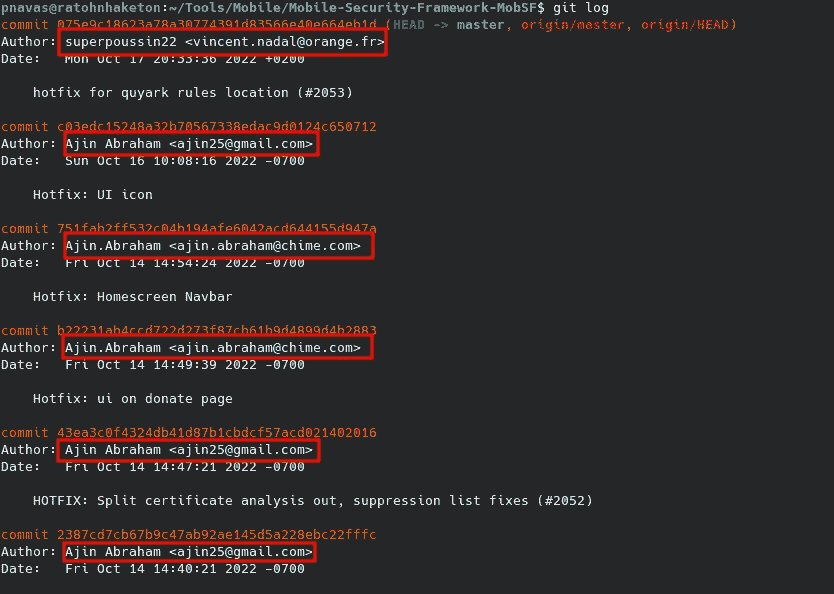

# 三个惊人的 GitHub OSINT 技巧和工具

> 原文：<https://medium.com/codex/three-incredible-github-osint-tricks-3b5e6c025863?source=collection_archive---------10----------------------->


越来越多的开发者每天都在使用 GitHub，当我们对一家公司或一项公司资产进行测试时，在这个平台上进行在线调查是至关重要的。这里有三个技巧来简化这项任务。

1.  **发现与用户相关的电子邮件帐户**

由于 GitHub 的工作方式，对我们的库的提交用我们的电子邮件地址签名是很常见的。引用 GitHub 文档:

> GitHub 使用您的提交电子邮件地址将提交与您的 GitHub.com 帐户相关联。您可以选择将与您从命令行推送的提交以及您进行的基于 web 的 Git 操作相关联的电子邮件地址。
> 
> 对于基于 web 的 Git 操作，可以在 GitHub.com 上设置提交电子邮件地址。对于从命令行推送的提交，您可以在 Git 中设置您的提交电子邮件地址。

这些信息可以在每次提交时单独查看，也可以在存储库日志中全局查看。为此，我们只需要访问存储库并使用 git 的工具。

要做到这一点，我们只需要克隆存储库并使用命令 git log:



我们可以过滤输出以获得所有电子邮件地址，如下所示:

```
git log | grep Author | cut -d '<' -f 2 | cut -d '>' -f 1 | sort | uniq
```

虽然可以从 GitHub 禁用这一功能，但大多数用户在每次提交时都会泄露他们的电子邮件地址。所以这个检查是**必须要做的**当我们在侦查的时候，我们遇到了一个 GitHub 库。

**2。找到泄露的秘密**

虽然手动审查代码总是必要的，但是有一些自动收集这些秘密的方法，使用这些方法我们可以快速找到这种类型的 bug，我们可以在侦察阶段之后将它们链接在一起。

这种类型的主要工具之一是松露猪。无论是 dockerized 版本还是 installed 版本，trufflehog 都是一个强大的工具，它将允许我们扫描存储库以寻找暴露的秘密。要对存储库执行简单的扫描，我们只需要如下传递存储库的 URL:

```
trufflehog git https://github.com/orgnaization-name/orgnaization-repo --only-verified
```

类似地，传递 GitHub 组织的名称将扫描其所有公共存储库中的秘密。

```
trufflehog github --org=orgnaization-name --only-verified
```

这个工具甚至可以集成到 CI/CD 管道的开发流程中，以验证秘密令牌没有被错误地泄露。

**3。查看第三方的源代码。**

虽然有时我们的目标不会在 GitHub 上提供公共存储库，但这并没有失去一切。第三方暴露与我们的目标相关的某种有趣信息是可能的，也是常见的。例如，提交脚本以自动执行任何任务的员工，第三方错误上传到公共存储库的数据库，子域列表，爬行工具显示的端点…

对于这个任务，我们可以使用 GitHub 搜索引擎和所谓的 GitHub 呆子。

GitHub Dorks 是带有操作符的特殊搜索，允许我们细化搜索以获得我们想要的结果。GitHub 呆子的一个例子如下:

```
extension:ppk private
```

这个呆子允许我们获得包含单词“private”的 PPK 格式文件，从而生成 puttygen 私钥。我们可以改进这种搜索，以获得符合我们要求的结果。

更全面的呆瓜名单可以从以下链接获得:

[](https://github.com/techgaun/github-dorks#list-of-dorks) [## GitHub - techgaun/github-dorks:通过 GitHub 搜索找到泄露的秘密

### 文件名:。npmrc _auth npm 注册表身份验证数据文件名:。dockercfg auth docker 注册表验证数据…

github.com](https://github.com/techgaun/github-dorks#list-of-dorks) 

有时，呆子是不够的，我们将需要利用更复杂的搜索，包括其他类型的操作符和正则表达式。这可以使用 grep.app 搜索引擎来完成，它将允许我们一次在大量存储库中执行几乎即时的搜索。

 [## grep.app |代码搜索

### 搜索 50 万个 git repos。通过正则表达式搜索。

grep.app](https://grep.app/) 

我希望你喜欢我的文章，并发现我的内容有用。下一篇文章再见。