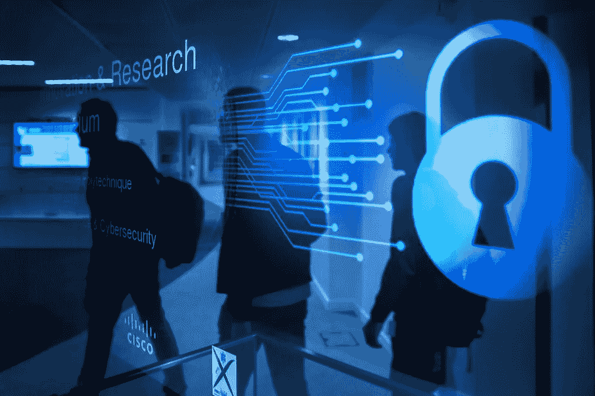

# 人工智能(AI)可以帮助您提高网络安全的三种方式

> 原文：<https://medium.com/codex/three-ways-artificial-intelligence-ai-can-help-you-improve-your-cybersecurity-1d7b1922fff9?source=collection_archive---------13----------------------->

## 人工智能(AI)有可能通过检测可疑行为、预测网络攻击和保护数据来改善网络安全。

图片:[https://www.flickr.com/photos/117994717@N06/40631791164](https://www.flickr.com/photos/117994717@N06/40631791164)