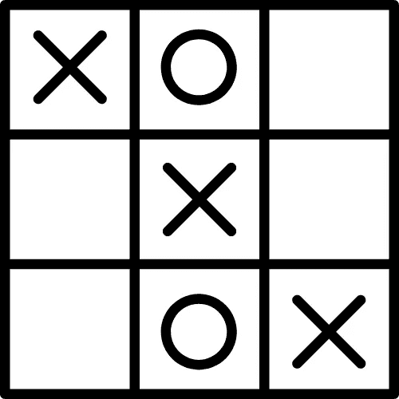
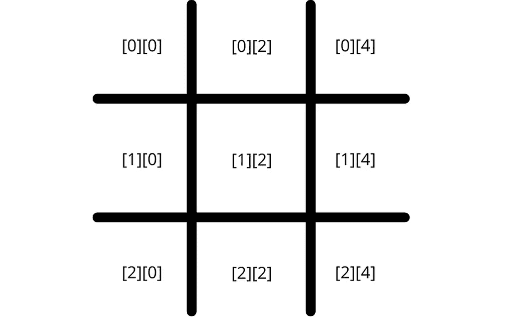
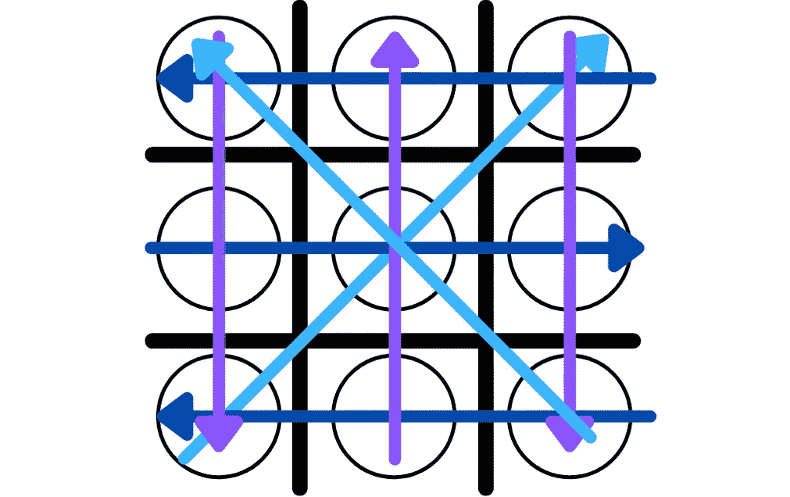

# 爪哇井字游戏

> 原文：<https://medium.com/codex/tic-tac-toe-e53212028341?source=collection_archive---------0----------------------->

## Java 教程—井字游戏

## 如何用 Java 创建一个控制台井字游戏



井字游戏(作者创作)

井字游戏是一个经典的编程问题，许多开发人员在他们的编程之旅中都遇到过。看似简单，井字游戏可以教会开发者:

*   数组
*   布尔运算
*   条件式
*   功能
*   环
*   变量
*   数据结构

在本教程中，我们将创建一个控制台井字游戏，它依靠随机数发生器来控制计算机。在适用的地方，我将评论如何改进代码。本教程将使用最基本的解决方案，使所有技能水平都可以使用。永远记住在每一节的末尾测试你的代码，以确保它能正常工作！我们开始吧。

注意:你可以在 YouTube 上以视频格式欣赏整个教程:

教程的 Youtube 链接

*如有任何困惑，可随时查看完整代码* [*此处*](https://github.com/Taylor-McNeil/YouTubeTutorials-/blob/master/TicTacToe.java) *。*

# 构建董事会

*为了简单起见，整个教程将构建在一个类中，并提供几个函数。*

构建游戏的第一步是创建棋盘。我们将使用一个充满破折号[ - ]、竖线[ | ]和空格[" "]的 2D 字符数组来创建我们的电路板。让我们创建一个名为 *gameBoard* 的数组，并填充它。我们还将创建一个名为 *printBoard()* 的函数，让我们能够可视化电路板。



游戏板的可视化(由作者创建)

这段代码的快速解释。竖线下划线，空格表示井字游戏棋盘的网格。你可以把棋盘想象成空间 1-9。第一个空格是[0][0]。第二个空格是[0][2]。第三个空格是[0][4]等。

*所有指标均在备注中注明。竖线存在；然而，在我们的游戏逻辑中，我们并没有把它们计算在内。*

*printBoard()* 接收一个 2D 数组并将数组内容打印到控制台。它通过使用嵌套的 for 循环来实现这一点。第一个循环告诉计算机，对于*游戏板*中的每个字符行，执行第二个循环。

第二个循环要求，对于行中的每个字符，打印出该字符。在每第二个循环的末尾，我们创建一个新的行来防止所有的字符被打印在同一行上。

```
/***Note: Printing the board could be accomplished using the tradition for loop. I think the foreach loop is easier to read. **/*for (int row = 0; row < gameBoard.length; row++) {
  for (int c = 0; c < gameBoard[0].length; c++) {
    System.out.print(gameBoard[row][c]);
  }
  System.out.println();
}
```

这个功能完成后，我们就完成了电路板的构建。

# 放置工件

现在，我们已经建立了我们的董事会，让我们潜入游戏逻辑。我们需要一种方法来确定哪个角色代表玩家和计算机；以及将这些角色放在黑板上的方法。所以让我们创建一些规则:

*   玩家将由 **X** 字符和数字 1 代表
*   计算机将由字符**和数字 2 表示**
*   放置棋子的有效索引为[0][0]，[0][2]，[0][4]，[1][0]，[1][2]，[1][4]，[2][0]，[2][2]，[2][4]

使用所有这些规则，我们可以创建一个叫做 *updateBoard 的方法。*这将允许我们根据轮到谁以及他们选择的位置来更新*游戏板*中的位置。

*注意:这是之前的课；我们刚刚在 printBoard()函数下添加了 updateBoard()函数。*

*updateBoard()* 接收棋子将要放置的位置，轮到谁了，以及游戏板的状态。

用我们之前的规则，玩家等于 1，他们的角色是 X；计算机等于 2，它们的字符是 o。使用 if-else 语句来确定该轮到谁了，以及应该放置什么棋子。

在我们决定轮到谁之后，我们需要决定将棋子放在哪里。switch 语句用于区分不同的情况。情况 1 表示玩家或电脑选择了第一个位置。(也就是左上角)根据谁选择了那个位置，相应的棋子就放在那个位置，我们就脱离了 switch 语句。

```
/** Change the position and player to see the pieces move around the board. Insert this function call in the main method and play around with the numbers to see the pieces appear. **/updateBoard(5, 1, gameBoard);
updateBoard(1, 2, gameBoard);
updateBoard(7, 1, gameBoard);
```

在这一点上，你应该能够:在棋盘上为电脑和玩家添加棋子。请务必通过从播放器切换到计算机来测试此功能。

# 获取玩家输入

现在我们可以看到棋盘并在棋盘上放置棋子，我们希望玩家告诉我们棋子应该放在哪里。为此，我们将创建一个名为 *playerMove()的新函数。*在 *playerMove()* 中，我们将利用内置的 Scanner 类来检索玩家输入，并包括一些用户验证，以确保用户输入有效的响应。

*注:这是之前的课；我们刚刚在 updateBoard()下添加了 playerMove()函数。我们还导入了扫描仪库，并在第 5 行创建了一个新的扫描仪对象。为了可读性，我把 main 方法留在了这里。*

```
/** We have created a static Scanner here because we will utilize the player input in other areas. If we create only one instance to hold the player response, we do not have to worry about deleted or having multiple Scanner objects. **/
```

*playerMove()* 函数本身很简单。我们询问玩家他们想要移动到什么位置，保存这个响应，并将其输入到我们的 *updateBoard()* 函数中。

```
/** Line #15 has code for testing this function. Play around with feeding different values into the function. Do you notice that something is off? **/
```

如果您尝试在代码中添加不同的值，您可能会注意到有些地方不对劲。也就是说，您实际上可以将字符放在已经包含字符的空格的顶部。这在井字游戏中是不允许的，我们需要解决这个问题。为此，我们将在放置棋子之前创建一个函数来验证玩家的移动。

# 验证移动

为了验证玩家是否进行了有效的移动，我们需要确定什么是有效的移动。在我们的世界里，我们正在构建一个由破折号[ — ]、竖线[ | ]和空格[" "]组成的游戏。虚线和空格代表板上的空白区域。

```
/**         _ | _ | _     Helpful indices:[0][0] , [0][2] , [0][4]
            _ | _ | _                     [1][0] , [1][2] , [1][4]
              |   |                       [2][0] , [2][2] , [2][4]   
**/ 
```

因此，如果一名球员选择了一个除了破折号或空格之外的空格，这个位置要么无效，要么被占据。例如，[0][1]是竖线，那是我们游戏的无效空格。

*注意:如果你回头看看注释或图表，你可以看到哪些值对应于有效空间。*

*注意:我们更新了 playerMove()函数，并在其下添加了 isValidMove()函数。*

*玩家移动*()功能现在在放置棋子和更新棋盘之前检查玩家是否正在进行有效的移动。我们更新了 *playerMove()* 函数，增加了一个 while 循环和一个布尔函数。布尔值保存着 i *sValidMove* ()函数的结果。当 *isValidMove* ()的结果为 false 时，程序将不断循环，直到玩家输入有效的移动。

进入 *isValidMove* ()函数，该函数接受玩家的移动输入，并测试玩家输入的位置是否为空。如果该位置为空，则返回 true，否则返回 false，因为该位置已被占用。

```
/** You could implement the validation differently. You could create a set for empty positions. You could check if the position was in the empty position set and return true or false based on that. You would need to fill the set with empty positions in the main method before running the game. **/import java.util.HashSet;static Set<Integer> emptyPositions = new HashSet<Integer>();public static void main(String [] args){ char [][] gameBoard = {{'_','|','_','|','_'},{'_', '|',   
  '_','|','_'},{' ','|',' ','|',' '}}; for(int i =1; i<10; i++){
      emptyPositions.add(i);
  }

  playerMove(gameBoard);...omitting playerMove ...public static boolean isValidMove(int move, char[][] gameboard){if(!emptyPositions.contains(move)){
    return false;
  }else{
    emptyPositions.remove(move);
    return true;
  }/** You can test this out by calling playerMove() a few times in the main method. Check and see if your invalid moves from before are allowed now. **/
```

# 模拟计算机

为了简单起见，我们将使用随机数生成器来模拟计算机。电脑会在每一回合选择一个 0-9 之间的随机数。我们将在 *computerMove()* 函数中调用 *isValidMove()* 函数，以确保我们的计算机也在有效空间中移动。

*注意:这个函数放在 isValidMove()函数下面。*

*computerMove()* 函数与 *playerMove()* 函数非常相似。唯一的区别是随机对象的引入。不要忘记导入随机库。随机对象将允许我们生成一个从 0 到 10 的数字。

```
/** You could stop the bound of the random number generator at 10.int move = rand.nextInt(10); 
int move = rand.nextInt(9)+1;These two lines of code are equivalent. Something worth pointing out is that the random number generator begins with zero and ends with the bound number not being included. That zero could cause us problems; however, we already handled that in our switch case in isValidMove(). Our valid moves only include 1 - 9\. Anything else outside that range is automatically considered an invalid move and returns a false value for isValidMove().
You can test this out by calling computerMove() a few times in the main method. Mix it up and call playerMove() too. You should start to see the beginnings of a game now. **/
```

# 赢得比赛

我们的游戏开始成形了；只剩下几步了。我们需要确定获胜的条件或者游戏结束的时间。遵循传统井字游戏规则，获胜条件如下:

*   左轴上的对角线
*   右轴上的对角线
*   三个横在顶部
*   三个横在中间
*   三个横在底部
*   右边三个
*   三个在中间
*   左边三个



所有可能获胜组合的视觉效果(由作者创建)

这些是获胜的条件；然而，游戏也可以处于平局状态，其中所有的空间都被填满，并且没有一个获胜条件被满足。按照这个逻辑，我们希望在每次玩家或计算机移动时检查是否满足任何获胜条件。

```
/** Technically, we do not have to check after every move. We can start checking after five moves, but we will check after every move to keep it simple. **/
```

检查是否满足获胜条件的最简单方法是检查组合中的所有空格是否都相同。例如，如果[0][0]、[1][0]和[2][0]被填满，那么玩家或计算机在左侧垂直向下有三个，并且已经赢了。让我们创建一个名为 *isGameOver()的新函数。*

*注意:这个函数放在 computerMove()函数下面。*

这个函数是前面使用的逻辑的巨大扩展。有八种可能获胜条件和一种平局条件。该函数检查计算机或玩家是否满足任何获胜条件。如果满足赢的条件或平局，那么游戏结束，将返回一个真结果，否则将返回一个假结果。

```
/** There are many ways to check to see if the player or computer has won. You could:- Convert all the rows and diagonals into sets, and check the length. A set can only contain unique values. Thus a winning set will only have a length of 1.-Make the current snippet smaller and check to see if the space is equal to the space next to it. For example is [0][0] == [0][2] == [0][4] and just determine what symbol is inside of the spaces.-Use a for loop for checking instead of using a giant if statement. You could use a loop for the horizontal conditions, a loop for the vertical, and a loop for the diagonals.These are just a few ways. There are more ways than these. **/
```

# 再玩一次？

在哪里放置这个函数可能不明显，这是因为我们还没有创建游戏循环。一旦满足获胜条件或平局，游戏循环将允许玩家再次游戏。为了实现这一点，我们将在两个 while 循环中包装 main 方法。第一个是检查玩家是否想再玩一次，第二个是检查游戏是否结束。我们将创建两个布尔值，gameOver 和 playAgain。

*注:这是我们游戏的主要功能。所有其他函数都是在这个函数之外编写的。*

playAgain 是主要的 while 循环。当 playAgain 为真时，整个游戏将继续。我们通过欢迎玩家并允许他们迈出第一步来开始游戏。游戏将通过调用 *playerMove()* 函数继续，并遍历我们之前创建的所有方法。然后我们将使用 *isGameOver()* 函数检查第 12 行的电路板状态。如果游戏结束了，我们就跳出内部 while 循环，问玩家是否想再玩一次。

如果游戏没有结束，它将成为计算机的回合，序列将一次又一次地重复，直到一个赢的条件或平局被满足。一旦 *isGameOver()* 返回 false，我们将打印出分数，并询问玩家是否想再玩一次。我们将重用之前保存玩家输入的扫描仪。根据玩家的输入，我们将结束游戏或重新开始游戏。

如果你仔细看，第 34 行包含一个我们还没有写的函数，叫做 *resetBoard()* 。这是因为它直到现在才变得相关。该功能将电路板设置回其初始状态。如果你愿意，你可以添加一个积分系统来记录分数。

# 鳍状物

我们完了。你现在已经有了一个用 Java 编写的完整的井字游戏控制台。世界是你的。通过创建其他游戏来继续提高你的编码技能，永远不要停止学习。贪吃蛇可能是一个有趣的游戏。如果你需要参考的话，这里的再次成为最终代码。你可以在 [twitter](https://twitter.com/ThatDevTaylor) 上找到我，我在思考新的文章，谈论游戏。